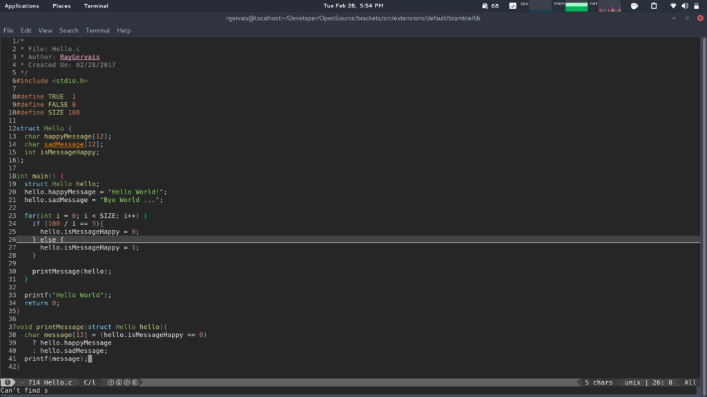
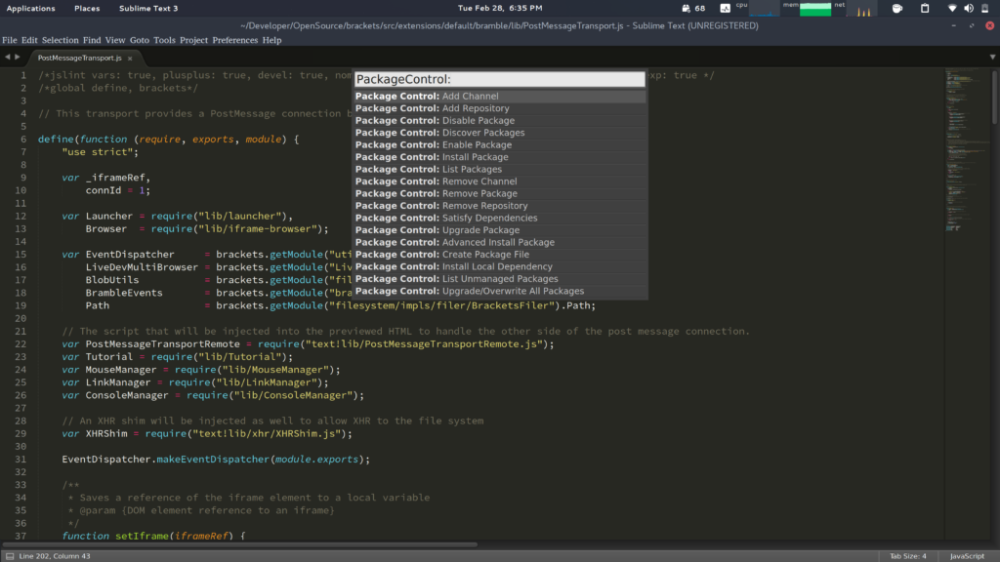

_OSD600 Week Seven Deliverable_

# Introduction

I have been a vim user for about two years, most of that time dedicated to simply learning how to exit the application. But all jokes aside, I’ve been using this editor for 90% of my projects and can say with confidence that despite its perverse editing modes, my continuous failures to execute the correct command -by hitting the key right beside the desired target mind you, I am proficient enough to navigate a document and develop. This week, I decided I wanted to see what it was like on the other side of the editor war. This week, I went evil.

# (Emacs + Vi) == Evil?

The reason why I had chosen an Emacs variant instead of a more modern text editor such as Atom, Sublime, Visual Studio Code, or even Notepad ++ for that matter was because I had developed a growing appreciation for keyboard-centric workflows. Though they above may be more inherently powerful and visually appealing, it was their reliance on a mouse for navigation which deterred my interests. Having used Atom in the past, I can say it’s a brilliant editor and capable of many feats which would suit many, I simply wanted something else.

Doing research for the next editor led me straight to the Emacs project called [Spacemacs](http://spacemacs.org/doc/QUICK_START.html), which is regarded as the best combination of emacs and vim functionality under one roof. Magnificent. This allowed for VIM users to migrate over or experiment with the other side, without losing precious memorised shortcuts. The inclusion of a **e**xtensible **vi** **l**ayer resulted in the term ‘EVIL’ mode.

Luckily, with my pride screaming ‘learn emacs’ editing patterns, the excellent vim-to-spacemacs documentation found [here](http://spacemacs.org/doc/VIMUSERS.html) allowed an easier transition than many YouTube tutorials could ever. One of my ambitions had always been to move to a terminal-centric workstation entirely, and I felt that this unique change could bring me closer to evaluating how useful that type of workflow could be. Regardless, back to the topic at hand.

## Common Commands

Thanks to the documentation referenced above, and this to-the-point command [guide](https://pi.sjtu.edu.cn/doc/spacemacs/), the initial using of spacemacs wasn’t overly daunting. I promised myself that I would learn the Emacs way of editing, and that’s what I intend to do. Switching over the editing mode from hybrid to Emacs gave quite the nightmare of an experience, resulting in twenty minutes spent learning just how to exit the current file without saving so that I did not ruin the file itself. Needless to say, I will have to ease into an Emacs-only workflow.

Taken from the guide, here are some common commands that I found very useful and would help any newcomer to spacemacs / emacs to get off the ground. Note that SPC ‘leader’ key, and can be configured to your individual preferences, furthermore M-x is simply hitting the leader key twice, which prompts for a contextual command.

**Description of Command**

**Command**

Access Documentation

SPC h SPC

Access Configuration File

SPC f e d

Fuzzy File Search

SPC f f

Open Recent File

SPC f r

Save Current File

SPC f s

Open current directory in dired

SPC f j

Git Staging Area

M-x Magit-Staging

Git Status

M-x Magit-Status

Buffer List

SPC b b

Kill This Buffer

SPC b d

Kill Other Buffers

SPC b m

# Week Impressions

Compared to Vim, Emacs and its variants load much slower, often exceeding 5 seconds in difference compared to Vim’s instantaneous startup. This though, is also to Spacemacs credit, due to the 205 extensions that are built into the application. I also learned very quickly that for my workflow, I had to open Spacemacs with the -nw argument to stop the opening of a separate window specifically for the Emacs instance. Once these two differences were adapted to, I realized how useful having a terminal instance of Emacs open at all times. Using it allowed for various functions common to a text editor, along with a well rounded plethora of non-editor centric possibilities including access to shell commands using SPC !, git commands using the Magit addon, and even a todo list using the org mode extension.

While working on my contribution to Thimble, I managed to do 90% of my average workflow without the leaving Spacemacs. Furthermore, the stock configuration for spacemacs is quite ergonomic for the home row enthusiasts and touch typists alike. Needless to say, I was impressed with this not-so little editor. While writing this post, the one wish I hoped to discover next from the Emacs strand was how to create temporary scratchpads for basic text input. This was easy to discover, with the shortcut being SPC TAB which would take me to an alternate buffer which was by default, a scratchpad. My only gripe, which I encountered while using the platform was that I could not copy any text to my clipboard from the terminal window. Emacs has supported copying to clipboard from it’s GUI application since the very start, but alas the terminal variant provided no such feature. Other shortcomings and victories are outlined below, so let us keep going through this adventure in the editor's version of no man’s land.

# Common Workflows and Features

Below, I discuss my findings which I did not cover previously. These are based on a preset list of ‘How do I do …’ styled questions. With that being said, keep in mind that with Spacemacs, there’s hundreds of different workflows for each task -each relying on different extensions, shortcuts and lots of lisp.

## Language support

Spacemacs supports many languages out of the box, but can easily extended to provide support for newer languages including Swift 3, Go, and Scala. Extensions are the responsibility of the developers, meaning that not every language supporting add on is complete, correct, or even compliant with the coding standard of said language.

## Linting

Though I was still learning the ins and outs of spacemacs, I did come across [Flycheck](http://www.flycheck.org/en/latest/), which is a linting extension that can support many languages natively, or through additional extensions such as jslint and pylint for JavaScript and Python support respectively.

## Beautifiers

Again, another feature that I had yet to come across in my workflow which resulted in research. This time, one of the most popular Emacs plugins for this type of task was [Web-Beautify](https://github.com/yasuyk/web-beautify). Fully customizable, this plugin supported HTML, CSS, JavaScript and JSON files with ease.

## Themes

Without listing the dozens of weekly updated websites showcasing user themes, one which became very relevant to me when I wanted a change from the default spacemacs-dark was [Theme Gallery](http://themegallery.robdor.com/), which showcased all of the included ‘Mega Pack’ themes that could be included in Spacemacs. The best part I’ve found so far, is that SPC T n command which, when configured properly, will cycle through your themes in a specified order. Some have even extended it to instantly cycle based on the time of day. As I write the blog, I’m currently a fan of the sanityinc-tomorrow-eighties theme, which I’ve substituted with the wombat theme since the theme mega pack addon include 103 extra files to download every time. Wombat has more contrast in my opinion, which makes readability much simpler. The default spacemacs-dark theme is great as well, so I’ve included below a picture describing the wombat theme.

## Syntax Highlighting

Though not as impressive as modern IDEs, capable of highlighting variables and objects with ease, Emacs -similarly to Vim, instead highlights what many refer to as lexical highlighting, which catn be described much better by [Wilfred Hughes](http://www.wilfred.me.uk/blog/2014/09/27/the-definitive-guide-to-syntax-highlighting/). He then, goes on to explain other syntax highlighting styles all of which emacs is capable of, along with citing another article by [Evan Brooks](https://medium.com/@evnbr/coding-in-color-3a6db2743a1e#.l04kk2565). I’m currently looking into adding a performant semantic highlighting package to my spacemacs configuration, with [rainbow identifier](https://github.com/Fanael/rainbow-identifiers) being the first package to test. You can see below of my (badly coded) example show casing the default syntax highlight methods of Emacs.

## Spell checking

A feature which many editors struggle to utilize well, and more so a task which has escaped the radar of many programmers alike, you can bet there’s functionality for those who oppose such disregard for the essentials. Built right into the base of spacemacs, spell checking is only a few keystrokes away.

# Feeling Sublime

An editor that I rarely used -simply because I seem to have the mindset which opposes the norm, was the Sublime 2 text editor which is regarded by many as the the modern day end-all, and be all of text editors. Former colleagues swore by Sublime 2 for diverse strands of Web Development, while others advocated the tool for languages such as C++, Python and even Swift. I felt, since I was already trying to shift my workflow to a different editor, I may as well experience what this editor has to offer as well.

In comparison to spacemacs, Sublime’s defaults date it quite a bit in my opinion, which had me circling through the pre installed themes quickly. Luckily, the theming community is even stronger in contrast to Emacs, and so I found the best version of Tomorrow Night Eighties I could. Now I could actually use it. Restarting the application reopens your previous session, which is a great convenience compared to Vim’s lackthereof knowledge of your sessions and projects. The power to reopen dozens of files, an entire project folder, and even the kitchen sink, in a matter of seconds was a task I never thought possible while using Atom,  Vi, or Spacemacs for that matter.

## Plugins, Plugins, Plugins.

Firstly, I cannot explain why I had avoided sublime for so long. The community, plugin support, and general atmosphere of Sublime is what I thought many editors should be like. Simplistic, and Inviting. Even for basic note taking, this editor is capable of providing quite the pleasant experience for the most mundane of tasks. That being said, this editor would also be nothing amazing had the developers turn the other way and not implemented thousands of plugins for your individual workflow. Instead, the plugin [package-control](https://packagecontrol.io/) is overflowing with potential listings which make or break your styling of working, improving productivity, reducing keystrokes and even a working [snake game](https://github.com/jonfinerty/sublime-snake). To makes things simple, I’ve included after this part a nice table with ‘must have’ plugins and little oddities.

**Plugin**

**URL**

**Description**

Sublime Snake

https://github.com/jonfinerty/sublime-snake

Snake for Sublime Text 2 & 3

Package Control

https://packagecontrol.io/

A package manager, which many claim should be the defacto standard bundled with Sublime.

Git

https://packagecontrol.io/packages/Git

Git integration with the Sublime Terminal

SublimeLinter

https://packagecontrol.io/packages/SublimeLinter

Linting code is a way to ensure my code is cleaner and more bug-free.

Markdown Preview

https://packagecontrol.io/packages/Markdown%20Preview

Preview and build your markdown files quickly in your web browser from sublime text 2/3.

Anaconda

https://packagecontrol.io/packages/Anaconda

Anaconda turns your Sublime Text 3 into a full featured Python IDE.

PlainTasks

https://packagecontrol.io/packages/PlainTasks

An opinionated todo-list plugin for Sublime Text (2 & 3) editor

Jedi Python

https://packagecontrol.io/packages/Jedi%20-%20Python%20autocompletion

[SublimeJEDI](https://github.com/srusskih/SublimeJEDI) is a [Sublime Text 2](http://www.sublimetext.com/) and Sublime Text 3 plugin to the awesome autocomplete library [Jedi](https://github.com/davidhalter/jedi)

# Conclusion

Without sounding like one obsessed with learning new tools, I can say that I have tried as many editors as I could. Regardless of the strengths or weaknesses, I flocked back to VIM within the weeks, updating my configuration file with new needs and lessons. It’s only been a week at the most, and I still have barely learnt enough to be confident enough to truly utilize Emacs platforms for my text editing. I think, this also lends itself to the fact that without the Evil layer, I’d be hopelessly lost with no safety nets. I’d love to continue using Spacemacs for my programming needs, but I certainly will have to learn a few shortcuts more and optimize the loading time which as of this moment, exceeds 5 seconds.

On the polar opposite of the speed spectrum, I found Sublime opens files and various instances within milliseconds of the enter key being hit. Even on an older Core 2 Duo machine, Sublime is very quick to launch. Having used Atom in the past, I could see similar shortcuts surfacing, and a package manager as robust too. One complaint that I had, was how quickly Sublime would begin to lag when working on thousand lined files. Though I rarely touch such large files, the requirement of having an editor which can navigate such large files becomes an must-have essential.

I’m at a standstill, caught between the platforms of the old monoliths, and the new modules. Between Spacemacs, and Sublime. Regardless of costs, feature sets, or ideologies, both editors provide everything you’d ever need. Having to choose one above the other, I’d have to go with Sublime if it were for quick edits. Every other task would benefit from Spacemacs once properly configured. Why? Because I believe that an Emacs platform with an open project is capable of much more in less time -using only a keyboard, than Sublime would be even with a mouse.
