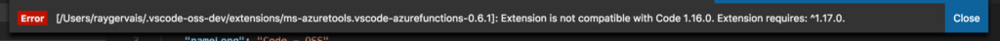

_An OSD Contribution Update - Part 1_

While working towards implementing a fix for this[bug](https://github.com/Microsoft/vscode/issues/42763), it was made clear to me that the bug was a regression, and not evident two months or so ago. This led David to directing me towards his _(awesome btw)_ [tutorial](https://blog.humphd.org/learning-to-git-bisect/) on how git bisect works, and how developers use it to determine where in the version history the bug was introduced. I'm glad that this concept existed, for even at work a few colleges and I attempted to replicate the similar behavior by hand, unaware that such tools already existed and was widely available.

Some background details that I had collected prior to me starting the bisect process:

- I knew that the current master branch contained the issue. According to the comment thread, this issue had arrived around a month or two ago.
- The Azure Functions validation logic is intact and functioning as expected, so the bug itself derives from refocusing the input after rerendering post-validation, a lifecycle which shouldn't occur to begin with.
- A custom extension could be created (and was provided in the bug description) which replicated the error.

## First Steps - Identifying a Working 'Good' Commit!

In git bisect, you identify a good and bad commit range, which is used to isolate and pinpoint where the commit occurred which causes the bug. I wanted to identify a good commit prior to entering the process where the bug was not present so that the process would go along smoother. I started as early as git commit 834ba9b, and moved my way down the following commits to identify a 'good' commit:

- [249a796](https://github.com/Microsoft/vscode/commit/249a796a76e2817bd4979e38a6d273b552700e3c#diff-efeb3f5a180f00bd9db3f96c43f67f5c) - November 20, 2017 - Still broken!
- [83d8cbe](https://github.com/Microsoft/vscode/commit/83d8cbeacaf15ad25761538adc0541672a7368cd#diff-efeb3f5a180f00bd9db3f96c43f67f5c) - October 2, 2017 - Still broken!
- [08d8f0f](https://github.com/Microsoft/vscode/commit/08d8f0f9f64b51fdad16b4535cfa27e4f31e87f6#diff-efeb3f5a180f00bd9db3f96c43f67f5c) - September 25, 2017 - Still broken!
- [a87dd9c](https://github.com/Microsoft/vscode/commit/a87dd9c7ad8fb618d0c8c53eb1f128389880a8ec#diff-efeb3f5a180f00bd9db3f96c43f67f5c) - August 21, 2017 - Still broken!

**_My Brain After This_** 

It was here that I decided there were two choices, continue going down this rabbit hole with the next commit jump being all the way to January 2017, or I admit that perhaps this edge case always existed and in consequence, needs to be addressed with the latest code base. I've decided that I want to go down the rabbit hole all the way to January 2016 if it produces a different edge case at least. That will be the introduction to part two, which I hope to publish in close succession to this first post.

**Below are some of the issues which I encountered while working out this bug, and what caused what felt like work-week-long delays in between progress.**

[caption id="attachment_724" align="alignnone" width="726"]](http://raygervais.ca/wp-content/uploads/2018/03/Screen-Shot-2018-03-04-at-5.16.51-PM.png) How far back I can go![/caption]

## Trials, Errors, Showstoppers along the Way

Before I even started with the bisecting process, I knew that I had to attempt to replicate the bug in the development version of Visual Studio Code. Two hours later, here is what I learned:

1. The Extension Gallery and it's respective API do not exist as a part of the developer / open source Visual Studio Code. They exist similar to a feature toggle, which Microsoft activates in the production version, this being due to some licensing concepts and beliefs which is explained in much better detail [here](https://github.com/Microsoft/vscode/issues/60#issuecomment-161792005).
2. You cannot sideload an extension easily without the Gallery API, which led me and hundreds of others who created, browsed, or cried for answers relating to this issue to a stackoverflow answer like no [other](https://stackoverflow.com/questions/37143536/no-extensions-found-when-running-visual-studio-code-from-source).

The code needed to be added to product.json:

```js
   "extensionsGallery": {
    "serviceUrl": "https://marketplace.visualstudio.com/_apis/public/gallery",
    "cacheUrl": "https://vscode.blob.core.windows.net/gallery/index",
    "itemUrl": "https://marketplace.visualstudio.com/items"
   }

```

3. Extensions hook into a proxy-esque API (depending on their required context), meaning this process of using git bisect is entirely based on faith that the extensions themselves are not the issue. If they produce the error, your scope broadened 10x.
4. Because all things must have versions and updates, it's entirely possible while going forward / backward to encounter where version mismatches causes the extension or host editor to not be compatible. [caption id="attachment_726" align="alignnone" width="792"]](http://raygervais.ca/wp-content/uploads/2018/03/Screen-Shot-2018-03-03-at-5.13.50-PM.png) Version Mismatch with Azure Functions[/caption]
5. It is entirely possible because of the number 4, you will have to create your own extension. This is a battle of itself which I will describe below more.

## Custom Extensions To Replicate Broken Edge Case

In the original bug, the reporter provided example code which when run, replicated the issue itself without an official extension. The tradeoff? Well you have to create a local temporary extension that Code will compile and attempt to integrate into its infrastructure. Issue? Well similar to the Extension Gallery being not included with the development version of visual studio code, neither is the node debugger and or compiler. These are extensions which are included by default with Microsoft's release version. In attempt to mitigate before I get very hacky, I side-loaded the extensions gallery in the same way described above, and then installed `node debug` and `node exec`. The first allowed for successful execution of the environment (more on that), and the later is incase I could find a way to bleed / inject my custom function into the live environment.

I was able to follow the Microsoft documentation for creating and launching an extension with my standard version of Code, but that doesn't help unless I'm debugging against the latest release (1.21.1). A few Github threads specify fixes for this issue so that you can bootstrap the production-built debug instance through your developer instance, but so far results have been less than stellar on MacOS and Linux. My worst case scenario that I think I will try if no further progress is made with the previous approach is to debug the latest (again), but this time focus on the validation handler, referencing commits which change its surrounding scope for example.

**Important Update:** Thanks to David, whose eyes and searching skills proved themselves far better than mine, I was able to sideload the custom extension consisting of the following code into the development version of Code with this command: `--extensionDevelopmentPath=\...`.

The extension which replicates the bug itself is:

```JS
'use strict';
// The module 'vscode' contains the VS Code extensibility API
// Import the module and reference it with the alias vscode in your code below
import \* as vscode from 'vscode';

// this method is called when your extension is activated
// your extension is activated the very first time the command is executed
export function activate(context: vscode.ExtensionContext) {
    vscode.window.showInputBox({
        prompt: 'Enter two words',
        validateInput: (text: string): string | undefined => {
            if (!text || text.indexOf(' ') === -1) {
                return 'You must enter two words';
            } else {
                return undefined;
            }
        }
    });
}
```

// this method is called when your extension is deactivated
export function deactivate() { }

## Dependency Issues with Linux (Fedora 27) While Rolling Back

I encountered many dependency and build process issues on my Fedora 27 box while moving between commits, often cleaning /tmp directory to see if the issue was related to version mismatch. Later after some Googling I found that some of the issues related to NPM's handling of file systems and permission, which was equally terrifying as I began to experiment while looking for a fix. Who wouldn't be terrified after this lovely [fiasco](https://github.com/npm/npm/issues/19883?) After about an hour or more of attempts, I moved to MacOS to see if that process would be smoother. If so, I can admit that my linux workstation probably needs a clean-up / reinstall, having served me and thousands of packages / files well for over two years without major issues. After I moved to MacOS on High Sierra 10.13.3, the issue relating to the different build systems was not apparent.
