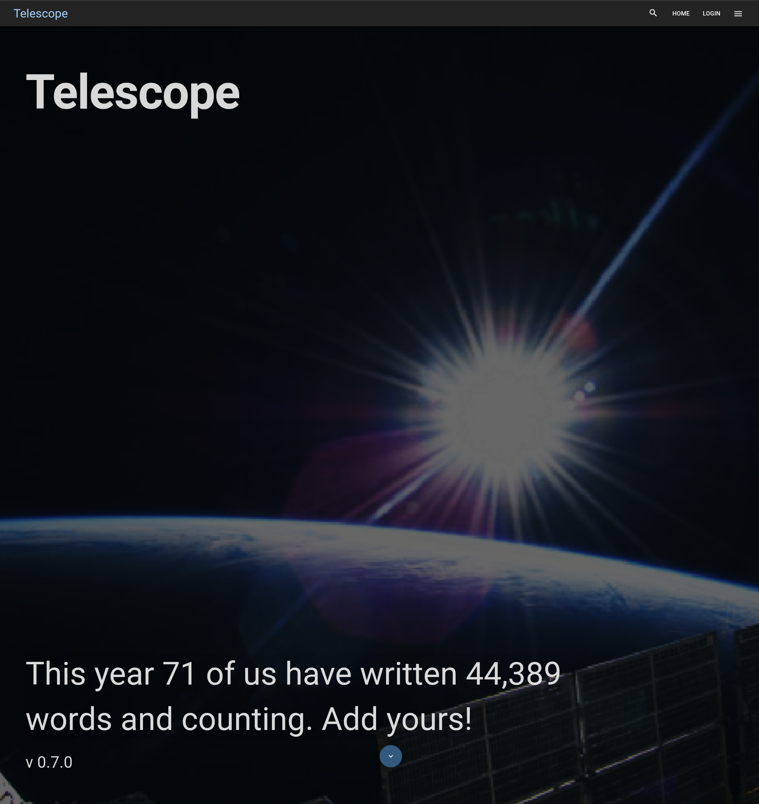

_Preface: I have no idea what I'm doing, but the best way to learn is through example and imitation._

## I've Never Worked With React Before

Before crossing over to the cloud engineering title, I was a front-end developer primarily with a hint of full-stack to spice up the mix. At that time, I was working with `Angular 2+` / `MEAN` stacks for both work and Seneca College projects. Later on, I'd learn and Leverage `VueJS`, `Gridsome`, and `GraphQL` for projects such as this blog, [Ray's Place](https://www.rayzplace.ca), and as of recent I've been testing `Svelte` for a hobby contact management application paired with `Electron` for cross-platform goodness. Yet, in all those projects, deliverables and experiences I never had to work with React. Perhaps due to my personal bias against using frameworks or tools that are built by questionable parties, or even simply circumstance, I've yet to require any introductions to the leading JavaScript framework.

Yet, Telescope's frontend is written in `React` on the `Gatsby` platform. Earlier at the start of the year, I had mentioned to Dave that I loved helping on the DevOps side (being titled `Doctor Docker` as I highlighted in a previous post), but my heart and passions still existed within the world of software development itself. I commented that I'd like to contribute more code-based contributions that didn't always involve Docker or CI/CD, and when a few stories came about which appeared to be just the right jumping platform to get into the project's front-end development, I took it. The [issue](https://github.com/Seneca-CDOT/telescope/issues/789) was a nice-to-have, not planned for Dave's 0.8 release and thus any delays on my part to get to the implementation would not derail the classes' delivery. I'd be leveraging recently developed back-end APIs to retrieve post stats and display such in a nice manner on the `Banner` component.

## Summarizing My Initial Thoughts In Four Points

- This shouldn't be hard, we're simply adding another subcomponent to `Banner.js`!
- I should wait until `Banner.js` is [refactored by Cindy Le](https://github.com/Seneca-CDOT/telescope/pull/815) into a proper JSX component which is happening this week!
- I've heard React components render at 60fps when possible by default... wonder if that's going to cause an issue... it did. More below.
- Dear God, everything is a const in this damn front-end.

## Diving Into The Deep End


Let's go over the above points, along with what I specifically learned by working on this `React.component`!

In my mind, I could envision exactly how I'd implement the requirement in a `VueJS` or `Angular7` way, but I understood that React components had a vastly different lifecycle and development approach compared to the two. I mean, Angular is vastly different compared to VueJS as well, but I had worked with both enough to understand their commonalities and differences when it came to web application development. That's not even getting into the state handling!

Once Cindy had landed her refactor, I knew the time to bear arms against the missing requirement was near. With VS Code at my right, terminals to my left, and an unhealthy mix of water in my caffeine it was time to hack.

### Enter, JavaScript Extensions and React.Components

Comparing `JSX` components to the way `VueJS` or `Angular` does components is rather interesting. I had read in the past that JSX feels more natural for JavaScript developers, like a natural extension of a language compared to bootstrapping it into the other formats. Though dated, I found this [comparison by ValueCoders](https://www.valuecoders.com/blog/technology-and-apps/vue-js-comparison-angular-react/) best at explaining the three framework's syntax differences. A great (though again, dated) comparison of VueJS to ReactJS can be found in [I created the exact same app in react and vue](https://medium.com/javascript-in-plain-english/i-created-the-exact-same-app-in-react-and-vue-here-are-the-differences-e9a1ae8077fd) for examples, we can compare some of the syntaxes there.

Considering this was the first time I was exposed to a JS-transitioning-to-JSX project, there was quite a bit to learn and understand. Luckily, Dave's class and the front-end guru's had created great examples of how to properly do modern `ReactJS` in the various JSX components which were already developed. I leveraged the `Login.jsx`, `Search.jsx` and `Post.jsx` components to learn how we composed UI and updated their state.

### State, We Have an Issue

```js
function RetrieveStats() {
  const { telescopeUrl } = useSiteMetadata();
  const [stats, setStats] = useState({
    stats: { posts: 0, authors: 0, words: 0 },
  });

  useEffect(() => {
    async function getStats() {
      try {
        const response = await fetch(`${telescopeUrl}/stats/year`);
        if (response.status !== 200) {
          throw new Error(response.statusText);
        }

        const stat = await response.json();
        const localeStats = {
          posts: stat.posts.toLocaleString(),
          authors: stat.authors.toLocaleString(),
          words: stat.words.toLocaleString(),
        };
        setStats(localeStats);
      } catch (error) {
        console.error("Error getting user info", error);
      }
    }

    getStats();
  }, [telescopeUrl]);

  return (
    <div className="stats">
      This year {stats.authors} of us have written {stats.words} words and
      counting. Add yours!
    </div>
  );
}
```

This is the final code contribution (abridged, lacking the class declarations for styles) that I had done for [Issue 836](https://github.com/Seneca-CDOT/telescope/pull/836) before it was merged, though I know the [component](https://github.com/raygervais/telescope/blob/master/src/frontend/src/components/Banner/Banner.jsx) itself will change as there are many more updates planned for the Banner. It looks dashing, don't you think? _'s rather clean implementation for a first-time front-end contribution by yours truly, don't you think?_ I'm not fond of the `localeStats` creation and hope to address a better implementation shortly. Let's backtrack to before the code was performing as expected.

Initially, I leveraged the Login and Search components mentioned above as examples of how to both write JSX and also how to modify state. Coming from VueJS -where state's modified via `Vuex` (Redux), or via local components without a state or store, React's state management both made more sense out of the box (and this could be attributed to Cindys and A Garcia maintenance and development of the front-end) and more convoluted in comparison. It had the intimidation and challenging factor that I was looking forward to tackling and equally yearning to avoid for as long as possible.

I learned the hard way why `useEffect` is so damn important to utilize when modifying the state of components which render at 60fps, resulting in a locked-up computer and eventually DDOSing my local instance of the backend. _So many API calls, so many I/O reads from Redis. Shudders._ Likewise, I'd never seen `useState` before in Angular or Vue. Configuring the initial state looked like `const [stats] = useState(null);` and took quite a few roundabouts through the source code to examine how internal component state was initialized. Never be afraid to reference other's work Dave used to repeat in OSD600, and how right he was to drill that our minds.

### Font Scaling vs Window Resolution

While being a front-end developer intern at SOTI, I learned there was always a topic or concept which a developer would fear and ignore for as long as time allowed. For many on the front-end, it was CSS. I was never the one to shy away from CSS, but I could admit that making web applications that were responsive to the growing landscape of different screen DPIs made me cry. Looking at _you_, `position: absolute !important` users. My God, you wonder why text and icons overlap. I digress. Ironically, adding the stats line of text in a rather font would lead to the same issue in some use-cases.


It's rather funny that this issue came about because of the `font-size`,] since it leveraged the viewport's width (vw) to determine size. It's a fun CSS trick but leads to this problem quite often. I never noticed the issue before, having laid my examples out nicely in the sun to bake and tan before showing off to the world -meaning that I didn't consider use cases such as a 1080p screen where the viewport itself is smaller than 1080p thanks to various toolbars, etc. For reference, here's my original screenshots which all came from a 4K monitor scaling to various resolutions with the help of Firefox's Development Tools.

**4K**


**1080p**


Once it was agreed that we'd move away from viewport width and introduce a media-query based scaling, I looked about and learned from this [Codepen: Material UI - Scaling Font Size](https://codesandbox.io/s/l48vjmk3om) how to implement font scaling. Applied to all text elements in the Banner component (abridged below) ensured that the component would scale far nicer than previous implementations.

```js
const useStyles = makeStyles((theme) => ({
  h1: {
    position: "absolute",
    color: "white",
    fontFamily: "Roboto",
    fontWeight: "bold",
    opacity: 0.85,
    fontSize: "12rem",
    [theme.breakpoints.between("xs", "sm")]: {
      fontSize: "4rem",
    },
    [theme.breakpoints.between("md", "lg")]: {
      fontSize: "8rem",
    },
    [theme.breakpoints.up("xl")]: {
      fontSize: "12rem",
    },
    display: "block",
    top: theme.spacing(20),
    left: theme.spacing(8),
    transition: "linear 250ms all",
  },
}));
```

## What's Your Status, Telescope?


With a few revisions leading to the code I've explained, it was time to land this PR! When all was said and done, the latest version of Telescope now contains my stats component and the phrase: _"This year X of us have written X words and counting. Add Yours!"_. With all the stability and improvements to the codebase that I've heard of around the Slack channel, Telescope truly is becoming an incredible project to work on and see others grow from. I was telling Dave, it's the exact project which changes someone learning computer programming into a software developer. It's the project that defines what real software development looks like, and truly gives you an edge in the career journey.



## Closing Thoughts On The React Experience

I'll start with this: React's documentation, along with the open-source examples, documentation, and modules provided by the community are incredible. Learning `useEffect`, `setState` and other React idioms was a breeze and rather enjoyable! Similar to Microsoft's recent work to improve their documentation, it's clear when a software company puts effort into their documentation and developer experience. I'd argue that when a software company commits to the experience, be it through their tooling, documentation, or SDKs, it's second-to-none.

Having achieved a decent understanding of React, and the `Banner.jsx` component specifically, I can say that I'm excited to add more to it, to develop more in that environment. Writing JSX does feel like a natural extension (hence the name) to Javascript, but at the cost of being rather alienating and intimidating from the outside world. I'm currently testing [Svelte](https://svelte.dev) for a hobby project and find it equally alienating and unique -these attributes are what draw me in; enveloping me into wanting to write more and push my understanding in the technologies. Perhaps my next web-based project will be in React? Perhaps I'll migrate my side project from Svelte to React -the benefits are very much spelled out: support, modules, documentation. We'll see on that one.

## Resources

- [Cover Image: Photo by Paweł Czerwiński on Unsplash](https://unsplash.com/photos/syy3bLQaMNY)
- [Pull Request: adds post stats component to banner](https://github.com/Seneca-CDOT/telescope/pull/836)
- [Scotch.IO: 7 Ways to Implement Conditional Rendering in React Applications](https://scotch.io/tutorials/7-ways-to-implement-conditional-rendering-in-react-applications)
- [Stackoverflow: Formatting Numbers in React](https://stackoverflow.com/questions/44784774/in-react-how-to-format-a-number-with-commas/44784907)
- [ReactJS: Using the Effect Hook](https://reactjs.org/docs/hooks-effect.html)
- [ReactJS: Introducing JSX](https://reactjs.org/docs/introducing-jsx.html)
- [Material UI - Scaling Font Size](https://codesandbox.io/s/l48vjmk3om)
