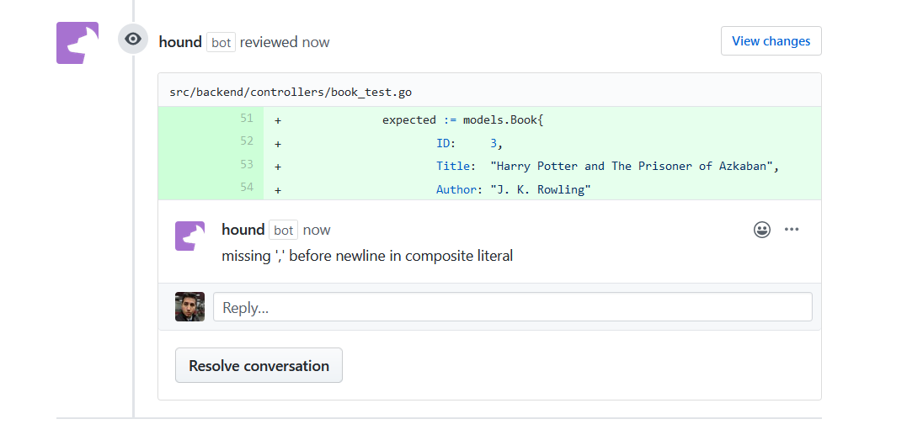

_An introduction to Hound, The Code Review CI Tool and Testing in Golang_

## Conceptualizing Athenaeum

[James Inkster](https://github.com/Grommers00) write up the best description of Athenaeum, which I'll share here.

> Sharing your favorite books has never been easier. What Athenaeum brings to the table is the ability to login and create a repository of your favorite books, you will be able to share your favorite books with other users on the platform, and find users who are into similar books as yourself. You'll be able to see trending books so you can always stay up-to date with what books might be enjoyable for you to read based on your likes. Athenaeum will implement a minimalistic design to allow for functional UI design choices.

The idea originally came about when I was interested in creating a full-stack application which would enable contributors to test and learn about modern development practices, technologies, and languages. I opted for the following stack after James proposed Athenaeum as the idea:

- Back-end Services: Golang
- Database Persistence: SQLite
- Front-end Interfaces: Node / ReactJS

_We're Going To Make It Awesome [And We're Going To Follow All The Best Practices!]_

Or at least, that's what we all think at the start of the project. Every code-base has their respective hacks, workarounds, and inconsistencies when not kept in check. I imagine that consistent code quality in each pull request is the goal, but we all know how easy it is for items to slip past our reviews. That's why I wanted to explore adding Code Analysis tooling from the very start to the project for both the front-end and back-end. The Open Web Application Security Project (OWASP) is a nonprofit foundation which lists tooling, strengths, and weaknesses such as:

> Some tools are starting to move into the IDE. For the types of problems that can be detected during the software development phase itself, this is a powerful phase within the development life cycle to employ such tools, as it provides immediate feedback to the developer on issues they might be introducing into the code during code development itself. This immediate feedback is very useful, especially when compared to finding vulnerabilities much later in the development cycle.

Enter the first tool, Hound!

## Being the Guardian of the Pull Request Gates

So what is Hound? Their [official website](https://houndci.com/) states the following:

> Hound comments on code quality and style issues, allowing you and your team to better review and maintain a clean code base.

The list of supported languages and linters are:

- JavaScript / TypeScript / CoffeeScript
- Ruby
- Python
- Swift
- PHP
- SASS
- Golang
- Elixir
- Haml

The site's [support](http://help.houndci.com/en/) pages are rather stark, but provide an excellent jumping ground in the configuration examples for those who don't want to dive into the [source code](https://github.com/houndci/hound). Did I mention that it's open source?!



I find Hound to be great spare pair of eyes during code reviews, since it enables a few convenience workflows:

- Shutdown all Github Actions if errors / issues are found
- Remove stale comments from previous Hound scans
- Consume eslint.json, tslint.json, and various configuration files for lint customization per-language
- Share lint customizations among projects

Golang's internal tooling comes with a built-in linter, which means that your editor -paired with it's corresponding golang-supported plugin- should complain when there's syntax and linting issues. I found even VIM-GO highlighted the same error in the screenshot above, which means that Hound itself isn't providing a critical service for the back-end aside from uprooting ignored warnings / errors (such as missing comments above function implementations). NodeJS in contrast, has quite the many ways that developer write JavaScript code. By leveraging a ESLint configuration `eslintrc` such as this [one](https://github.com/raygervais/Athenaeum/blob/master/.eslintrc), we're able to ensure that code base is adhering to a set of defined guidelines in the less opinionated languages.

```json
{
  "env": {
    "commonjs": true,
    "es6": true,
    "node": true
  },
  "extends": ["eslint:recommended", "plugin:prettier/recommended"],

  "parserOptions": {
    "ecmaVersion": 2020
  },
  "rules": {
    "no-console": "error",
    "require-atomic-updates": "error",
    "default-case": "error",
    "default-case-last": "error",
    "default-param-last": "error",
    "require-await": "error",
    "camelcase": [
      "error",
      {
        "properties": "never"
      }
    ],
    "comma-dangle": [
      "error",
      {
        "arrays": "always",
        "objects": "always"
      }
    ],
    "comma-spacing": [
      "error",
      {
        "before": false,
        "after": true
      }
    ],
    "quotes": ["error", "double"]
  }
}
```

## Setting The Hound Loose


For Athenaeum's case, we only need to leverage `golint` and `eslint` for our services so far, so that configuration would look like this:

_That last line enables us to tell GitHub Actions to stop building / testing!_

```yml
golint:
  enabled: true

eslint:
  enabled: true
  config_file: .eslintrc

fail_on_violations: true
```

## Next Steps

One of the goals of this project was to explore and learn through trial and error modern practices, tooling, and services which help enrich a code base, Hound was the easiest to add; a single source of truth when it came to code style enforcement. From there, I want to explore adding other tools in the CI chain, and in the Release chain such as:

- Security Analysis using [LGTM](https://lgtm.com/)
- Security Analysis Using [WhiteSource](https://bolt.whitesourcesoftware.com/github/)
- Dependency Updates and Risks using [Dependabot](https://dependabot.com/)
- Container Remediation and Testing using [Synk](https://snyk.io/)
- Release Management using [release-tool](https://github.com/containerd/release-tool)

## Resources

- [Cover Image: Photo by Andrey Konstantinov on Unsplash](https://unsplash.com/photos/drir5tDCWF4)
- [Hound](https://houndci.com/repos)
- [Athenaeum](https://github.com/raygervais/athenaeum)
- [OWASP SOurce Code Analysis Tools](https://owasp.org/www-community/Source_Code_Analysis_Tools)
