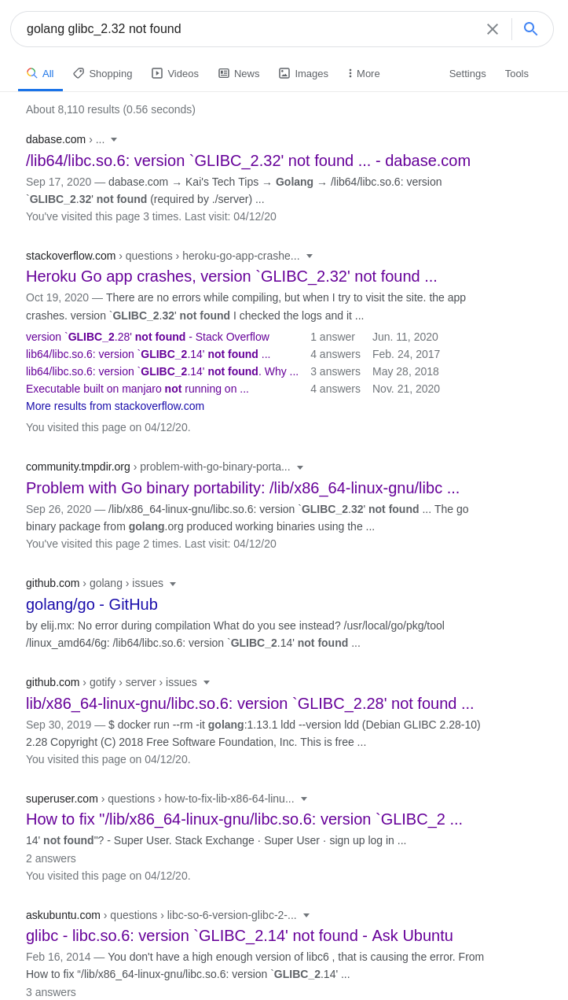

_Or, how SELinux and Docker can destroy a weekend of ambition_

## Context

My WSL 2.X setup finally kicked the bucket when Windows was acting far too slow as of recent, so I opted to reset everything and pursue a dual-boot configuration; my logic being that having dedicated systems for games/music and software development being easier to manage. On the Linux side, as the title suggests I decided to install [Fedora 33](https://getfedora.org/) which I've had great experience with in the past. Originally, I was inclined to return back to [Pop!OS](https://pop.system76.com/), but was curious to see what the state of Nvidia drivers looked like when not preconfigured. Following this [tutorial](https://itsfoss.com/install-nvidia-drivers-fedora/) allowed me to add support for my 1070 with little stress, so I was very content using Fedora going forward (and of course, bringing the Pop Shell tiling extension over to this environment).

Now with my `deployed` environment, I had to configure it for a recent project I've been working on with James: Civitas - a league application with a Golang backend. I've previously written about the application, so I'll save describing the architecture for those posts. Instead, I'll explain the interesting part of the project. In attempts to learn, we've committed to transforming the (basic, at the time) CRUD API to run on serverless computing via AWS Lambda.

## Installing CLI(s)

To install both CLIs, here is a point form which worked for me:

### AWS CLI:

[Following the instructions available on the site](https://docs.aws.amazon.com/cli/latest/userguide/install-cliv2-linux.html)

```bash
cd /tmp
curl "https://awscli.amazonaws.com/awscli-exe-linux-x86_64.zip" -o "awscliv2.zip"
unzip awscliv2.zip
sudo ./aws/install
```

We can verify the install was successful with `aws --version` which should produce something around:

```bash
raygervais ) aws --version
aws-cli/2.1.7 Python/3.7.3 Linux/5.9.12-200.fc33.x86_64 exe/x86_64.fedora.33 prompt/off
```

Now, we need to configure the CLI to use our AWS account. Whereas the CLIs by Microsoft Azure and Google Cloud Platform offer a SSO / Browser login, AWS takes a different approach and instead opts for a IAM Access Key and Secret approach. After creating the IAM account with the appropriate permissions needed (I opted for LambdaFullAccess and DynamoDBFullAccess), we can run `aws configure` and enter the data in the prompt. Once configured, we are done with the CLI.

```bash
AWS Access Key ID [****************]:
AWS Secret Access Key [****************]:
Default region name [us-east-2]:
Default output format [None]:
```

### AWS SAM CLI

If you were able to install the AWS CLI without any issues, then it's safe to assume you have Python3.X installed on your system. We can install the SAM CLI with pip: `pip3 -g install aws-sam-cli`.

We can again verify with the `sam --version` command:

```bash
raygervais ) sam --version
SAM CLI, version 1.13.2
```

## Installing Docker

Hey reader, do you want a laugh? Google "Install Docker on Fedora" vs "Install Docker on Ubuntu" (or any other distro really). To quote Josue who's been attempting to love Fedora for the past while:

> installing docker on fedora 32+ is a bit annoying

So, how do you install docker? Well you wrestle with getting `podman` working (which I want to love, trust me), and then install [`moby-engine`](https://mobyproject.org/)! Moby is the open framework without corporate branding / involvement (think VS Code vs VSCodium). Even attempting to `dnf install docker` will result in `moby-engine` being provided as the provider. Luckily, the commands still use docker as the prefix meaning there is no new semantics to memorize. Once installed, there's still some head scratching to be done. See, it's not that simple. We're not here for a easy install and run routine. After consulting the _Elders of the Internet_ (blog posts listed), I learned that I had to enable and whitelist some aspects of my system:

- [https://docs.docker.com/engine/install/fedora/](https://docs.docker.com/engine/install/fedora/)
- [https://fedoramagazine.org/docker-and-fedora-32/](https://fedoramagazine.org/docker-and-fedora-32/)
- [https://developer.fedoraproject.org/tools/docker/docker-installation.html](https://developer.fedoraproject.org/tools/docker/docker-installation.html)
- [https://poweruser.blog/how-to-install-docker-on-fedora-32-f2606c6934f1](https://poweruser.blog/how-to-install-docker-on-fedora-32-f2606c6934f1)

```bash
# Enable old cgroups
sudo grubby --update-kernel=ALL --args="systemd.unified_cgroup_hierarchy=0"

# Enable firewall permissions for Docker and it's images
sudo firewall-cmd --permanent --zone=trusted --add-interface=docker0
sudo firewall-cmd --permanent --zone=FedoraWorkstation --add-masquerade

# Grant service permissions if they weren't already
sudo systemctl enable docker.service --now

# Let all the above take affect.
sudo reboot

# Grant my user access to run Docker
sudo groupadd docker
sudo usermod -aG docker $USER
```

## Troubleshooting When Running the Local API Gateway

### fork/exec /var/task/main: permission denied

Originally, when trying to invoke my function locally using `sam local start-api` and hitting the endpoint which was configured in our `template.yaml`, I saw the following output:

```bash
rewrite ) sam local start-api --template template.yaml --debug
2020-12-03 19:09:02,014 | Telemetry endpoint configured to be https://aws-serverless-tools-telemetry.us-west-2.amazonaws.com/metrics
2020-12-03 19:09:02,152 | local start-api command is called
2020-12-03 19:09:02,155 | No Parameters detected in the template
2020-12-03 19:09:02,171 | 3 resources found in the template
2020-12-03 19:09:02,171 | Found Serverless function with name='ProfileHandler' and CodeUri='functions/profile/'
2020-12-03 19:09:02,173 | No Parameters detected in the template
2020-12-03 19:09:02,188 | 3 resources found in the template
2020-12-03 19:09:02,188 | Detected Inline Swagger definition
2020-12-03 19:09:02,188 | Lambda function integration not found in Swagger document at path='/profiles' method='x-amazon-apigateway-any-method'
2020-12-03 19:09:02,188 | Found '0' APIs in resource 'ApiGatewayApi'
2020-12-03 19:09:02,188 | Found '1' API Events in Serverless function with name 'ProfileHandler'
2020-12-03 19:09:02,188 | Removed duplicates from '1' Explicit APIs and '0' Implicit APIs to produce '1' APIs
2020-12-03 19:09:02,188 | 1 APIs found in the template
2020-12-03 19:09:02,189 | Mounting ProfileHandler at http://127.0.0.1:3000/profiles [DELETE, GET, HEAD, OPTIONS, PATCH, POST, PUT]
2020-12-03 19:09:02,189 | You can now browse to the above endpoints to invoke your functions. You do not need to restart/reload SAM CLI while working on your functions, changes will be reflected instantly/automatically. You only need to restart SAM CLI if you update your AWS SAM template
2020-12-03 19:09:02,189 | Localhost server is starting up. Multi-threading = True
2020-12-03 19:09:02  * Running on http://127.0.0.1:3000/ (Press CTRL+C to quit)
2020-12-03 19:09:08,365 | Constructed String representation of Event to invoke Lambda. Event: {"body": null, "headers": {"Accept": "text/html,application/xhtml+xml,application/xml;q=0.9,image/webp,*/*;q=0.8", "Accept-Encoding": "gzip, deflate", "Accept-Language": "en-CA,en-US;q=0.7,en;q=0.3", "Cache-Control": "max-age=0", "Connection": "keep-alive", "Host": "127.0.0.1:3000", "Upgrade-Insecure-Requests": "1", "User-Agent": "Mozilla/5.0 (X11; Fedora; Linux x86_64; rv:83.0) Gecko/20100101 Firefox/83.0", "X-Forwarded-Port": "3000", "X-Forwarded-Proto": "http"}, "httpMethod": "GET", "isBase64Encoded": false, "multiValueHeaders": {"Accept": ["text/html,application/xhtml+xml,application/xml;q=0.9,image/webp,*/*;q=0.8"], "Accept-Encoding": ["gzip, deflate"], "Accept-Language": ["en-CA,en-US;q=0.7,en;q=0.3"], "Cache-Control": ["max-age=0"], "Connection": ["keep-alive"], "Host": ["127.0.0.1:3000"], "Upgrade-Insecure-Requests": ["1"], "User-Agent": ["Mozilla/5.0 (X11; Fedora; Linux x86_64; rv:83.0) Gecko/20100101 Firefox/83.0"], "X-Forwarded-Port": ["3000"], "X-Forwarded-Proto": ["http"]}, "multiValueQueryStringParameters": null, "path": "/profiles", "pathParameters": null, "queryStringParameters": null, "requestContext": {"accountId": "123456789012", "apiId": "1234567890", "domainName": "127.0.0.1:3000", "extendedRequestId": null, "httpMethod": "GET", "identity": {"accountId": null, "apiKey": null, "caller": null, "cognitoAuthenticationProvider": null, "cognitoAuthenticationType": null, "cognitoIdentityPoolId": null, "sourceIp": "127.0.0.1", "user": null, "userAgent": "Custom User Agent String", "userArn": null}, "path": "/profiles", "protocol": "HTTP/1.1", "requestId": "9ae9d8d0-48f2-4c5c-9531-63c44505458b", "requestTime": "04/Dec/2020:00:09:02 +0000", "requestTimeEpoch": 1607040542, "resourceId": "123456", "resourcePath": "/profiles", "stage": "staging"}, "resource": "/profiles", "stageVariables": null, "version": "1.0"}
2020-12-03 19:09:08,366 | Found one Lambda function with name 'ProfileHandler'
2020-12-03 19:09:08,366 | Invoking profile (go1.x)
2020-12-03 19:09:08,366 | No environment variables found for function 'ProfileHandler'
2020-12-03 19:09:08,366 | Environment variables overrides data is standard format
2020-12-03 19:09:08,366 | Loading AWS credentials from session with profile 'None'
2020-12-03 19:09:08,374 | Resolving code path. Cwd=/home/raygervais/Developer/civitas/backend/rewrite, CodeUri=functions/profile/
2020-12-03 19:09:08,374 | Resolved absolute path to code is /home/raygervais/Developer/civitas/backend/rewrite/functions/profile
2020-12-03 19:09:08,374 | Code /home/raygervais/Developer/civitas/backend/rewrite/functions/profile is not a zip/jar file
2020-12-03 19:09:08,380 | Skip pulling image and use local one: amazon/aws-sam-cli-emulation-image-go1.x:rapid-1.13.2.

2020-12-03 19:09:08,380 | Mounting /home/raygervais/Developer/civitas/backend/rewrite/functions/profile as /var/task:ro,delegated inside runtime container
2020-12-03 19:09:08,784 | Starting a timer for 3 seconds for function 'ProfileHandler'
START RequestId: cbfb1ed4-fda5-496c-a9c7-c59e2658862a Version: $LATEST
fork/exec /var/task/profile: permission denied: PathError
null
END RequestId: cbfb1ed4-fda5-496c-a9c7-c59e2658862a
REPORT RequestId: cbfb1ed4-fda5-496c-a9c7-c59e2658862a	Init Duration: 0.12 ms	Duration: 4.25 ms	Billed Duration: 100 ms	Memory Size: 128 MB	Max Memory Used: 128 MB
START RequestId: cbfb1ed4-fda5-496c-a9c7-c59e2658862a Version: $LATEST
fork/exec /var/task/profile: permission denied: PathError
null
END RequestId: cbfb1ed4-fda5-496c-a9c7-c59e2658862a
REPORT RequestId: cbfb1ed4-fda5-496c-a9c7-c59e2658862a	Init Duration: 0.12 ms	Duration: 4.25 ms	Billed Duration: 100 ms	Memory Size: 128 MB	Max Memory Used: 128 MB
2020-12-03 19:09:09,022 | Lambda returned empty body!
2020-12-03 19:09:09,022 | Invalid lambda response received: Invalid API Gateway Response Keys: {'errorMessage', 'errorType'} in {'errorMessage': 'fork/exec /var/task/profile: permission denied', 'errorType': 'PathError'}
2020-12-03 19:09:09 127.0.0.1 - - [03/Dec/2020 19:09:09] "GET /profiles HTTP/1.1" 502 -
```

I think I tried all semi-reasonable approaches to debugging this issue:

- Googling
- Drinking
- Granting 777 permissions to every file in that folder
- Considering installing Ubuntu
- Googling how to sell soul
- [Opening a ticket with Amazon](https://github.com/aws/aws-sam-cli/issues/2448)
- Google how to pivot to the life of a lumberjack

Finally, I stumbled upon this github issue after searching for `Fedora` alone in the issue tracker, [SELinux prevents volume mount on Fedora 32](https://github.com/aws/aws-sam-cli/issues/2360). Interesting. Could this be related to my problem? Let's see. I've battled SELinux at work before, so it's habit of messing with even the most basic of systems was not a surprise to my war-torn experience. Debating between security, best practices and stubbornness, I opted to change SELinux to permissive mode for testing. It's a Linux setup that I can setup in an hour at worst, what's the worst that could happen? _KNOCKS ON BIGGEST WOOD I CAN FIND(tm)_ We can change the SELinux mode with the following commands:

```bash
# Verify that it is in enforcing mode by default
sestatus

    # SELinux status:                 enabled
    # SELinuxfs mount:                /sys/fs/selinux
    # SELinux root directory:         /etc/selinux
    # Loaded policy name:             targeted
    # Current mode:                   enabled
    # Mode from config file:          permissive
    # Policy MLS status:              enabled
    # Policy deny_unknown status:     allowed
    # Memory protection checking:     actual (secure)
    # Max kernel policy version:      33

# Change SELinux=enforcing to SELinux=permissive
sudo vim /etc/selinux/config

# Reboot for changes to be applied
sudo reboot

# Verify that we are now in permissive mode
sestatus

    # SELinux status:                 enabled
    # SELinuxfs mount:                /sys/fs/selinux
    # SELinux root directory:         /etc/selinux
    # Loaded policy name:             targeted
    # Current mode:                   permissive
    # Mode from config file:          permissive
    # Policy MLS status:              enabled
    # Policy deny_unknown status:     allowed
    # Memory protection checking:     actual (secure)
    # Max kernel policy version:      33
```

After reboot, I was no longer welcomed with the error message which had already cost me two days of debugging and development! Yay for progress. To be a kind user, I updated my AWS ticket to point to the SELinux ticket I had discovered (so that way others who would discover it while Googling the same error) with the resolution. Then, closed it.

### glibc_2.3

With my lambda functions now accessible in binary form via my development environment spun up with `sam local start-api`, I was greeted with another issue when attempting to invoke localhost:3000/profiles: `glibc_2.32 not found`. ARGGGGGG. What's more frustrating is this entire development workflow has not a single issue on Ubuntu and all my issues were byproducts of my OS and the configuration of it's packages. For the curious, here was the output.

```bash
Mounting /home/raygervais/Developer/civitas/backend/rewrite/.aws-sam/build/ProfileHandler as /var/task:ro,delegated inside runtime container
START RequestId: 5a52f3b9-944c-40d0-8ef6-c194dc5e39b3 Version: $LATEST
/var/task/profile: /lib64/libc.so.6: version `GLIBC_2.32' not found (required by /var/task/profile)
2020/12/11 17:45:57 exit status 1
time="2020-12-11T17:45:57.47" level=error msg="Init failed" InvokeID= error="Runtime exited with error: exit status 1"
time="2020-12-11T17:45:57.471" level=error msg="INIT DONE failed: Runtime.ExitError"
time="2020-12-11T17:45:57.47" level=error msg="Init failed" InvokeID= error="Runtime exited with error: exit status 1"
time="2020-12-11T17:45:57.471" level=error msg="INIT DONE failed: Runtime.ExitError"
START RequestId: 5a52f3b9-944c-40d0-8ef6-c194dc5e39b3 Version: $LATEST
/var/task/profile: /lib64/libc.so.6: version `GLIBC_2.32' not found (required by /var/task/profile)
2020/12/11 17:45:57 exit status 1
Invalid lambda response received: Lambda response must be valid json
```



In the problem solving mood having just conquered SELinux (by disabling it, mind you. I never said I was a noble knight), I thought what if I could compile the binaries myself and place them in the `.aws-sam` folder which is used to reference the binaries? This logic originated from getting James to confirm his Ubuntu software stack which was able to run everything flawlessly. Somewhere along the lines, my glibc was different and after Googling and reading horror story after horror story, I was in no mood to mess with it. I wrote this script to _automate_ the local build and replace task:

```bash
#!/bin/bash -e

# Init Sam if needed
make

cd functions

for dir in *; do
    echo "Building $dir Handler"
    cd ./$dir/
    CGO_ENABLED=0 GOOS=linux GOARCH=amd64 go build
    cp $dir "../../.aws-sam/build/${dir^}Handler/"
    rm -f $dir
    cd ..
done

cd ..

# Start Local API
sam local start-api
```

Now instead of running `sam local start-api`, I'd run `ray_build.sh` which goes about this bit of logic and then deploys the local instance. Time wise, each function compiles within a second. Am I salty that this had to be done, slightly.

## The Release of Docker 20.10

When browsing Reddit, I saw a post pointing to the latest Docker [release Notes](https://docs.docker.com/engine/release-notes/) which added support for `firewalld` and `cgroups` v2, both of which Fedora has switched to in a recent release. According to the poster, this implies that Docker should work on a brand new install without tweaks such as the ones I had described in the _troubleshooting_. That's pretty exciting, and I hope that the repos and `moby-engine` package are updated soon so I can get to testing. I doubt this corrects the glibc issue in my case though.

With that, I cannot say that I have tested the new version at the time of writing this blog post. My current version of `moby-engine` installed on the system is:

```bash
Name         : moby-engine
Version      : 19.03.13
Release      : 1.ce.git4484c46.fc33
Architecture : x86_64
Size         : 158 M
Source       : moby-engine-19.03.13-1.ce.git4484c46.fc33.src.rpm
Repository   : @System
From repo    : fedora
Summary      : The open-source application container engine
URL          : https://www.docker.com
License      : ASL 2.0
Description  : Docker is an open source project to build, ship and run any application as a
             : lightweight container.
             :
             : Docker containers are both hardware-agnostic and platform-agnostic. This means
             : they can run anywhere, from your laptop to the largest EC2 compute instance and
             : everything in between - and they don't require you to use a particular
             : language, framework or packaging system. That makes them great building blocks
             : for deploying and scaling web apps, databases, and backend services without
             : depending on a particular stack or provider.
```

## Conclusion

With the above, I am now able to build, deploy and test locally using AWS' Serverless Application Model on Fedora 33. The next step, localizing DynamoDB! Hopefully this helps anyone who is running into the `fork/exec /var/task/main: permission denied/` error.

## Resources

- [Cover Image: Photo by İsmail Enes Ayhan on Unsplash](https://unsplash.com/photos/lVZjvw-u9V8)
- [Amazon Web Services CLI](https://aws.amazon.com/cli/)
- [Amazon Web Services Serverless Application Model](https://aws.amazon.com/serverless/sam/)
- [AWS SAM CLI](https://docs.aws.amazon.com/serverless-application-model/latest/developerguide/serverless-sam-cli-install.html)
- [How we migrated our startup to serverless](https://read.acloud.guru/our-serverless-journey-part-2-908d76d03716)
- [Awesome Serverless](https://github.com/anaibol/awesome-serverless)
