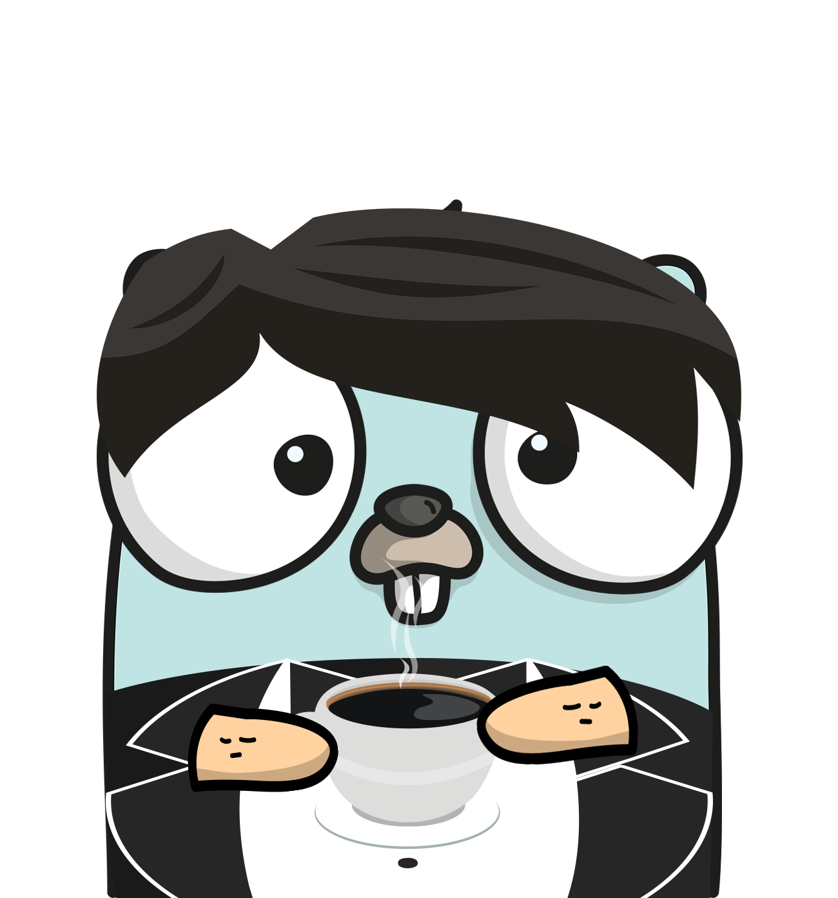

_A quick CLI notetaking application written in Go. Logo TBD_

I've wanted to write a Go-based application for a while now; the problem was always how to approach it without following the suspected purpose of said language: networking. See I've for a while been wanting to develop tooling which doesn't have to rely on API calls to provide value. A local note-jotting application made the most sense since it also fills a need of mine: a cli-centric workflow which is fast and flexible.

I've tested and evaluated many note taking applications, ranging from Simplenotes, Standard Notes, Google Keep, Google Drive, Evernote (way back in the day), and even local Markdown (similar to this Hugo blog in layout) in attempts to maximize the value of taking and recalling notes of various topics. Standard Notes has been utterly fantastic so far, but I found for quicker "rapid thought" notes such as updates to a JIRA task (at work), or random thoughts that I want to store and recall on a whim, I needed something with less interaction requirements. Essentially, I had the obscured need of a database application which had no requirement to use a mouse. At a point, I even considered the easiest (although not the most intuitive) solution being to simply take notes in a MySQL DB using it's SHELL.

## MVP vs 1.0 Release

We've all heard the term MVP (Minimum Viable Product) in the world of Software Development, and it's a mindset which I subscribe to for all my projects without second thought -although, this is perhaps due to the Agile/Scrum methodologies being indoctrinated into my very being. The idea of iteration and constant feedback I find invaluable, both in and outside the information technology field. That is why I wanted to release the very basic of MVPs first, allowing me to attempt to pawn it off to friends to use for feedback.

### MVP Features

_Let's just pull straight from [the Github Releases page](https://github.com/raygervais/GopherNotes/releases/tag/0-1-0)_

- Note CRUD: You can create, edit, delete or search notes!
- Fully CLI based: no TUI included in MVP.
- Fetch support: now we can retrieve all the thoughts

### Commands Supported

```bash
# Create
gn create --note "This will be an awesome note"

# Fetch
gn fetch

1) 2021-01-04: This will be an awesome note

# Edit & Fetch
gn edit --id 1

gn fetch

1) 2021-01-04: This will be an legendary note


# Delete without user prompt
gn delete --id 1 --y

```

### 1.0 Planned Features

_Subject to change, your warranty has been voided, etc._

- Tags support: So that way we can group notes into "folders" ala tags such as `todo` for example.
- Filtering and sorting support: So that when I do `gn fetch`, I'm not returned everything in the system. Sometimes you just want to `gn fetch --limit 10 --sort desc` and see where your headspace has been at.
- Windows support: For our dear friends on Windows 10 who wish to live the CLI life as well.
- Full-note editing: So that we can add/remove tags in edit mode
- Linux packaging: I really want to learn how to package for Fedora, Ubuntu, and Arch-based systems so that it's easily accessible to more people.

## Architecture and Rewrites

_Or, how to fail successfully in a MVP_



I believe that I've rewritten this application (in it's various states of brokenness) at least three times in 2020. According to my commits, I started with a purely functional approach with minimal understanding of the concept. It was rather ugly and the main file looked like this mess:

```go
// main.go
package main

import (
	"flag"
	"fmt"
	"os"
	"strings"
	"time"
)

const (
	layoutISO = "2006-01-02"
)

var NOTES = []string{"2020-02-14:\"Hello, World!\"", "Hello Ray!"}

func CreateTimeStampFormat() string {
	return time.Now().Format(layoutISO)
}

// fx a,a -> b
func CreateNoteEntryText(timestamp, note string) string {
	return timestamp + ":\"" + note + "\""
}

func CreateSearchResults(notes []string, text string) []string {
	results := make([]string, 0)

	for _, note := range notes {
		if strings.Contains(note, text) {
			results = append(results, note)
		}
	}

	return results
}

// Application Entry Point
func main() {
	// Subcommand Parents
	newCommand := flag.NewFlagSet("new", flag.ExitOnError)
	searchCommand := flag.NewFlagSet("search", flag.ExitOnError)

	// New Note Command Flag Pointers
	newTextPtr := newCommand.String("text", "", "Note text to be saved")

	// Search Note Command Flag Pointers
	searchTextPtr := searchCommand.String("text", "", "Search notes with the following text")

	// Verify we are providing a subcomamnd
	// os.Arg[0] is the main command
	// os.Arg[1] is the subcommand
	if len(os.Args) < 2 {
		fmt.Println("Please provide a command, new or search")
		os.Exit(1)
	}

	// Switch on subcommand parsing
	switch os.Args[1] {
	case "new":
		newCommand.Parse(os.Args[2:])
	case "search":
		searchCommand.Parse(os.Args[2:])
	default:
		fmt.Println("Subargument Parsing failed!")
		flag.PrintDefaults()
		os.Exit(1)
	}

	// Validate Required Fields
	if newCommand.Parsed() {
		// Required Flags
		if *newTextPtr == "" {
			newCommand.PrintDefaults()
			os.Exit(1)
		}

		// Call New Note Controller
		NOTES = append(NOTES,
			CreateNoteEntryText(
				CreateTimeStampFormat(), *newTextPtr))
		fmt.Println(strings.Join(NOTES, "\n"))
	}

	if searchCommand.Parsed() {
		// Required Flags
		if *searchTextPtr == "" {
			searchCommand.PrintDefaults()
			os.Exit(1)
		}

		// Call Search Note Controller
		note := CreateSearchResults(NOTES, *searchTextPtr)
		if len(note) == 0 {
			fmt.Println("Failed to find:", *searchTextPtr)
			os.Exit(1)
		}

		fmt.Println("Search Results:")
		fmt.Println(strings.Join(note, "\n"))
	}
}
```

The above file was written in February, with the next rewrite occurring by the end of the month because the database module was rather ugly as well. So, that along with main (which I'll save you from having to read since it didn't change much) were refactored to appear as the following. Notice the lack of packages and all instead residing with `main`.

```go
// db.go
package main

import (
	"database/sql"
	"fmt"
	_ "github.com/mattn/go-sqlite3"
)

/*
 *
 * Database Helpers
 *
 */

func PrepareCommandStatement(database *sql.DB, command string) (*sql.Stmt, error) {
	return database.Prepare(command)
}

func QueryCommandStatement(database *sql.DB, command string) (*sql.Rows, error) {
	return database.Query(command)
}

func ExecuteStatementHandler(statement *sql.Stmt, arguments ...interface{}) sql.Result {
	result, err := statement.Exec(arguments...)
	ErrorHandler(err)
	return result
}

func DatabaseStatementErrorHandler(value *sql.Stmt, err error) *sql.Stmt {
	ErrorHandler(err)
	return value
}

func DatabaseRowsErrorHandler(rows *sql.Rows, err error) *sql.Rows {
	ErrorHandler(err)

	return rows
}

func ErrorHandler(err error) {
	if err != nil {
		fmt.Println(err)
		panic(err)
	}
}

/*
 *
 * Database Actions
 *
 */
// CreateDatabase - Creates Database Connection to Given SQLite DB Path
func CreateDatabaseConnection(path string) *sql.DB {
	db, err := sql.Open("sqlite3", path)
	ErrorHandler(err)

	return db
}

// InitializeNotesTable - Creates Notes Table with Provided Database Connection
func InitializeNotesTable(database *sql.DB) sql.Result {
	return ExecuteStatementHandler(
		DatabaseStatementErrorHandler(
			PrepareCommandStatement(database, "CREATE TABLE IF NOT EXISTS notes (id INTEGER PRIMARY KEY, entry TEXT, date TEXT)")))

}

// InsertIntoNotesTable - Inserts New Note Into Table
func InsertIntoNotesTable(database *sql.DB, note Note) sql.Result {
	return ExecuteStatementHandler(
		DatabaseStatementErrorHandler(
			PrepareCommandStatement(database, "INSERT INTO notes (entry, date) VALUES (?, ?)")), note.entry, note.date)
}

// RetrieveNotes - Gets All Notes from Database
func RetrieveNotes(database *sql.DB) *sql.Rows {
	return DatabaseRowsErrorHandler(
		QueryCommandStatement(
			database, "Select id, entry, date from notes"))
}
```

All things considered, I really did like the concept of the minimalistic / functional approach I attempted in the `db.go` file. It has a certain `aesthetic` to it. Around here, I was even writing unit tests for the various parts of the `main` package. Writing these unit tests is what revealed that my overall codebase -though interesting to look at,- was not easily testable or easy to extend. Plus, I hated having such a sloppy `main.go` entry point.

I have a certain naivety to how I approach ideas and projects without prior experience, and that is to assume you know best and form the other requirements as you go. It was here that I realized I truly had never written a proper CLI application which had real use-cases. I simply didn't know good/best practices to write such a thing. Instead of using common sense, I had gone with the challenge of writing the program in a specific manner instead of writing it properly. Interestingly, this flaw is incredibly evident when I go about writing synth-y music where I try to approach it from the most "complex, yet listenable" structure I can.

Understanding that I need to properly learn how to write a Golang application, I discovered [Steve Hook's Reminders CLI tutorial](https://www.youtube.com/watch?v=-9CbX2MncZg) when I returned to the application much later in the year. His explanation of custom FlagSets and writing the CLI interface to map to a hashmap ala `cli.commands = map[string]func() func(string) error` was ingenious. It made the sub-command processing cakewalk and immediately revealed how much I could learn from his not-yet-completed-tutorial-series. Even with the tutorial repo already complete, I still await his videos in hopes I can soak up more understanding and nuance from his explanations. With his suggestions and my own newly-formed understanding of standard golang project structures, I was able to devise the following module structure:

- /
  - cli
    - `gophernotes`: Main entry point to the application.
  - pkg
    - `app`: Contains the main application instance logic.
    - `cli`: Contains all command and sub-command logic.
    - `conf`: Helper class to create, validate and interpret a user's configuration of the application.
    - `db`: Contains all DB transaction logic.
    - `edit`: Helper class to validate and interact with the user's text editor of choice.
  - test

My `main.go` now appears as this!

```go
// cmd/gophernotes/main.go
package main

import (
	"fmt"
	"os"

	"github.com/raygervais/gophernotes/pkg/app"
)

func main() {
	code, message := app.Application()
	fmt.Println(message)
	os.Exit(code)
}
```

Now, I see from here how this appears to be a ploy, and I've simply moved ALL the main logic to the `app` sub-package. Let me affirm that with Steve's tutorial guidance and my own experience (having at least 5+ months of time in-between to allow lessons to fester and better heads to prevail), I did not do that. Here is what the app.go file looks like at the time of writing, and will be the last go file I hope I put here for the sake of you the reader.

```go
// pkg/app.go
package app

import (
	"flag"
	"fmt"
	"os"

	"github.com/raygervais/gophernotes/pkg/cli"
	"github.com/raygervais/gophernotes/pkg/conf"
	"github.com/raygervais/gophernotes/pkg/db"
)

var (
	helpFlag = flag.Bool("help", false, "Display application usage material")
)

func Application() (int, string) {
	// Determine where to store the database for the user based on operating system
	configPath, err := conf.DetermineStorageLocation()
	if err != nil {
		return 1, fmt.Sprintf("Could not determine configuration location: %s", err)
	}

	if err := conf.InitializeConfigurationLocation(configPath); err != nil {
		return 1, fmt.Sprintf("Could not initialize configuration location: %s", err)
	}

	// Create and connect to database
	db := db.CreateDatabaseConnection(configPath +
		conf.ApplicationName + conf.DatabaseLocation)
	if err := db.InitializeNotesTable(); err != nil {
		return 1, fmt.Sprintf("Could not initialize database and tables: %s", err)
	}

	cli := cli.InitCLI(db)

	flag.Parse()

	if *helpFlag || len(os.Args) == 1 {
		cli.Help()
		return 0, "Exiting"
	}

	if err := cli.Handler(); err != nil {
		return 1, fmt.Sprintf("Command error: %v\n", err)
	}

	return 0, "Exiting"
}
```

Let me point out some of the advancements in this file compared to the `main.go` of the very first version:

- All critical errors pass through the application to the main thread, meaning that when it comes to error handling we can allow our application's middleware to handle and bail as needed. Here is an example of the direction which the error and it's message travel if we were to fail the creation of a note: db > cli > app > main. This bottom-up architecture I am a fan of because it doesn't hide errors (at the moment) behind various services and instead exposes them so that we can utilize handlers to react appropriately in the main runtime. Currently we simply exit out and spit out the error.
- The application now utilizes the default storage location (`~/.config` on Linux) for the database and configuration files.
- We set the help flag right and parse before doing any other sub-command logic. This allows us to handle such a flag without going through the hashmap logic.
- `cli.Handler` does all the sub-command lifting, and is the direct interface to the use-cases of this application. I'm not sure if this would be considered a hexagonal/clean architecture, but the removal of responsibly from the main application instance makes complete sense.

## What's After 1.0?

### The GUI and the CLI

An item that I'm taking into consideration as I develop this application is the idea that it can be extended and used in various ways. Though right now we process directly from the command line, I'm trying to write in such a way that we can use adapters to handle supplying data to the correct logics and not have to be confined _only_ to the command line. With this, in the future perhaps there could be a GTK / QT application UI for those who'd prefer it; the same logic underneath powering both the CLI and GUI variants.

### The TUI

Terminal UIs are interesting because they work so well in the /r/unixp0rn posts, and I do find some apps with their TUIs to be incredibly more accessible and useful vs full blown GUI instances. Yet, I'm hesitant to add such a feature to GopherNotes because this also has the risk of reducing the speed of interaction with the user. To those saying, "How can it be that fast if you have to always type out the commands?", I say: Have you ever heard of command suggestions in BASH/ZSH/FISH? Furthermore, for many the idea of typing still is far quicker than moving a cursor over to various windows and elements and clicking -just to have your dominate hand return to the keyboard to enter the actual context.

### Automated Packaging

Currently, I leverage a `Makefile` to create the OS-specific binary files manually. Along with a better testing platform, I want to automate the release and publishing of the application on Github when commits are merged into master.

## Resources

- [Cover Image: Photo by Wesson Wang on Unsplash](https://unsplash.com/photos/y0_vFxOHayg)
- [Gopernotes Repo](https://www.github.com/raygervais/gophernotes)
- [Steve Hook's Reminders CLI tutorial](https://www.youtube.com/watch?v=-9CbX2MncZg)
