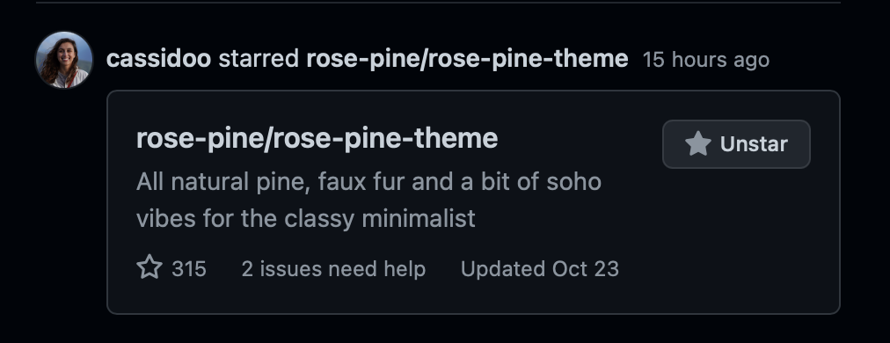

_TIL: Vim uses 8-bit or 24-bit color schemes_

For a few of my Hacktober contributions, I wanted to add a few small tweaks which would help integrate the [Helix text editor](http://helix-editor.com) better into my desktop's colorscheme. See, for the past while I've been testing out different terminal-based text editors to see if any could sway me away from my beloved Neovim -an experiment which I may add, broke all my muscle memory. See, Helix is based on [Kakoune](http://kakoune.org), which is another modal editor using a vastly different [keymap](https://delapouite.github.io/kakoune-explain/keys.html). In some ways, the new keymap seems much more intuitive with each function being achieved by only a single key (or key combo) vs a few. For example, to delete a character in VI you could use `x` or `d`, but in Kakoune/Helix, deletion of the selected characters is achieved only by `d`.

## Nord

Regardless of which is better (I still love both, so I won't imply a new generation of flamewar), one thing which Helix had lacked was a proper `Nord` colorscheme which every other application on my desktop had adopted. So, I thought why not port the offical [Nord](http://nordtheme.com) theme to it? Colorthemes are defined in `toml` files located at `~/.config/helix/themes/`, and appear to be key-value pairs. Easy enough. I fearlessly moved forward bringing the `Polar Night`, `Snow Storm`, `Frost`, and `Aurora` palettes.

```toml
# Author : RayGervais<raygervais@hotmail.ca>

# "ui.linenr.selected" = { fg = "#d8dee9" }
# "ui.text.focus" = { fg = "#e5ded6", modifiers= ["bold"] }
# "ui.menu.selected" = { fg = "#e5ded6", bg = "#313f4e" }

# "info" = "#b48ead"
# "hint" = "#a3be8c"

# Polar Night
# nord0 - background color
"ui.background" = { bg = "#2e3440" }
"ui.statusline.inactive" = { fg = "#d8dEE9", bg = "#2e3440" }


# nord1 - statW Òus bars, panels, modals, autocompletion
"ui.statusline" = { fg = "#88c0d0", bg = "#3b4252" }
"ui.popup" = { bg = "#232d38" }
"ui.window" = { bg = "#232d38" }
"ui.help" = { bg = "#232d38", fg = "#e5ded6" }

# nord2 - active line, highlighting
"ui.selection" = { bg = "#434c5e" }
"ui.cursor.match" = { bg = "434c5e" }

# nord3 - comments
"comment" = "#4c566a"
"ui.linenr" = { fg = "#4c566a" }

# Snow Storm
# nord4 - cursor, variables, constants, attributes, fields
"ui.cursor.primary" = { fg = "#d8dee9", modifiers = ["reversed"] }
"attribute" = "#d8dee9"
"variable"  = "#d8dee9"
"constant"  = "#d8dee9"
"variable.builtin" = "#d8dee9"
"constant.builtin" = "#d8dee9"
"namespace" = "#d8dee9"

# nord5 - suble UI text

# nord6 - base text, punctuation
"ui.text" = { fg = "#eceff4" }
"punctuation" = "#eceff4"

# Frost
# nord7 - classes, types, primiatives
"type" = "#8fbcbb"
"type.builtin" = { fg = "#8fbcbb"}
"label" = "#8fbcbb"

# nord8 - declaration, methods, routines
"constructor" = "#88c0d0"
"function" = "#88c0d0"
"function.macro" = { fg = "#88c0d0" }
"function.builtin" = { fg = "#88c0d0" }

# nord9 - operator, tags, units, punctuations
"punctuation.delimiter" = "#81a1c1"
"operator" = { fg = "#81a1c1" }
"property" = "#81a1c1"

# nord10 - keywords, special
"keyword" = { fg = "#5e81ac" }
"keyword.directive" = "#5e81ac"
"variable.parameter" = "#5e81ac"

# Aurora
# nord11 - error
"error" = "#bf616a"

# nord12 - annotations, decorators
"special" = "#d08770"
"module" = "#d08770"

# nord13 - warnings, escape characters, regex
"warning" = "#ebcb8b"
"escape" = { fg = "#ebcb8b" }

# nord14 - strings
"string" = "#a3be8c"

# nord15 - integer, floating point
"number" = "#b48ead"
```

With the following examples, I submitted my pull request and was pleased of the addition I had added to the editor.

### Go Example


### Rust Example


### Toml Example


### Yaml Example


## Base16 Dark

After, I wanted to add two more themes which again helped extend the color choices available. The first addition of Nord I was very proud of, and had already learned how to better structure the `toml` after another contributor refactored my theme into a more reusable format. So, I thought why not contribute the [Base16 Dark](http://chriskempson.com/projects/base16/) theme! What is Base16? the official website defines it as,

> An architecture for building themes based on carefully chosen syntax highlighting using a base of sixteen colours. Base16 provides a set of guidelines detailing how to style syntax and how to code a builder for compiling base16 schemes and templates.

As we can see from the final code I submitted below, Helix supports the `[palette]` object which allows a developer to define colorscheme variables after, and reference them in the above color mappings. Much cleaner, far less repetitive. Coincidentally, I had forgotten the original intent of ths PR (which inspired the second colorscheme addition): [Create an alternative default theme for 16 color terminals](https://github.com/helix-editor/helix/issues/791). Turns out, I had misunderstood the ask itself (and promised I would revisit and implement the ask), but had provided another theme (Base16 Dark) which the project agreed to merge in. Win-win!

```toml
# Author: RayGervais<raygervais@hotmail.ca>

"ui.background" = { bg = "base00" }
"ui.menu" = "base01"
"ui.menu.selected" = { fg = "base04", bg = "base01" }
"ui.linenr" = {fg = "base01" }
"ui.popup" = { bg = "base01" }
"ui.window" = { bg = "base01" }
"ui.liner.selected" = "base02"
"ui.selection" = "base02"
"comment" = "base03"
"ui.statusline" = {fg = "base04", bg = "base01" }
"ui.help" = { fg = "base04", bg = "base01" }
"ui.cursor" = { fg = "base05", modifiers = ["reversed"] }
"ui.text" = { fg = "base05" }
"operator" = "base05"
"ui.text.focus" = { fg = "base05" }
"variable" = "base08"
"number" = "base09"
"constant" = "base09"
"attributes" = "base09" 
"type" = "base0A"
"ui.cursor.match" = { fg = "base0A", modifiers = ["underlined"] }
"strings"  = "base0B"
"property" = "base0B"
"escape" = "base0C"
"function" = "base0D"
"constructor" = "base0D"
"special" = "base0D"
"keyword" = "base0E"
"label" = "base0E"
"namespace" = "base0E"
"ui.popup" = { bg = "base01" }
"ui.window" = { bg = "base00" }
"ui.help" = { bg = "base01", fg = "base06" }

"info" = "base03"
"hint" = "base03"
"debug" = "base03"
"diagnostic" = "base03"
"error" = "base0E"

[palette]
base00 = "#181818" # Default Background
base01 = "#282828" # Lighter Background (Used for status bars, line number and folding marks)
base02 = "#383838" # Selection Background
base03 = "#585858" # Comments, Invisibles, Line Highlighting
base04 = "#b8b8b8" # Dark Foreground (Used for status bars)
base05 = "#d8d8d8" # Default Foreground, Caret, Delimiters, Operators
base06 = "#e8e8e8" # Light Foreground (Not often used)
base07 = "#f8f8f8" # Light Background (Not often used)
base08 = "#ab4642" # Variables, XML Tags, Markup Link Text, Markup Lists, Diff Deleted
base09 = "#dc9656" # Integers, Boolean, Constants, XML Attributes, Markup Link Url
base0A = "#f7ca88" # Classes, Markup Bold, Search Text Background
base0B = "#a1b56c" # Strings, Inherited Class, Markup Code, Diff Inserted
base0C = "#86c1b9" # Support, Regular Expressions, Escape Characters, Markup Quotes
base0D = "#7cafc2" # Functions, Methods, Attribute IDs, Headings
base0E = "#ba8baf" # Keywords, Storage, Selector, Markup Italic, Diff Changed
base0F = "#a16946" # Deprecated, Opening/Closing Embedded Language Tags, e.g. <?php ?>
```

### Go Example


### Rust Example


### Missing Elements

Like any lazy developer, sometimes we move so fast it's ensured that something is missed; either it's a critical step in documentation, a line of code which breaks the program when omitted, or a feature toggle which implements the item that you painstakingly developed over the past two days. Luckily, in this case it wasn't the latter. Instead, I was mentioned in a comment when another contributor was refactoring my nord theme that both they and I had missed the `info`, `warning`, `diagnostic` UI elements found within Helix. [Another PR](https://github.com/helix-editor/helix/pull/890) later resolved this issue, which now includes the diagnostic and info elements covered in Base16 Dark colors.


## Rose Pine



Originally, I was going to end my color contributions to the editor at Base16, but while writing this post I opened Github and has noticed [Cassido](https://github.com/cassidoo)'s starring of the `Rose Pine` theme. Naturally, the description implying that of a classy minimalist drew me in, and I started to see what [Rose Pine](https://github.com/rose-pine/rose-pine-theme) had to offer. It's kind of weird, how things can relate to each other that only make sense to you at the given moment. See, I was discussing with a friend how I wish the [Dracula](https://draculatheme.com) color theme had a softer variant, for those who didn't flock to contrast hues of it's base offering. In Rose Pine, I found a purplish theme which with a little modification, could help answer some of my ask. So, I thought why not [add this theme](https://github.com/helix-editor/helix/pull/897) as well, so that way at the end of the day, three more color themes are available to the Helix Editor!

```yaml
# Author: RayGervais<raygervais@hotmail.ca>

 "ui.background" = { bg = "base" }
 "ui.menu" = "surface"
 "ui.menu.selected" = { fg = "iris", bg = "surface" }
 "ui.linenr" = {fg = "subtle" }
 "ui.popup" = { bg = "overlay" }
 "ui.window" = { bg = "overlay" }
 "ui.liner.selected" = "highlightOverlay"
 "ui.selection" = "highlight"
 "comment" = "subtle"
 "ui.statusline" = {fg = "foam", bg = "surface" }
 "ui.help" = { fg = "foam", bg = "surface" }
 "ui.cursor" = { fg = "rose", modifiers = ["reversed"] }
 "ui.text" = { fg = "text" }
 "operator" = "rose"
 "ui.text.focus" = { fg = "base05" }
 "variable" = "text"
 "number" = "iris"
 "constant" = "gold"
 "attributes" = "gold" 
 "type" = "foam"
 "ui.cursor.match" = { fg = "gold", modifiers = ["underlined"] }
 "string"  = "gold"
 "property" = "foam"
 "escape" = "subtle"
 "function" = "rose"
 "function.builtin" = "rose"
 "function.method"  = "foam"
 "constructor" = "gold"
 "special" = "gold"
 "keyword" = "pine"
 "label" = "iris"
 "namespace" = "pine"
 "ui.popup" = { bg = "overlay" }
 "ui.window" = { bg = "base" }
 "ui.help" = { bg = "overlay", fg = "foam" }
 "text" = "text"

 "info" = "gold"
 "hint" = "gold"
 "debug" = "rose"
 "diagnostic" = "rose"
 "error" = "love"

 [palette]
 base     = "#191724" 
 surface  = "#1f1d2e" 
 overlay  = "#26233a"
 inactive = "#555169"
 subtle   = "#6e6a86"
 text     = "#e0def4"
 love     = "#eb6f92"
 gold     = "#f6c177"
 rose     = "#ebbcba"
 pine     = "#31748f"
 foam     = "#9ccfd8"
 iris     = "#c4a7e7"
 highlight = "#2a2837"
 highlightInactive = "#211f2d"
 highlightOverlay = "#3a384a"
```

### Rust Example


### Go Example


## Resources

- [Cover Image: Photo by kevin laminto on Unsplash](https://unsplash.com/photos/7PqRZK6rbaE)
- [Jeff Kreeftmeijer: Consistent terminal colors with 16-ANSI-color Vim themes](https://jeffkreeftmeijer.com/vim-16-color/)
- [Nord Colors Scheme](http://nordtheme.com)
- [Base16 Color Scheme](http://chriskempson.com/projects/base16/)
- [Rose Pine Color Scheme](https://rosepinetheme.com/themes.html)