*Or, how to waste hours a week making the same codebase you looked at in the last hour appear different*

I decided to write this after managing what would be considered a hell of a move: bringing down an entire cluster along with two months of the team's work with a single command. After all the humour, sometimes it's best to learn, document and move on from the experience itself so you and the rest are better prepared for next time. So, I thought I'd extrapolate on the my favorite code editor themes, and monospace fonts which grace my screen through the good and bad commits! After all, this very [topic of editor aesthetic made it's way into a very length post of mine](https://raygervais.dev/articles/2021/5/re_my_most_notable_failures/) as it's own section! Plus, this will help sum up October's focus on editor themes for my Hacktoberfest contributions and my own setup looks.

## Fonts

When it comes to fonts, I've always searched for characteristics that I could never describe correctly. Overtime, I learned some of the basic concepts from others about x-heights, serifs vs san-serifs and also italicized characters and how they create some of the distinct nuances of fonts. For example, there's interesting relationships for many with [Victor Mono](https://rubjo.github.io/victor-mono/) due it's thin, extreme x-height characters or [Operator Mono](https://www.typography.com/blog/introducing-operator)'s cursive stylings paired with the $200 price. In other cases, there's some who detest the fonts such as the famous [Fira Code](https://github.com/tonsky/FiraCode) who introduced ligature characters, and others who love those programming ligatures so much that they'll take well loved monospace fonts like [Source Code Pro](https://github.com/adobe-fonts/source-code-pro) and add the missing piece -ligatures in this case, to the mix as [Hasklig](https://github.com/i-tu/Hasklig). In years, all the messing with various fonts, I finally came across a fantastic article, [*Coding with Character*](https://realdougwilson.com/writing/coding-with-character) which started to explain some of the interests I had in niche, specific font characterizations; font's with uniqueness. Personality.

### IBM Plex Mono

- [Main Site: IBM Plex Mono](https://www.ibm.com/plex/)
- [Github](https://github.com/IBM/plex)

### Recursive Mono Duotone

- [Main Site: Recursive Mono](https://www.recursive.design)

### Hack

- [Main Site: Hack](http://sourcefoundry.org/hack/)
- [Github](https://github.com/source-foundry/Hack)

### Jetbrains Mono

- [Main Site: Jetbrains Mono](https://jetbrains.com/mono)
- [Github](https://github.com/JetBrains/JetBrainsMono)

## Themes

### Nord

- [Main Site: Nord](http://nordtheme.com)
- [Github](https://github.com/arcticicestudio/nord)

#### IBM Plex Mono

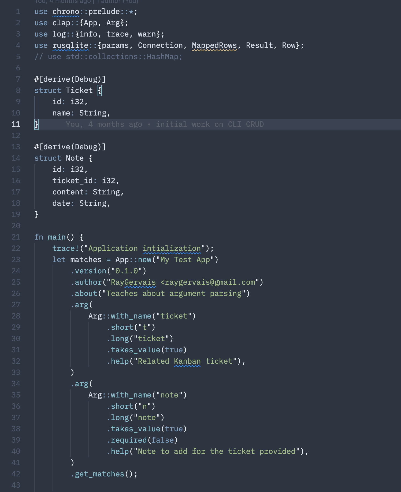 

#### Recursive Mono Duotone

#### Hack

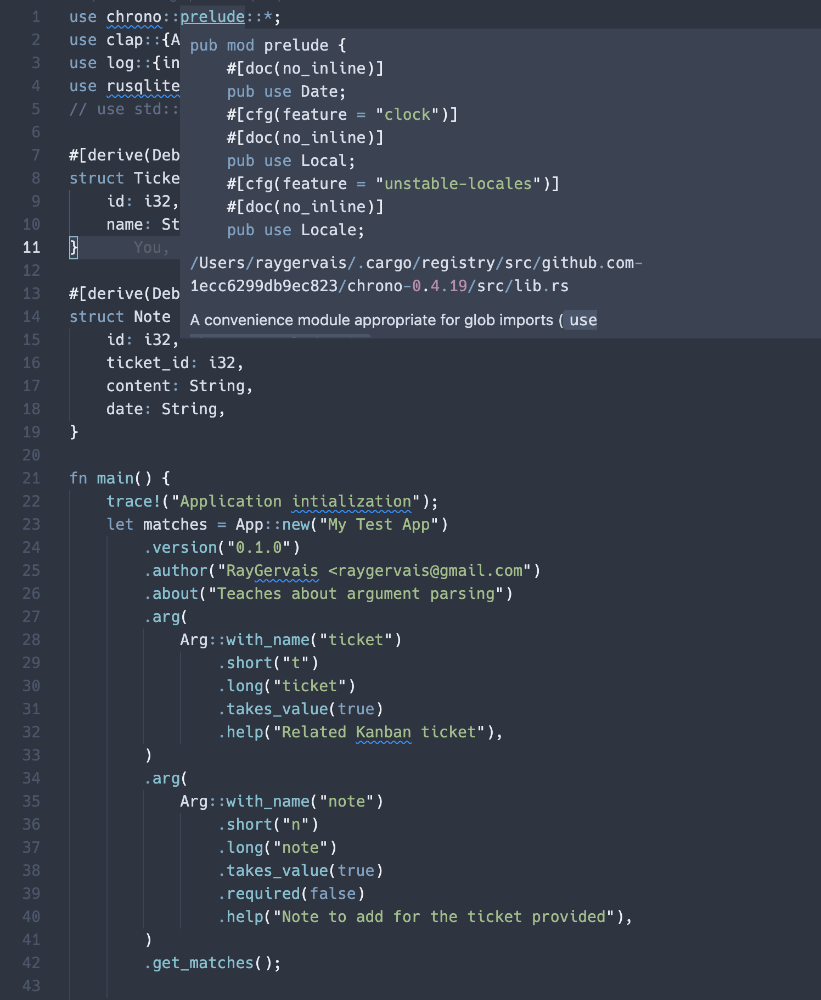

#### Jetbrains Mono

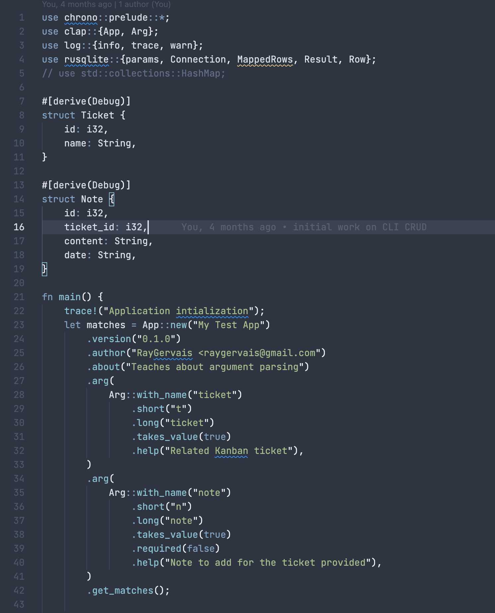

### InBedBy7

- [Github](https://github.com/sdras/inbedby7pm)
- [Windows Marketplace for VS Code](https://marketplace.visualstudio.com/items?itemName=sdras.inbedby7pm)

#### IBM Plex Mono

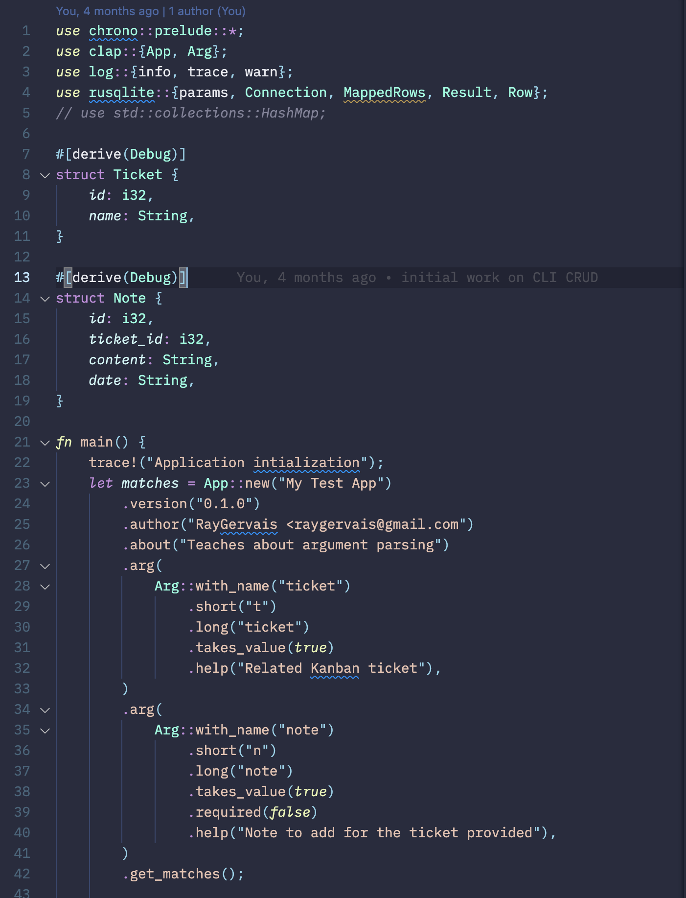 

#### Recursive Mono Duotone

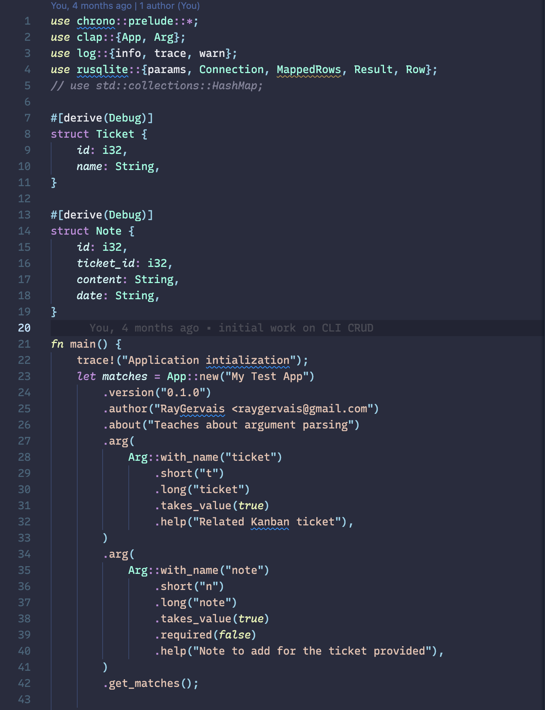 

#### Hack

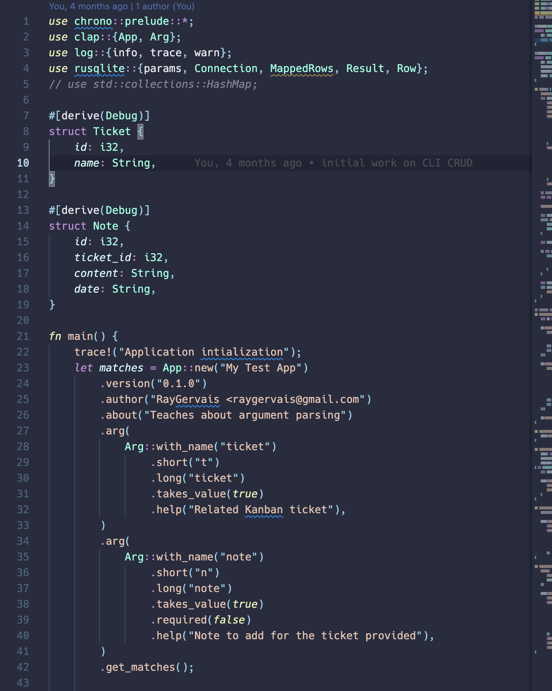 

#### Jetbrains Mono

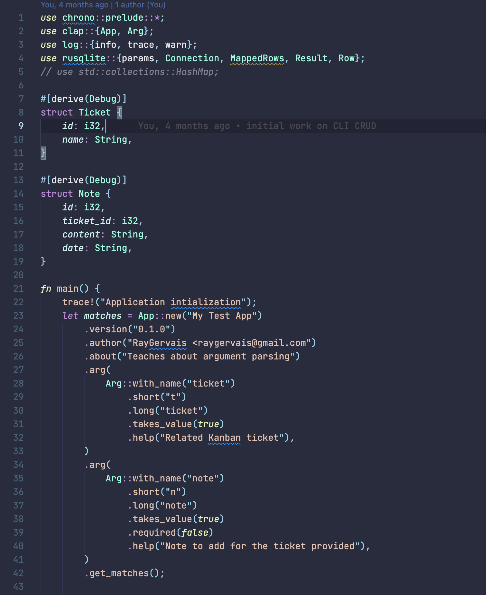 |

### Gruvbox Material

- [Github](https://github.com/sainnhe/gruvbox-material-vscode)
- [Windows Martketplace for VS Code](https://github.com/sainnhe/gruvbox-material-vscode)

#### IBM Plex Mono

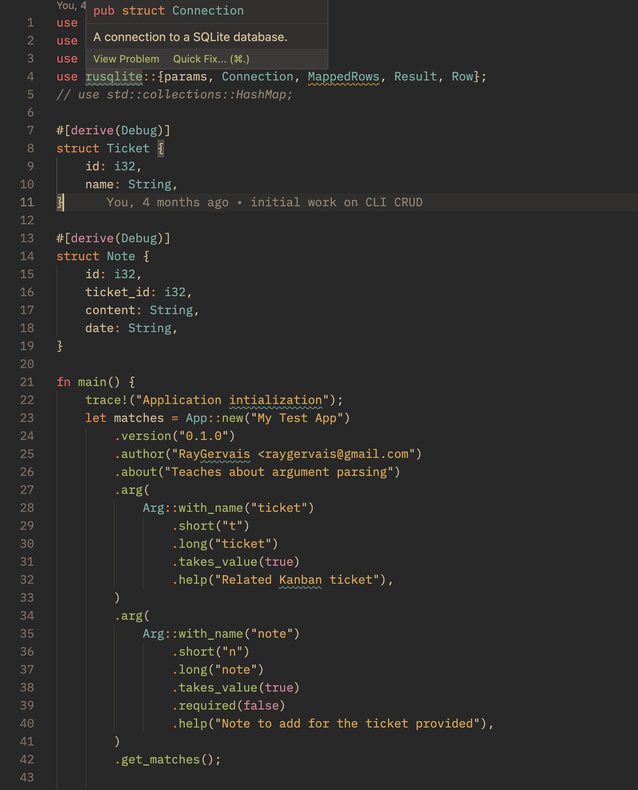

#### Recursive Mono Duotone

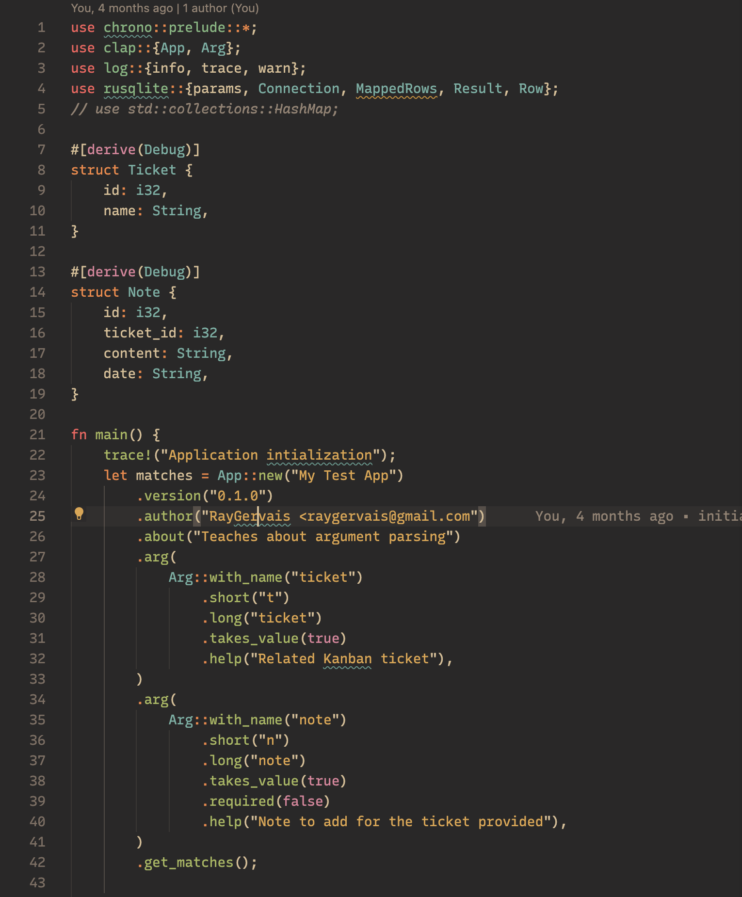

#### Hack

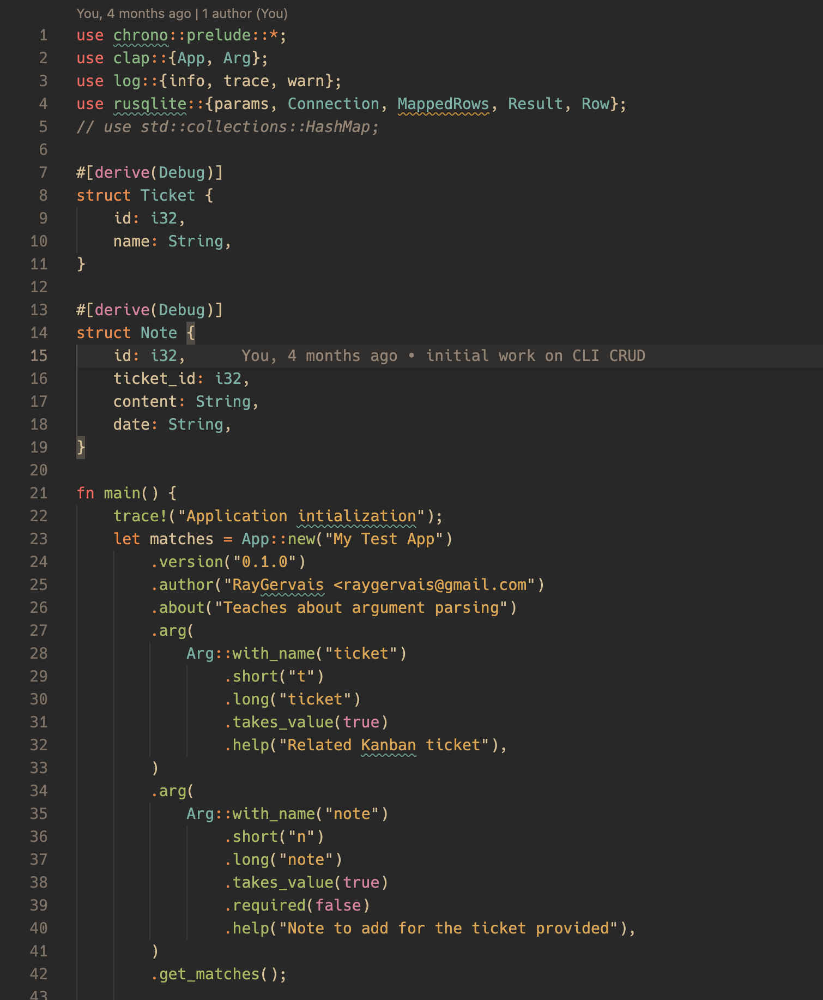

#### Jetbrains Mono

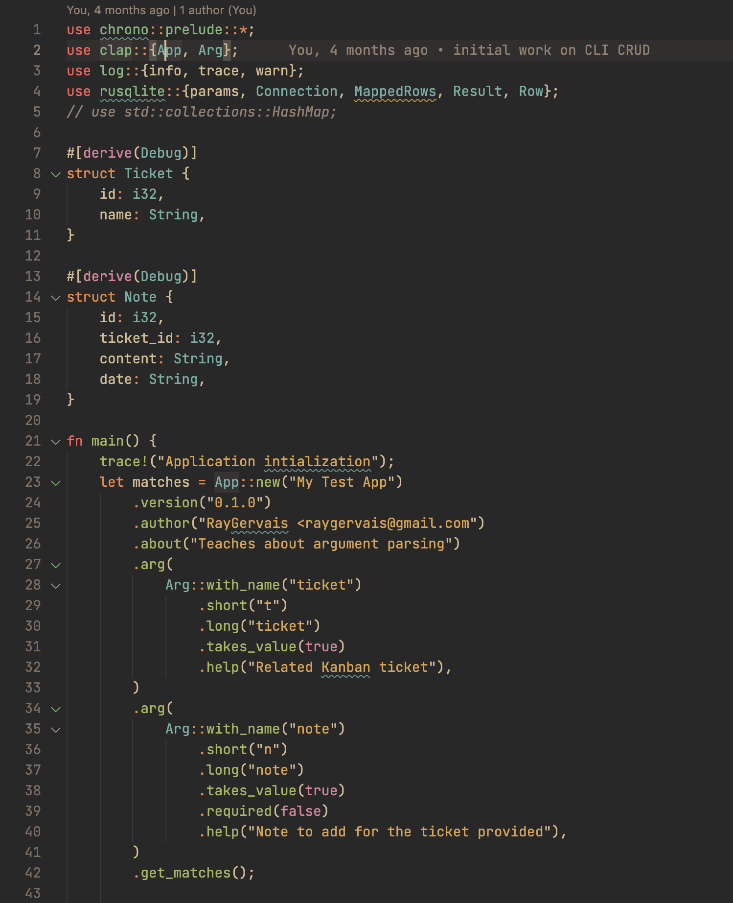

## Resources

- [Cover Image: Photo by Nick Fewings on Unsplash](https://unsplash.com/photos/C2J92BO3qTw)