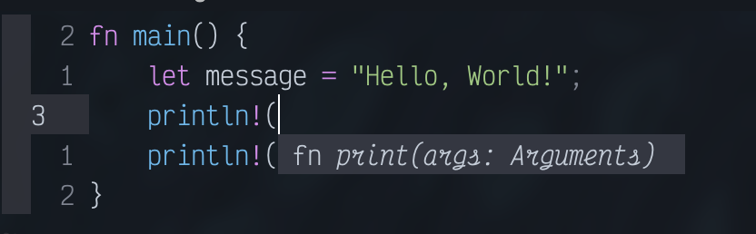
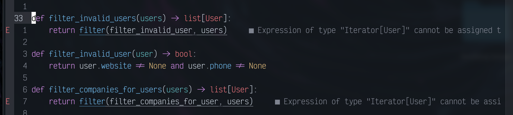
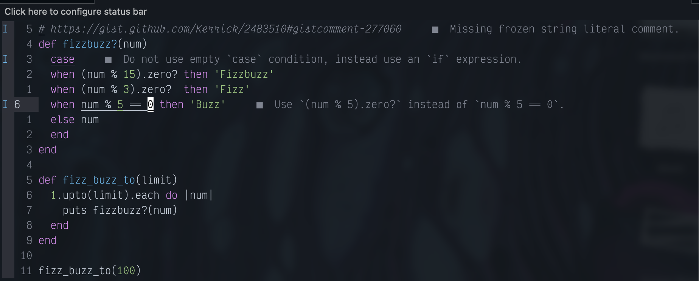

_Or how to alienate yourself in the world of VS Code_

In my previous exploits around the terminal-based workflow -which, you can read about more [here](https://raygervais.dev/articles/2020/09/embracing-terminal-centric-workflows/), I had setup a workflow with `tmux`, `alacritty`, and `vim` to great success for my average day tasks. Over the past while, I've wondered how I could further improve the setup and remove the context-switch which often occured when working with other tooling such as VS Code. Plus, I may have been watching far too many of videos of the awesome (ThePrimeagen)[https://www.youtube.com/channel/UC8ENHE5xdFSwx71u3fDH5Xw] and become star-struck at the idea of digging deeper into the VIM world. So, I thought why not? 

Part of this could also derive from my lack of appreciation for the IDE-like features which come bundled by VS Code by default, resulting in the features becoming more of a bloat vs convience in my usecase. My everyday tasks often involve text editing more than writing brand new modules, so the natural step in the experiment made sense. Let's go all in on the vim world and try the long-rumored LSP integration which would restore the key feature which I leverage the most in VSCode!Let's get started! 

## Installing Neovim 0.5

For this experiment, I had opted to use my Macbook(s) so that I could replicate the configuration and workflow for both personal and work environments. Surely if this is successful I will update my [dotfiles repo](https://github.com/raygervais/dotfiles) and update my Fedora 33 setup accordingly! I thought that it would be a slew of build commands to get Neovim 0.5 (_nightly_), but luckily Homebrew rose to the challenge and provided a far easier command to set it all up: `brew install --HEAD neovim`.

From there, it was a matter of setting an `alias` for `nvim` to be `vim` purely so I can _lazily_ save a keystroke and not break muscle memory. In the FISH shell, this can be done with `alias vim nvim`. No scripts breaking on me tonight! 

## Setting up LSP

To leverage the LSP(s), we must first install an appropriate LSP per language we want to interact with. For this test, I opted for Golang, Rust, Python and Ruby; all languages I interact with frequently in a given week. Let's explore what's needed to get these setup on MacOS 11, Big Sur. 

### Golang

### Rust

For some reason, I kept getting errors when using the `rustup` toolbox (which is recommended by Rust itself) and ended up installing the `rust_analyzer` with `brew install rust_analyzer` which, appeared to be a wrapper around the original `rustup` setup. Once installed and configured in my `init.vim` file, I was greated with this awesome completion and suggestion dialog when working in a rust project! 

#### Completion Suggestions


#### Function Arguments



### Python

From a little research, Python appears to have quite a few Language Server implementations, I opted for for Microsoft's `pyright`, which can be installed with `npm install -g pyright`. Again, once configured in my `init.vim` -which, I really should split into multiple files, opening any Python file would trigger the language server to initialize, and within a second or two I'd have full access to the same power found inside VS Code.

#### Errors



### Ruby

`Solargraph` has been the defacto Ruby-based LSP for the past while, and after much endorsement from my team at work, I opted to install and leverage it with `gem install --user-install solargraph`. From there, opening any ruby file provides me with the all-judging eyes of those who know how to write _good_ Ruby code, and I'm reminded at-least a dozen times how much better I can improve my understanding of the language.

#### Analysis



### Final LSP Configuration

```lua
  local nvim_lsp = require('lspconfig')

  local on_attach = function(client, bufnr)
    require('completion').on_attach()

    local function buf_set_keymap(...) vim.api.nvim_buf_set_keymap(bufnr, ...) end
    local function buf_set_option(...) vim.api.nvim_buf_set_option(bufnr, ...) end

    buf_set_option('omnifunc', 'v:lua.vim.lsp.omnifunc')

    -- Mappings
    local opts = { noremap=true, silent=true }
    buf_set_keymap('n', 'gD', '<Cmd>lua vim.lsp.buf.declaration()<CR>', opts)
    buf_set_keymap('n', 'gd', '<Cmd>lua vim.lsp.buf.definition()<CR>', opts)
    buf_set_keymap('n', 'K', '<Cmd>lua vim.lsp.buf.hover()<CR>', opts)
    buf_set_keymap('n', 'gi', '<cmd>lua vim.lsp.buf.implementation()<CR>', opts)
    buf_set_keymap('n', '<C-k>', '<cmd>lua vim.lsp.buf.signature_help()<CR>', opts)
    buf_set_keymap('n', '<space>wa', '<cmd>lua vim.lsp.buf.add_workspace_folder()<CR>', opts)
    buf_set_keymap('n', '<space>wr', '<cmd>lua vim.lsp.buf.remove_workspace_folder()<CR>', opts)
    buf_set_keymap('n', '<space>wl', '<cmd>lua print(vim.inspect(vim.lsp.buf.list_workspace_folders()))<CR>', opts)
    buf_set_keymap('n', '<space>D', '<cmd>lua vim.lsp.buf.type_definition()<CR>', opts)
    buf_set_keymap('n', '<space>rn', '<cmd>lua vim.lsp.buf.rename()<CR>', opts)
    buf_set_keymap('n', 'gr', '<cmd>lua vim.lsp.buf.references()<CR>', opts)
    buf_set_keymap('n', '<space>e', '<cmd>lua vim.lsp.diagnostic.show_line_diagnostics()<CR>', opts)
    buf_set_keymap('n', '[d', '<cmd>lua vim.lsp.diagnostic.goto_prev()<CR>', opts)
    buf_set_keymap('n', ']d', '<cmd>lua vim.lsp.diagnostic.goto_next()<CR>', opts)
    buf_set_keymap('n', '<space>q', '<cmd>lua vim.lsp.diagnostic.set_loclist()<CR>', opts)

    -- Set some keybinds conditional on server capabilities
    if client.resolved_capabilities.document_formatting then
        buf_set_keymap("n", "<space>f", "<cmd>lua vim.lsp.buf.formatting()<CR>", opts)
    elseif client.resolved_capabilities.document_range_formatting then
        buf_set_keymap("n", "<space>f", "<cmd>lua vim.lsp.buf.formatting()<CR>", opts)
    end
  end

  local servers = {'pyright', 'gopls', 'rust_analyzer', 'solargraph'}
  for _, lsp in ipairs(servers) do
    nvim_lsp[lsp].setup {
      on_attach = on_attach,
    }
  end

  require'nvim-treesitter.configs'.setup {
    highlight = {
        enable = true
    },
  }
```

## Inital Experience

### Bonus Feature, Telescope

Upon digging deeper into the Dotfiles of VIM warriors, I noticed a common plugin which was deemed vital enough (spoiler, I completely agree with how amazing it is upon using it) to have dedicated YouTube video's such as []() to explain it. The neovim plugin [`Telescope`](https://github.com/nvim-telescope/telescope.nvim) is described as,

>telescope.nvim is a highly extendable fuzzy finder over lists. Built on the latest awesome features from neovim core. Telescope is centered around modularity, allowing for easy customization.

In a single phrase, I'd say that the plugin is blazingly fast and intuitive once setup for your preferred shortcuts. Essentially, it's a glorified wrapper around common BASH commands (to overstate it from a high level), and powered via grep. 

### Keybindings

With the migration to NeoVim, a few keybindings that I identified as essential are the following. Based on online popularity, I opted to make <SPACE> the leader key for when the keybinding required one.

| Action                | Keybinding         | Notes                                                       |
| --------              | ------------       | -------                                                     |
| Jump to definition    | `gd`               | - Ensure your cursor is over the exact field                |
| Format markdown table | `<leader><Bslash>` | - You need to visually select the table you want to format. |
| Fuzzy file search     | `<leader>ff`       | - Will only search for files in current PWD                 |
| Open VIM buffers      | `<leader>fb`       |                                                             |

## Resources

- [Medium: Neovim LSP, DAP and Fuzzy Finder](https://medium.com/swlh/neovim-lsp-dap-and-fuzzy-finder-60337ef08060)
- [nvim-lspconfig](https://github.com/neovim/nvim-lspconfig#Keybindings-and-completion)
    - [rust_analyzer](https://github.com/neovim/nvim-lspconfig#Keybindings-and-completion)
    - [gopls](https://github.com/golang/tools/tree/master/gopls)
    - [solargraph](https://solargraph.org)
