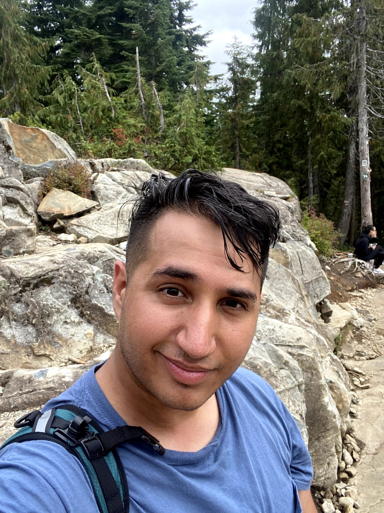
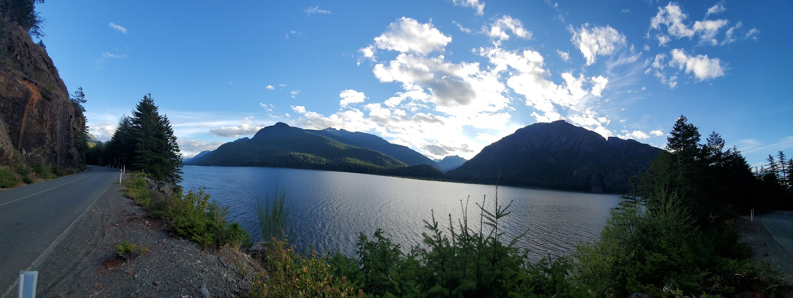
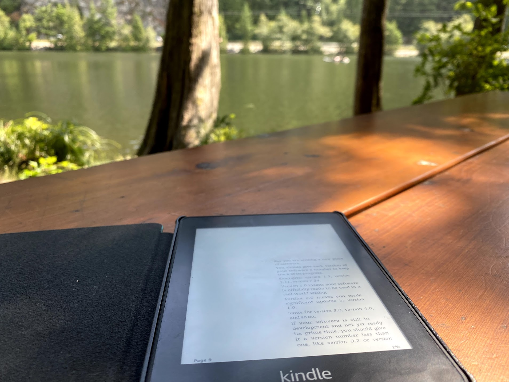

# A Busy August

Previously, I had written about some lessons I wanted to share from my time at Scotiabank as I made my exit, but left out a few other items which made my August (and by extension, summer) packed. That’s what this separate read is for good reader, join me as I recount some interesting experiments, experiences and projects!

## Vancouver


Earlier in the year, the roommates and I managed to snag round trip tickets to Vancouver for a phenomenal price. At ~$350, who could say no? This was going to be the first time I had been to Vancouver, so there was lots of opportunities to experience the west coast hiking-culture and also traverse into rainforests and mountain tops!

### Living out the Minimalist Bag

If you were to look at my passport, you’d deduce that I haven’t travelled much. You’d be rather correct, but even so, a common flaw which I so easily exploit during both big and small travels is the art of over-packing. Oh? it’s just an overnight? Might as well bring the Kindle, Wall Charger, Apple Watch charger, etc. I’m staying for a day or few? Might as well bring the entire closet!

This vacation enabled me to test an exercise that I’ve long wanted to try: packing and living like a minimalist. [Matt’s video](https://www.youtube.com/watch?v=BtNAX36j1c4&t=270s) goes over the pack itself best, but my main goals were the following:

- Everything just fit in either the hiking bag, or the travel bag.
- If it’s not of any significance during the travel, do not bring it.
- No laptop is to be brought.
  - In hindsight, this was great for unplugging, but terrible for the creative process if the mood hit me to work on anything musical.

So, I packed the following items and ensured laundry facilities were available at every other Airbnb location:

- Sunglasses
- Two pairs of pants
- One pair of work-out shorts
- Hiking shoes
- Everyday shoes
- Seven blue t-shirts
- Seven hiking socks
- Seven normal socks 
- Nine undergarments
- iPhone and its Charging cable
- Kindle and its Charging cable
- Wireless headphones and it’s Charging Cable

So what’s so special about the above? Well, it allowed me to test having such a [minimal and consistent set of clothing](https://www.youtube.com/watch?v=DSHsIOIhjJY). More so, I want to try for the first week or more of September living by the same clothing limitations, similar to how Natalie did [here](https://www.youtube.com/watch?v=kgMtMUDL51M). I believe, if successful, I have downsizing to do. Before venturing out, I also spent some time attempting to understand what I truly needed on my Linux setup, and then reinstalling without the crud. This I plan on describing in more detail in another blog post, which I’ll link to here.

### Learning to Unwind and Disconnect

You know what’s really weird? I’ve been drafting this exact section from Joplin on my iPhone (another blog post relating to this coming up) while riding a faerie to Vancouver. Every fourth person who’s not on their phone has a laptop open to something of their interest or work. Here I am, for the first time without work to concern myself with or a laptop to stare at during my travels. 

In some ways, being forced to disconnect from my systems, projects etc is healing I imagine for the mind. And before we get into technicalities regarding my phone, good reader, know that I have not had signal for the majority of the areas I’ve been in. No insomniac inducing YouTube night binges happening this trip! But, without a laptop or something more tangible than the phone, I found myself longing for a medium to test out musical or software ideas on. 

See, I realized that the moment I had a musical idea, I had to attempt to capture it on my phone via voice notes or using a far simpler app instead vs the software that I’ve used daily for the past two years. This isn’t too bad because the ideas came and went, and I jotted down what I could with hopes that I’d revisit them when back in Toronto; it was the developer side of me who really pinned for a physical keyboard and terminal.

The world of technology is always moving, and I did try to stay in touch with the various news outlets and friends who followed the happenings around Linux, Open-source etc, but this created the blocker in a feedback loop which had me always wanting to write, test out, or even just experiment with items that I couldn’t reach at the time. Do you understand how mentally twisted it is to think about the ‘Nord’ color scheme (I blame the ocean and moody blues which made up the atmosphere) and how you’ll implement it further into your desktop setup since ‘Dracula’ and you had a fight? Well, I thought a lot about my Linux setup and the programs on it, but could never action. It was a forced disconnect, a reset perhaps, which in computing terms typically results in a healthier system.

### Completing The Hardest Trails Known to Vancouver



Prior to the pandemic, I could admit that I rarely `hiked` aside from relatively modest trails in the Dysart and Surrounding areas. I prefer to compare them to nature walks since no one could break a sweat on them. In contrast, on the first day after landing, the guys and I went straight to attempt the hardest trail in all of Vancouver, the [Grouse Grind](https://www.grousemountain.com/grousegrind). This beast was a 2.9km monster with 853m of elevation which took an average of two hours to complete. We completed it in 2 hours, 10 minutes. The next day, we braved the [Sea to Summit](https://www.seatoskygondola.com/trails/sea-to-summit-trail/) trail which was arguably even harder than the first. This item captured 918m of elevation (downward slopes aren't calculated in this total, so lots of `backtracking`) in 7.5km of rough, unforgiving trail. By the first quarter of this trail, every part of my legs were feeling the burn from the first hike, yet we continued on and got to see some truly amazing views along the way (while avoiding cougars in the process). The last major hike before the promised rest day was to visit and complete the much hyped [Whistler](https://www.vancouvertrails.com/regions/whistler/) trail,  [High Note Trail](https://www.vancouvertrails.com/trails/high-note-trail/). This one-way trail, 9.5km beast clocked us at 4 hours and took the long way around Whistler Mountain itself. The views truly did inspire when you're so high up, and made all the toil much more worth it. 


As we were completing Whistler, the nerdy side of me kept relating these hikes to my learning experience in the world of technology. Some days are damn hard, and similar to a mountain, as you get over one hill you find another much taller and harder which you'll also climb. I'll go more into detail with this in a further section below, but the analogy itself was reassuring given the various `mountains` that I've scaled to achieve my career so far, and that I could have bragging rights about completing the Grouse Grind. I wonder if my technological Grouse Grind is upcoming. I know there were dozens of much smaller trails we had done during the trip, but I cannot help but admire Bryan's commitment to completing the hardest ones, no matter the cost. For the curious, here is a list of the trails we had done between August 19th and the 31st: 



| Trail                | Distance | Elevation |
| -------------------- | -------- | --------- |
| Grouse Grind         | 2.9km    | 853m      |
| Sea to Summit        | 7.5km    | 918m      |
| Whistler: High Note  | 9.5km    | 500m      |
| Kinsole Trestle      | 3.4km    | 103m      |
| Sombrio Beach        | 1.4km    | 22m       |
| Englishman Waterfall | 1.3km    | 52m       |
| Catherdal Grove      | 1.6km    | 48m       |
| Hole in the Wall     | 1.3km    | 27m       |
| Canso Crash Site     | 5.1km    | 134m      |
| Rainforest Figure 8  | 3.2km    | 53m       |
| Lighthouse Loop      | 2.9km    | 68m       |
| CR Millennium Trail  | 6.4km    | 224m      |
| Elks Fall Loop       | 1.4km    | 45m       |
| Upana Caves          | 0.6km    | 23m       |
| Logging Roads        | 6.0km    | 120m      |
| Myra Falls           | 1.3km    | 33m       |
| Lil Huson Caves      | 0.8km    | 28m       |


### Reading on the Road



According to my roommate, we travelled for at least 3,000km during the trip. That's a lot of time spent in a vehicle and an eternity if you don't have cell reception. Sure, I had a few Netflix movies downloaded, but I also had another hobby which I employed between movies and napping: reading. Prior to the trip, I made sure my Kindle had every ebook in my collection synced to it so that the possibilities of what I could read were endless. My typical pattern is to alternate (or sometimes read in parallel) between a non-fiction (more serious) book and a fiction tale. Here's what I ended up reading during the trip in order!

#### [_The Ride of a Lifetime: Lessons Learned from 15 Years as CEO of the Walt Disney Company_](https://www.goodreads.com/book/show/44525305-the-ride-of-a-lifetime)

>In 2005, Robert Iger became CEO of The Walt Disney Company during a difficult time. Morale had deteriorated, competition was more intense, and technology was changing faster than at any time in the company's history. "I knew there was nothing to be gained from arguing over the past," Iger writes. "The only thing that mattered was the future, and I believed I had a clear idea of the direction Disney needed to go." It came down to three clear ideas: 1) Create the highest quality content Disney could produce. 2) Embrace and adopt technology instead of fighting it. And 3) Think bigger--think global--and turn Disney into a stronger brand in international markets.

>Twelve years later, Disney is the largest, most respected media company in the world counting Pixar, Marvel, Lucasfilm and 21st Century Fox among its properties. Its value is nearly five times what it was when Iger took over, and Iger is recognized as one of the most innovative and successful CEOs of our time.

>Now, he's sharing the lessons he's learned while running Disney and leading its 200,000 employees--taking big risks in the face of historic disruption; learning to inspire the people who work for you; leading with fairness and communicating principles clearly. This book is about the relentless curiosity that has driven Iger for forty-five years, since the day he started as a studio supervisor at ABC. It's also about thoughtfulness and respect, and a decency-over-dollars approach that has become the bedrock of every project and partnership Iger pursues, from a deep friendship with Steve Jobs in his final years to an abiding love of the evolving Star Wars myth.
"Over the past fourteen years, I think I've learned so much about what real leadership is," Iger writes. "But I couldn't have articulated all of this until I lived it. You can't fake it--and that's one of the key lessons in this book."

#### [_Version Zero_](https://www.goodreads.com/book/show/43276213-version-zero)

>Max, a data whiz at the Facebook-like social media company Wren, has gotten a firsthand glimpse of the dark side of big tech. When he starts asking questions about what his company is doing with the data they collect, he finds himself fired…and then blackballed across all of Silicon Valley.

>With time on his hands and inside knowledge about the biggest tech companies, Max and his longtime friend—and sometime crush—Akiko, decide to get even by…essentially, rebooting the internet. After all, in order to fix things, sometimes you have to break them. But when Max and Akiko join forces with a reclusive tech baron, they learn that breaking things can have unintended—and disastrous—consequences. And those consequences will ripple across the world, effecting every level of society in ways no one could have imagined. 

#### [_Hyperbole and a Half: Unforntunate Situations, Flawed Coping Mechanisms, Mayhem, and Other Things That Happened_]()

>Hilarious stories about life's mishaps from the creator of the immensely popular blog 'Hyperbole and a Half'. Fully illustrated with over 50% new material.

>Hyperbole and A Half is a blog and webcomic written by a 20-something American girl called Allie Brosh. She tells fantastically funny, wise stories about the mishaps of her everyday life, with titles like 'Why Dogs Don't Understand Basic Concepts Like Moving' and 'The God of Cake'.. 

#### [_The Alchemist_]()

>Paulo Coelho's enchanting novel has inspired a devoted following around the world. This story, dazzling in its powerful simplicity and soul-stirring wisdom, is about an Andalusian shepherd boy named Santiago, who travels from his homeland in Spain to the Egyptian desert in search of a treasure buried near the Pyramids.

>Along the way he meets a Romany woman, a man who calls himself a king, and an alchemist, all of whom point Santiago in the right direction for his quest. No one knows what the treasure is, or whether Santiago will be able to surmount the obstacles in his path; but what starts out as a journey to find worldly goods turns into a discovery of treasure within.
>Lush, evocative, and deeply humane, the story of Santiago is an eternal testament to the transforming power of our dreams and the importance of listening to our hearts.

## Releasing IDFKU with Tori V


[Spotify: IDFKU](https://open.spotify.com/track/3DDtg4iQbtC2fUiM0DElyP?si=9cfe2d90818c408b)

In March, I had released under the alias of Losing Signals the track ‘Anything Like You’ which featured the fantastical vocal stylings of Tori V over my lyrics. It was an absolute joy to collaborate with her (despite the pandemic forcing a 100% online work style), and we immediately asked: _let's do another collab?_

Well, months later, it appears we did exactly that. This collab we considered to be more unique and special since it was approached with a different mindset: take the learnings of working together, doing everything in house etc, and work on a song which would serve as not one artist featuring another, but a track which both artists truly owned. IDFKU comes from the frustrations of Tori and her experiences, which resulted in the mood that I can confidently say came across exactly as we wanted.

From an audio engineer’s perspective, there is a day and night difference between our first release and the second. So much has been learned on both sides when it came to recording high quality vocals in makeshift rooms, arranging and understanding how the various instrumentation and melodies support the mood and vocal, and further refining the Losing Signals sound which created the final mix; The mid-lows aren’t muddy, the separation between the various stereo elements are clear and defined. I couldn’t be prouder. If ‘Anything Like You’ was the alpha, and ‘IDFKU’ is the beta, I can’t wait to see where we go with the release of future projects that are in the works.

## Figuring out My Interests and Goals for The Next Career


For the past while, I've been digging into `Go` and `Rust` for systems programming more and more. The first real experiment was `Gophernotes`, which was rewritten in Rust ala `Coppernotes` purely to compare the two and also to update the workflow. I've always enjoyed writing in typed languages, even for the most basic of applications, which could have been written in shorter time had I chosen a higher-level language such as `Python` or `JavaScript`. To me, the trade-off in project development speed during the initial on-boarding process is worth it, even with the additional technicality included! Maybe this derives from the first languages that I was exposed to, `C` and `C++` at Seneca; or maybe it's because I enjoy the pain and challenge of it. Maybe I'm biased, but I want to say it's the latter. Still, the code can look rather beautiful in my opinion: 

```rust
use chrono::prelude::*;
use clap::{App, Arg};
use log::{info, trace, warn};
use rusqlite::{params, Connection, MappedRows, Result, Row};

#[derive(Debug)]
struct Ticket {
    id: i32,
    name: String,
}

#[derive(Debug)]
struct Note {
    id: i32,
    ticket_id: i32,
    content: String,
    date: String,
}

fn main() {
    trace!("Application intialization");
    let matches = App::new("My Test App")
        .version("0.1.0")
        .author("RayGervais <raygervais@gmail.com")
        .about("Teaches about argument parsing")
        .arg(
            Arg::with_name("ticket")
                .short("t")
                .long("ticket")
                .takes_value(true)
                .help("Related Kanban ticket"),
        )
        .arg(
            Arg::with_name("note")
                .short("n")
                .long("note")
                .takes_value(true)
                .required(false)
                .help("Note to add for the ticket provided"),
        )
        .get_matches();

    // Initialize Application
    let mut conn = Connection::open("tickets.db").expect("db connection failed");

    initialize_db(&mut conn).expect("failed to initialize the applications database");

    let ticket = matches.value_of("ticket").unwrap();
    match create_new_ticket(&mut conn, ticket.to_string()) {
        Ok(_) => info!("created new entry for {}", ticket),
        Err(e) => warn!("error creating {}: {}", ticket, e),
    }

    let ticket = get_ticket(&mut conn, ticket.to_string()).expect("Failed to deserialize row");

    if let Some(content) = matches.value_of("note") {
        match create_new_note(&mut conn, ticket.id, content) {
            Ok(_) => info!("Successfully created new note"),
            Err(_) => warn!("Failed to create new note"),
        }
    }
}

// Create the database schemas
fn initialize_db(conn: &mut rusqlite::Connection) -> Result<()> {
    let tx = conn.transaction().unwrap();

    tx.execute(
        "CREATE TABLE IF NOT EXISTS TICKETS (
            id          INTEGER PRIMARY KEY AUTOINCREMENT,
            name        TEXT NOT NULL UNIQUE
        )",
        [],
    )?;

    tx.execute(
        "CREATE TABLE IF NOT EXISTS NOTES (
            id          INTEGER PRIMARY KEY AUTOINCREMENT,
            ticket_id   INTEGER NOT NULL,
            content     TEXT NOT NULL UNIQUE,
            date        TEXT NOT NULL,
            FOREIGN KEY (ticket_id) REFERENCES TICKETS(row_id)

        )",
        [],
    )?;

    tx.commit()
}

fn create_new_ticket(conn: &mut rusqlite::Connection, ticket: String) -> Result<usize> {
    conn.execute("INSERT INTO TICKETS (name) VALUES (?1)", [ticket])
}

fn create_new_note(
    conn: &mut rusqlite::Connection,
    ticket_id: i32,
    content: &str,
) -> Result<usize> {
    let date = Utc::now();

    conn.execute(
        "INSERT INTO NOTES (ticket_id, date, content) VALUES (?1, ?2, ?3)",
        params![ticket_id, date.timestamp(), content],
    )
}

fn get_ticket(conn: &mut rusqlite::Connection, ticket: String) -> Result<Ticket, rusqlite::Error> {
    info!("Querying database for ticket {}", ticket);

    conn.prepare("SELECT id, name FROM TICKETS WHERE name = ?;")
        .expect("Failed to create query string")
        .query_row([ticket], |row| {
            Ok(Ticket {
                id: row.get(0).unwrap(),
                name: row.get(1).unwrap(),
            })
        })
}

fn get_notes_from_ticket(conn: &mut rusqlite::Connection, ticket_id: i32) -> Vec<Note> {
    info!(
        "Querying database for notes relating to ticket_id {}",
        ticket_id
    );

    conn.prepare("SELECT id, ticket_id, date, content FROM NOTES WHERE ticket_id = ?;")
        .expect("Failed to create query string")
        .query_map([ticket_id], |row: &Row| {
            Ok(Note {
                id: row.get(0).unwrap(),
                ticket_id: row.get(1).unwrap(),
                date: row.get(2).unwrap(),
                content: row.get(3).unwrap(),
            })
        })
        .expect("Failed to deserialize rows")
        .flatten()
        .collect()
}
```

Going forward in my career, I'm aiming to work more with such languages professionally on various mediums, from lower levels such as CLI systems tooling to much greater heights (hahah! get it?) cloud native platforms. In order to extrapolate the later, of course `Dr Docker` (thanks Cindy for the nickname) has to keep up with his practice and equally integrate focus into leveraging container technology throughout the process! Though, I do believe that the nickname will be handed down to Josue as I focus on learning more of `containerd`, `podman` and the various ecosystems around it more so than Docker itself. Never hurts to diversify, right? I hear Kuberenetes is a rather hot topic right now, and appears to be a hell of a mountain.

