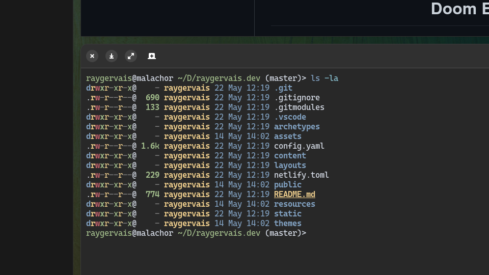
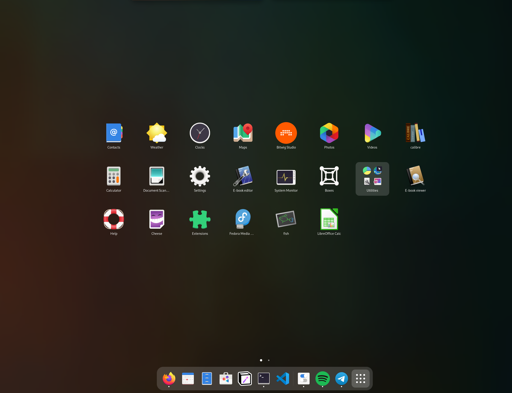
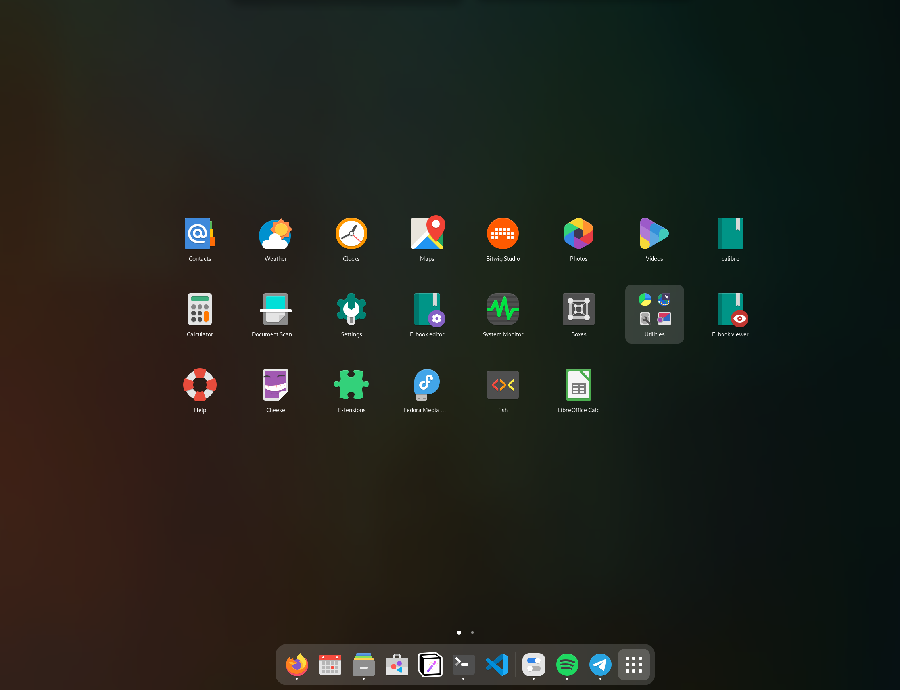
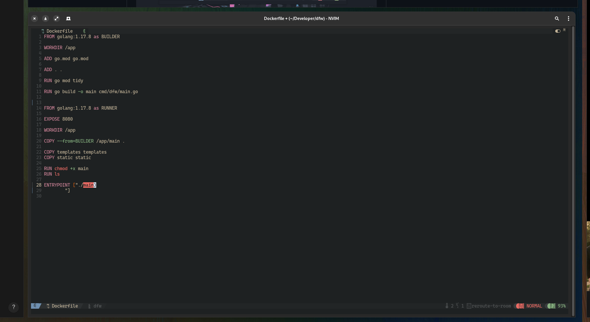
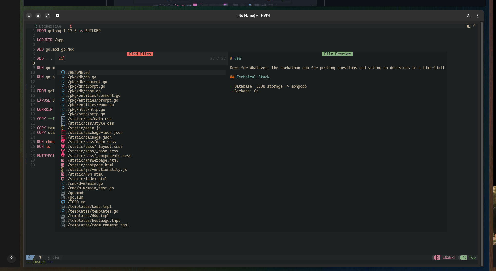
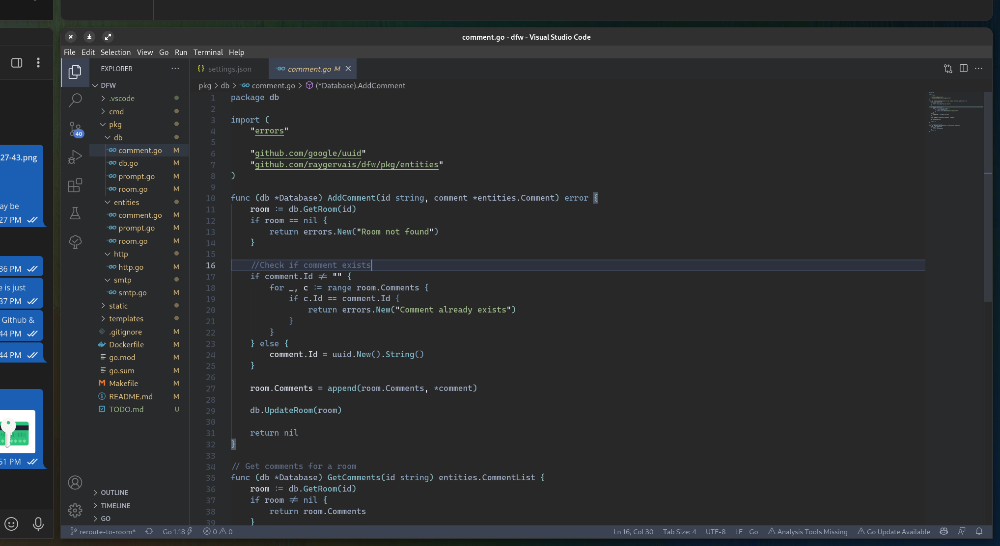

*For the first time in years, I managed to break my Fedora installation to the point where I thought, “hey, why not install from scratch and start fresh?” So I did.* 

## Evaluating Fedora Media Writer

Recently, I decided to change it up and also use the offical Fedora Media Writer, which  replaced [Rufus](https://rufus.ie/en/), [Linux Live USB](https://www.linuxliveusb.com/), and [Balena Etcher](https://www.balena.io/etcher/) as my Installation Media creator of choice for the past few years. Using the tool itself is smooth and polished as one could hope, but I did discover  two gripes: 

1. When used against a USB Drive, it partitions the drive to the size required for the installation + 2GB (I may be wrong on the number) for live boot purposes. This means, if I provided it a 256GB USB for example, it makes resizing the drive to leverage the lost 200+GB a PITA due to it’s [known behaviour](https://ask.fedoraproject.org/t/fedora-media-writer-made-my-usb-stick-unusable/8676/2) which requires modifying the USB’s partitions from the live boot itself vs on your host machine which created it.
2. I’m not sure if it’s based around user error, hardware failure, or a software bug, but there’s a good 50% chance that a USB formatted by Fedora Media Writer becomes unusable once ejected. I had done some research into this when I was testing a few weeks ago, and am looking into how to fix two separate USBs which are experiencing the same issue after using Fedora Media Writer on two separate machines. Working out how to resolve that issue as I type this. Anyways, that’s another blog post if I can figure it out.
    1. Update: I managed to restore the 256GB which was eaten by FMW simply by booting into it (I guess Fedora couldn’t read the UEFI boot sector?) and removing the fat32 boot sector. So, with that I booted into normal Fedora and reformatted the drive back to normal. Less annoyed now that I’ve fixed it, but still something to investigate for the other USB.

Installing Linux distributions has improved year over year, to the point where even [Arch Linux received a newly polished graphical installer](https://archlinux.org/news/installation-medium-with-installer/) which I find humorous, but a fantastic step in making the distro accessible to more people. In my experience, installation of Fedora has always been a painless experience even when tied with manual configuration or partitioning. So, let’s skip the easy stuff and show what it looks like upon first boot after install with only a small change: the background wallpaper. 

### Stock Fedora Installation

### Customized Fedora Installation

## Setup & Configuration

The last time I setup Fedora was in 2019, and later in 2021 I took the current state and immortalized it using Ansible for a few-click setup of my developer environment. More can be read on that [here](https://raygervais.dev/articles/2021/9/ansible_automation/),  but this setup removes my previous decisions and automation so that I could evaluate and be intentional about every customization I make on the fresh installation.

### Gnome Desktop

An interesting item that those who know me close will notice when looking at my setup: I didn’t find any reason to change the default desktop theme to a third-party theme (which, my Ansible has done since it’s implementation). At most, I switch from the modest light semantic to my preferred desktop theme: dark. Gnome 42’s dark theme pairs well with the few extensions I add: 

- [Blur My Shell](https://github.com/aunetx/blur-my-shell) → To bring the few outstanding eye sores into a modern look
- [Clipboard](https://github.com/Tudmotu/gnome-shell-extension-clipboard-indicator) → Because who doesn’t want a clipboard?!
- [Pop!OS Shell](https://github.com/pop-os/shell) → I’m in love with Tiling Window Managers, but find them inaccessible to those who also want a normal desktop experience or live in a world which is aware of non-terminal applications. This extension fulfills that ask by providing robust tiling to Gnome.
- [GSConnect](https://github.com/GSConnect/gnome-shell-extension-gsconnect) → At the start of the year, I switched to the Google Pixel 6 Pro after having the iPhone 11 Pro max since it’s release, and wanted to test out the KDE Connect + Android possibilities. So far, I’ve been very happy with being able to message, transfer photos and files, and even issue commands between my desktop and phone.

### SHELL & CLI Tools

Since discovering `fish` I’ve yet to go back. The times where I miss having a POSIX compliant shell is quickly dismissed when remembered the load-times of a fully customized `zsh` environment which could mimic Fish’s out of the box experience.

#### Language Servers

- Go → [gopls](https://pkg.go.dev/golang.org/x/tools/gopls)
- Rust → [rls](https://github.com/rust-lang/rls)

#### CLI Replacements

- ls → [exa](https://github.com/ogham/exa)
- cat → [bat](https://github.com/sharkdp/bat)

### Fonts & Icons

Though I change fonts and color schemes weekly it feels, I’ve attempted to implement a rule which reduces straying too far into the illusion of choice concept. Essentially, Any font I use must be found within the standard Fedora repositories (and installed via `dnf`), or the rpm fusion repositories which is enabled of course as well. The following fonts are what I install and move about as the mood hits me: 

- [JetBrains Mono](https://github.com/JetBrains/JetBrainsMono)
- [Fira Code](https://github.com/tonsky/FiraCode)
- [Cascadia Code](https://github.com/microsoft/cascadia-code)

For icons, though the latest batch of `adwaitia` icons look great, there’s something about the unified look which dedicated icon packs provide that I can’t help but miss when not in use. My icon pack of choice is `papirus`

_Adwaitia Icons_

_Papirus Icons_

### Developer Environment

Before my Fedora 36 install, I was messing with [Doom Emacs](https://github.com/doomemacs/doomemacs) to compare against my primary development environments: Visual Studio Code & Neovim. It was an interesting two-week experiment, and I got fluid *enough* with the tool that I even drafted and published my last [blog post](https://raygervais.dev/articles/2022/05/exploring_copilot/) all from Emacs itself. Perhaps I’ll explore more this summer, but for now I’ve gone back to the battle tested setup until I get annoyed once more. 

#### Neovim

Used primarily for small edits, quick note taking. In the past, I’ve tried to use Vim for more tasks and contexts, attempting to approach an emacs-like environment where from a single editor I could do everything. VIM doesn’t scale as well on that area, so I found myself regressing back to using it as a text editor alone, which led me to mess with the concept of Doom Emacs. After that experiment, I was content with what I had learned and the possibility of using it more in the future, but I found that I was still more productive in Visual Studio Code for when I need a dedicated development environment.

In the past, I had a 200+ `vimrc` file which configured the editor with a whole bunch of plugins and packages; setting color-schemes, enabling language server support for Go and Rust; formatting markdown tables to always look neat. I found [NvChad](https://github.com/NvChad/NvChad) in the past year, and have migrated to using it plus a far far smaller `init.lua` file to set the few items that it doesn’t set by default.

#### Visual Studio Code

No matter how many times I try to escape the embrace of Visual Studio Code, I always find myself returning. It’s one of the best IDEs for any language once configured, and more so is powered by incredible tooling underneath & extensions which tailor the experience. In my Ansible setup, I included at least 20 extensions which are installed during the playbooks run through, but overtime I’ve found myself not needing so many or preferring to keep my Visual Studio Code setup as lightweight as possible. Here’s the standard extensions which I have installed: 

- [Better TOML](https://github.com/bungcip/better-toml) → Better TOML Language support
- [Github Copilot](https://github.com/github/copilot-docs) → Your AI pair programmer
- [Go](https://github.com/golang/vscode-go) → Rich Go language support for Visual Studio Code
- [Nord](https://github.com/arcticicestudio/nord-visual-studio-code) → An arctic, north-bluish clean and elegant Visual Studio Code theme.
- [Paste JSON as Code (Refresh)](https://github.com/doggy8088/quicktype-vscode-refresh) → Copy JSON, paste as Go, Typescript, C#….
- [Rust](https://github.com/rust-lang/vscode-rust) → Rust for Visual Studio Code
- [Todo Tree](https://github.com/Gruntfuggly/todo-tree) → Show TODO, FIXME, etc. comment tags in a tree view

## Closing Notes

An item that I’ve become increasingly aware of is my lack of interest in tweaking 24/7. Gone are the days full of testing & messing around, here are the days where my patience and focus demands stable & accessible. Sure, I may change the fonts & icons to fit my mood and interests for the day, but I don’t find myself constantly wanting to distrohop, try out other desktop-environments or mess with Nvidia drivers where It’s not needed. Part of this I can attribute to Gnome’s recent direction and releases, which compared to the earlier Gnome 3.X days, is a breath of fresh air and much needed.