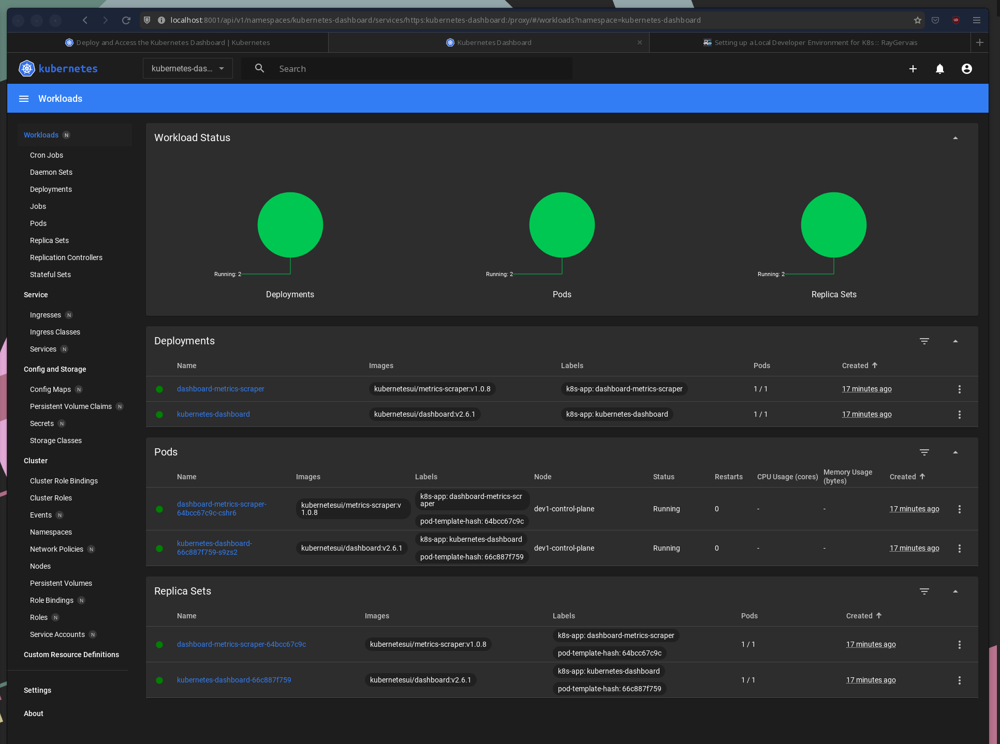

_The first in a series of kubernetes wisdom nuggets that I wish I had when I started working with Kubernetes in both a professional and hobby manner. All instructions are relative to Fedora and the Red Hat Enterprise Linux family using `dnf`, but should be applicable to all distributions and MacOS_

## Setting Up podman, containerd, go, and kind

On Fedora, [podman](https://podman.io/) is the default daemonless container engine choice for development and testing. For the curious, here are a few sites which break down some of the differences between Docker and Podman: [Imaginary Cloud: Podman vs Docker](https://www.imaginarycloud.com/blog/podman-vs-docker/).

In my case, installation is done through `dnf` on Fedora and quite simple. Note that for those who battle with muscle memory, the second package `podman-docker` when installed aliases `docker` to `podman` since their CLI APIs are the same.

```bash
❯ sudo dnf install -y podmam podman-docker

Dependencies resolved.
==========================================================================================================================================================================
Package                                      Architecture                     Version                                          Repository                           Size
==========================================================================================================================================================================
  Installing:
  podman                                       x86_64                           4:4.2.1-2.fc36                                   @updates                             41 M
  podman-docker                                noarch                           4:4.2.1-2.fc36                                   @updates                            7.2 k
  Installing dependencies:
  aardvark-dns                                 x86_64                           1.1.0-1.fc36                                     @updates                            3.1 M
  catatonit                                    x86_64                           0.1.7-5.fc36                                     @anaconda                           831 k
  conmon                                       x86_64                           2:2.1.4-2.fc36                                   @updates                            327 k
  container-selinux                            noarch                           2:2.190.0-1.fc36                                 @updates                             57 k
  containers-common                            noarch                           4:1-59.fc36                                      @updates                            111 k
  criu                                         x86_64                           3.17.1-2.fc36                                    @updates                            1.5 M
  criu-libs                                    x86_64                           3.17.1-2.fc36                                    @updates                             85 k
  crun                                         x86_64                           1.6-2.fc36                                       @updates                            430 k
  fuse-overlayfs                               x86_64                           1.9-1.fc36                                       @updates                            145 k
  libbsd                                       x86_64                           0.10.0-9.fc36                                    @anaconda                           344 k
  libnet                                       x86_64                           1.2-5.fc36                                       @anaconda                           128 k
  netavark                                     x86_64                           1.1.0-1.fc36                                     @updates                            8.7 M
  podman-gvproxy                               x86_64                           4:4.2.1-2.fc36                                   @updates                             11 M
  shadow-utils-subid                           x86_64                           2:4.11.1-4.fc36                                  @updates                             55 k
  slirp4netns                                  x86_64                           1.2.0-0.2.beta.0.fc36                            @anaconda                            89 k
```

Next, we'll install Go if it's not already found on the system since we'll be using Go to install the latest `kind` binary. Installing and setting up `kind` is a easy two-liner assuming that `podman` was successfully installed and configured earlier, so I've bundled the commands below:

```bash
# Install Go
❯ sudo dnf install golang -y

Dependencies resolved.
==========================================================================================================================================================================
Package                               Architecture                          Version                                         Repository                              Size
==========================================================================================================================================================================
Installing:
  golang                                x86_64                                1.18.6-1.fc36                                   updates                                615 k

Transaction Summary
==========================================================================================================================================================================

  Total download size: 615 k
  Installed size: 7.5 M


# Install kind binary
❯ go install sigs.k8s.io/kind@latest

# Create a new cluster
❯ kind create cluster --name dev 

enabling experimental podman provider
Creating cluster "dev" ...
✓ Ensuring node image (kindest/node:v1.25.2) 🖼 
✓ Preparing nodes 📦  
✓ Writing configuration 📜 
✓ Starting control-plane 🕹️ 
✓ Installing CNI 🔌 
✓ Installing StorageClass 💾 
Set kubectl context to "kind-dev"
You can now use your cluster with:

kubectl cluster-info --context kind-dev

Not sure what to do next? 😅  Check out https://kind.sigs.k8s.io/docs/user/quick-start/

```
  

Just as the output recommends, let's run `kubectl cluster-info` and validate that our local cluster is running

```bash
❯ kubectl cluster-info

Kubernetes control plane is running at https://127.0.0.1:35667
CoreDNS is running at https://127.0.0.1:35667/api/v1/namespaces/kube-system/services/kube-dns:dns/proxy

To further debug and diagnose cluster problems, use 'kubectl cluster-info dump'.
```

And for those curious, if we do `podman ps` we'll see our _node_ is a container!

```
❯ podman ps
CONTAINER ID  IMAGE                                                                                           COMMAND     CREATED         STATUS             PORTS                      NAMES
d68e23b76760  docker.io/kindest/node@sha256:9be91e9e9cdf116809841fc77ebdb8845443c4c72fe5218f3ae9eb57fdb4bace              29 seconds ago  Up 28 seconds ago  127.0.0.1:34647->6443/tcp  dev1-control-plane
```


## Installing Your Custom Resources and Working In a Rapid Iteration Feedback Loop

Assuming you're working with a kubernetes operator deriving from `kubebuilder` or `operator-sdk`, a Makefile should be present which makes installing the Custom Resource Definition as simple as `make install`. From there, you can see your CRD in the cluster using `kubectl get crds -A`: 

```bash
❯ kubectl get crds -A
NAME                                       CREATED AT
weatherapis.batch.weather.raygervais.dev   2022-10-04T01:17:18Z
```

I'm using the `weatherapi` CRD which will be found in a different repo (//TODO) for this example, and the simple idea around it is that given a CR with valid latitude and longitude coordinates, it returns the current weather data for that location in the form of a resource status. Is this Idiomatic to Kubernetes? Probably not, but it works for an example of a Go operator interfacing with the outside world and allows me to experiment with concepts and patterns which have both been a blessing and curse for the past year of my career. I digress, back on topic. 

With our CRD installed on the cluster, we have the potential to now run a debugging instance of our operator which is connected to the cluster. In most cases, I default to using VS Code for this, but if you purely just want to run your operator locally (outside the cluster) to monitor logs etc, the `make run` command will be your best friend. 

```bash
❯ make run
go fmt ./...
go vet ./...
go run ./main.go
1.6652576181657362e+09	INFO	controller-runtime.metrics	Metrics server is starting to listen	{"addr": ":8080"}
1.6652576181662054e+09	INFO	setup	starting manager
1.6652576181663492e+09	INFO	Starting server	{"path": "/metrics", "kind": "metrics", "addr": "[::]:8080"}
1.665257618166365e+09	INFO	Starting server	{"kind": "health probe", "addr": "[::]:8081"}
1.6652576181664536e+09	INFO	Starting EventSource	{"controller": "weatherapi", "controllerGroup": "batch.weather.raygervais.dev", "controllerKind": "WeatherApi", "source": "kind source: *v1alpha1.WeatherApi"}
1.6652576181664743e+09	INFO	Starting EventSource	{"controller": "weatherapi", "controllerGroup": "batch.weather.raygervais.dev", "controllerKind": "WeatherApi", "source": "kind source: *v1alpha1.WeatherApi"}
1.665257618166484e+09	INFO	Starting Controller	{"controller": "weatherapi", "controllerGroup": "batch.weather.raygervais.dev", "controllerKind": "WeatherApi"}
```

Now, we have a rapid iteration feedback loop with minimal limitations. Depending on your own hardware, you could spin up your entire cluster deployment(s) locally, such as some would in a CI/CD pipeline for integration tests, or you could deploy ReplicaSets and various other items to test idempotentcy, load-balancing, etc. With our local cluster, we as developers have access to a dedicated environment which we can test our programs on, and also break without the fear of running into another developer's testing instance. Most importantly, setup and tear down are stupidly simple and quite scriptable! More on that last point at the end. The real question is, how can we improve this setup for those who wish to interact with their cluster in a visual manner? 

## Kubernetes Dashboard

> Dashboard is a web-based Kubernetes user interface. You can use Dashboard to deploy containerized applications to a Kubernetes cluster, troubleshoot your containerized application, and manage the cluster resources. You can use Dashboard to get an overview of applications running on your cluster, as well as for creating or modifying individual Kubernetes resources (such as Deployments, Jobs, DaemonSets, etc). For example, you can scale a Deployment, initiate a rolling update, restart a pod or deploy new applications using a deploy wizard.

Deploying the dashboard to our local cluster can be done with `kubectl apply -f https://raw.githubusercontent.com/kubernetes/dashboard/v2.6.1/aio/deploy/recommended.yaml`, and we can confirm if it was successful with `kubectl get deployments -n kuberenetes-dashboard`

```bash
kubectl get deployments -n kubernetes-dashboard
NAME                        READY   UP-TO-DATE   AVAILABLE   AGE
dashboard-metrics-scraper   1/1     1            1           17s
kubernetes-dashboard        1/1     1            1           17s
```

To access the internal network (and thus, the dashboard), we need to run `kubectl proxy` in another terminal. Doing so exposes _`localhost:8001`_.

We can access the UI at [http://localhost:8001/api/v1/namespaces/kubernetes-dashboard/services/https:kubernetes-dashboard:/proxy/](http://localhost:8001/api/v1/namespaces/kubernetes-dashboard/services/https:kubernetes-dashboard:/proxy/), and expect to see an authentication screen requesting a token or kubeconfig. In our case, we'll create a sample `ServiceAccount`, [as recommended by their documentation](https://github.com/kubernetes/dashboard/blob/master/docs/user/access-control/creating-sample-user.md), and `ClusterRoleBinding`: 

```yaml
apiVersion: v1
kind: ServiceAccount
metadata:
  name: admin-user
  namespace: kubernetes-dashboard
---
apiVersion: rbac.authorization.k8s.io/v1
kind: ClusterRoleBinding
metadata:
  name: admin-user
roleRef:
  apiGroup: rbac.authorization.k8s.io
  kind: ClusterRole
  name: cluster-admin
subjects:
- kind: ServiceAccount
  name: admin-user
  namespace: kubernetes-dashboard
```

Save the above as a file, and deploy using `kubectl apply -f <FILE_NAME>`! If successful, we can create a token using `kubectl -n kubernetes-dashboard create token admin-user` which will return a token we'll use to sign into the dashboard as an admin.



_I like to think it's partially meta that the screenshot is of dashboard displaying it's own deployment_

There's a few common items I use Kubernete's Dashboard for, often because doing so is much easier via CLI commands: 

- Updating a resource (such as removing a finalizer during a failed deletion)
- Reading the status & conditions, though `kubectl get <resource name> -n <namespace> -w` works incredibly if you need terse information.
- **Validating pod health & logs**

## Setup and Teardown

So, we've already seen the setup individually, but how could we script this? 

```bash
# Install dependencies
sudo dnf install -y podmam podman-docker go

# Install kind
go install sigs.k8s.io/kind@latest

# Create new cluster
kind create cluster -n dev

# Validate
kubectl cluster-info
```

*And of the tear down?*

```bash
kind delete cluster -n dev`
```


## Resources

- [Cover Image: Photo by jon bagnato on Unsplash ](https://unsplash.com/photos/BR9lOIwBJKQ)
- [kind](https://kind.sigs.k8s.io/)
- [kubernetes dashboard](https://kubernetes.io/docs/tasks/access-application-cluster/web-ui-dashboard/)

