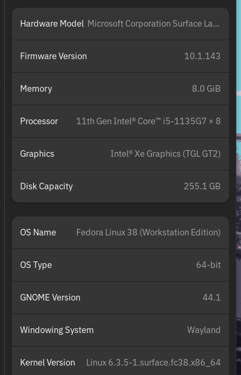
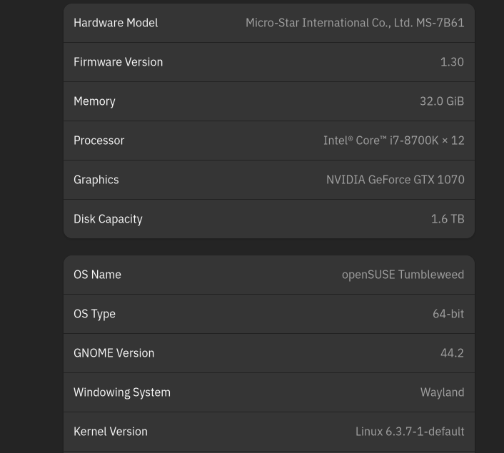
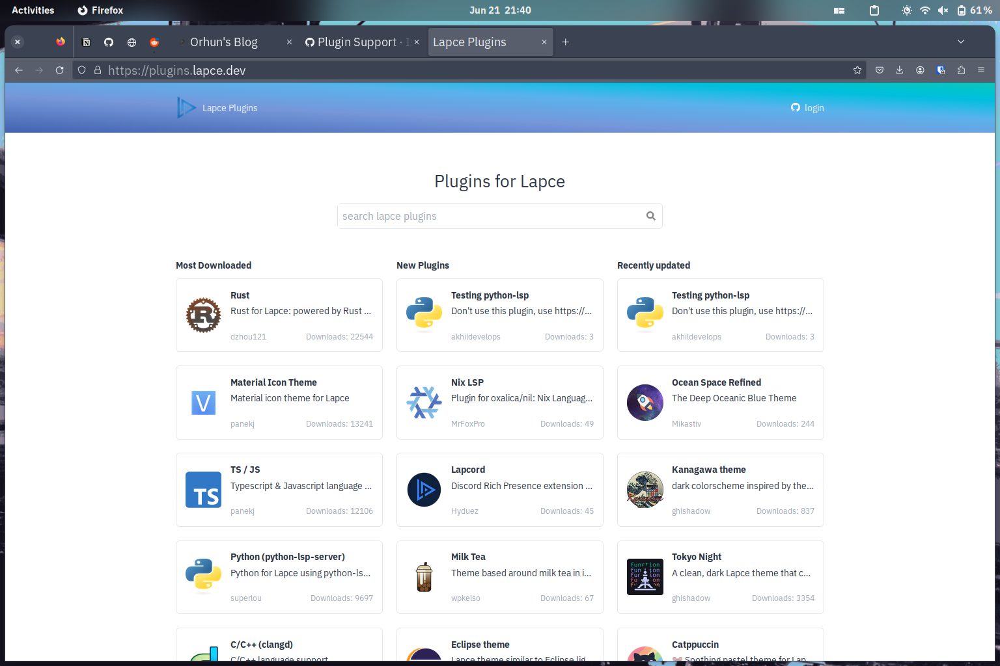
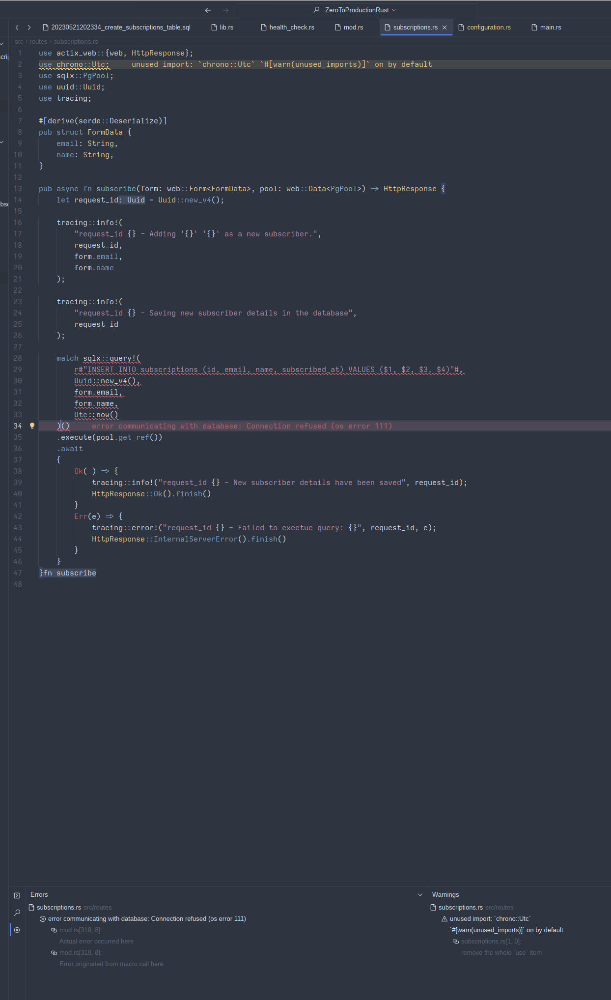
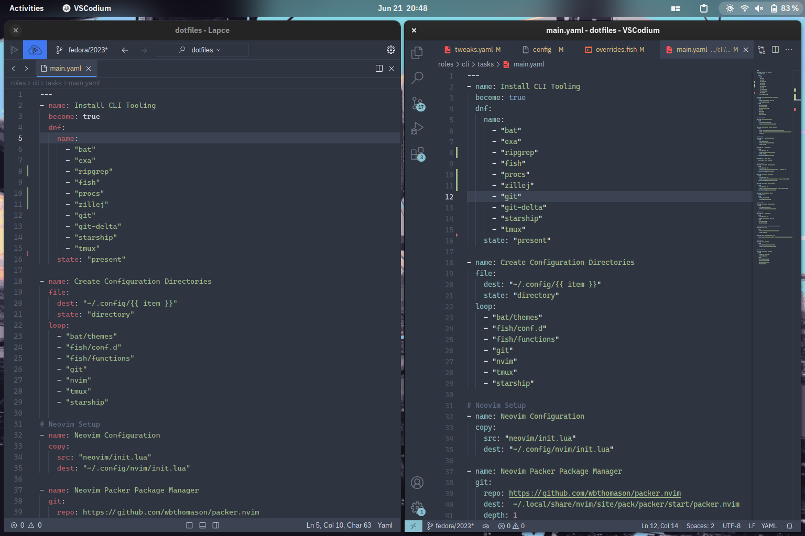
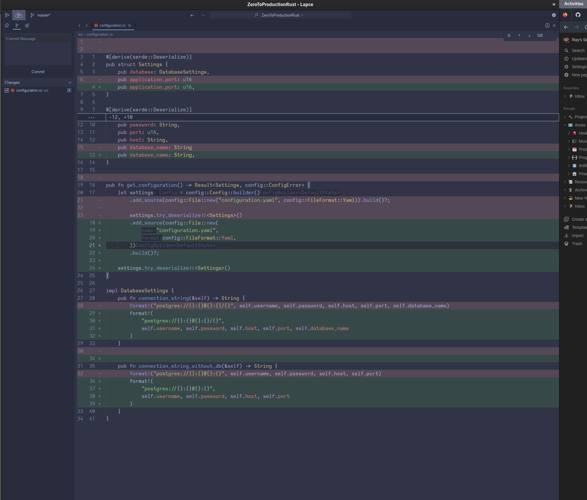
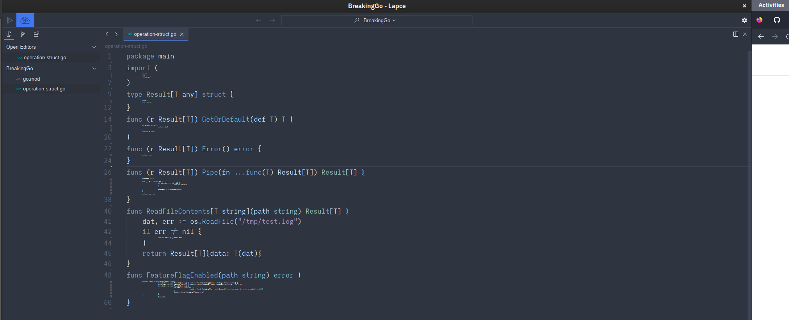
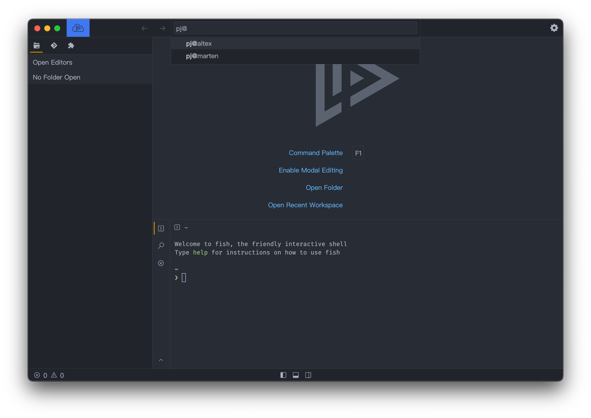

*Another article about a text editor? Really Ray? Yes. Because, choice.*

Like any good *nix user, I’ve found enjoyment in following and eventually testing out projects straight from someones basement while avoiding both commitment and technical norms! But on a more serious note, I do enjoy watching the landscape shift and grow around the tools that I use daily such as text editors. Though I am a frequent user of VS Code, those who’ve been part of any pair programming, screen sharing, or debugging sessions with me over the past years have seen me toying with (and, not exclusive to):

- GNU Emacs
- Doom Emacs
- Neovim
- Nano (that was a dark day.)
- Kate
- KDevelop (I absolutely have KDE / QT centric phases)
- Gedit
- Gnome Builder
- Micro
- Tea
- Helix (still my favorite terminal text editor! I even wrote about some of my Hacktoberfest ramblings over here [https://raygervais.dev/articles/2021/10/color_helix_editor/](https://raygervais.dev/articles/2021/10/color_helix_editor/))
- CudaText
- LiteXL

Still, when I need to be productive I return to VS Code or Codium for majority of my text editing, unless I need to call upon the superpowers provided by a Jetbrains IDE. [https://github.com/xi-editor/xi-editor](https://github.com/xi-editor/xi-editor) was an editor I dearly looked forward to testing, but [alas not all things work out as a planned](https://raphlinus.github.io/xi/2020/06/27/xi-retrospective.html) sometimes. Still, while following the talks around the XI editor, another interest surfaced from it’s development, the idea of a rust-based editor! Over time, the handle of “written in Rust” and “Blazingly Fast™️”  became quite the neon sign while browsing GitHub, which led me of course to Helix. But, two other editors also started to pop up in various subreddits, online forums, Twitter feeds even: [Zed](https://lapce.dev/), and [Lapce](https://lapce.dev/).

In my eyes, Zed has gotten all the attention compared to Lapce, and for a pretty valid reason stated right on their website,  "from the creators of Atom and Tree-sitter.” My first thought as someone who started on Atom and swears by Tree-sitter was, what would they do differently after all these years of experience and feedback having spawned the era of Atom, VS Code, and Electron? An editor which, according to their websites and testing, outperforms all editors! I know I can’t wait to try it, but alas now is not the time unless you are running MacOS. So, I thought why not checkout the pre-alpha release of Lapce? For the past month, in the moments where I was writing little things and coding outside of work, I decided to try to use Lapce,  

On lapce.dev, the very headline is, *Native GUI and Rust powered performance, we as developers know what you need for an essential tool like a code editor. Write code with joy in Lapce.* So, let’s see if this code brings me `joy`.

## Performance

I was the most curious about memory usage and startup performance to see how it contrasts Zed’s claims, and to see how it handled on a mid-powered Microsoft Surface Go 2 Laptop running Fedora. All things considered, this laptop runs VS Code (or, Codium in my case) well enough that I wasn’t expecting any stark differences, so I’ll more so comment on the general feel vs the scientific or fact-based.



*Microsoft Surface Laptop Go 2 + Fedora 38*



*Desktop Running OpenSuse*


Gnome System Monitor, note that though `lapce` is using the most memory, VSCodium has many more active processes. This was taken directly after the screenshots below showing the Nord theme in use.

On both my main (aging) desktop and the Surface, Lapce opens quicker than any GUI application I’ve used in the past few years, and unlike some Electron apps, is fully rendered and loaded in that time posted below. Notice the local package installation’s speed is even faster than the flatpak variant even on the slower Netbook-like machine.

```bash
raygervais ~> time flatpak run dev.lapce.lapce 

________________________________________________________
Executed in   93.87 millis    fish           external
   usr time   13.55 millis    1.79 millis   11.76 millis
   sys time    9.78 millis    0.35 millis    9.43 millis

raygervais ~> time lapce

________________________________________________________
Executed in   17.71 millis    fish           external
   usr time    5.75 millis    0.00 micros    5.75 millis
   sys time    5.12 millis  331.00 micros    4.79 millis

raygervais ~> time codium 

________________________________________________________
Executed in  123.22 millis    fish           external
   usr time   84.57 millis  151.00 micros   84.42 millis
   sys time   29.91 millis   66.00 micros   29.84 millis
```

## Language Servers and Extensions Support



*Plugins for Lapce*

Lapce plugins are written in [WASI](https://wasi.dev/), or the WebAssembly Systems Interface, which has me curious to try writing a small basic plugin in rust or similar to see how the developer experience is, and to add to size of the plugin repo if it’s anything of value. Though the amount of extensions is exponentially dwarfed by the amount offered within Microsoft’s editor, those who are curious if their must-haves can check out the primary `marketplace`,  [plugins.lapce.dev](https://plugins.lapce.dev/). I was surprised to see Zig, Rust, and Go language server implementations alongside C/C++, Python, Dart, Swift, and many others.


*Go LSP in action*



*Learning Rust via Zero To Production with Rust, while the language server keeps me honest*

## Color Themes and Customization



Nord theme on Lapce (left), and VSCodium (right)

Similar to the plugins topic, themes are very limitied within the plugins space, but that can always change with time. Until then, I did find the following popular colorschemes within the marketplace:

- Nord
- Catppuccin
- Solarized
- Gruvbox
- Monokai
- Rose Pine
- Adwaita
- Tokyo Night
- Github
- Dracula
- Dark+
- Ayu



*Catppucinn Frappe theme showing the Git Diff view*

## Some Final Notes

### Code Lens



Code Lens in action

While reviewing the sites docs, I noticed the page called “[Code Lens”](https://docs.lapce.dev/features/code-lens) and had to find out what that meant. Code Lens is described as the following below, and supports both normal and modal-editing modes.

> Lapce has a unique feature called Code Lens. It's a mixture of folding, minimap and code outline, with the content of functions rendered in very small fonts.
>

More so, you can customize the font size of Code Lens -I imagine this feature would be useful to those working in *massive* files with 1K+ lines of code that simply need a symbol overview of what’s contained in the file.

### SSH Editing



SSH Editing, picture from website

For those working with Virtual Machines and remote servers, one feature built directly into the core of Lapce which you’ll appreciate is SSH editing, which similar to VS Code’s Remote SSH extension allows all of the extensions and processes to run on the remote server while the client becomes a thin-client. In my day-to-day, I have no direct usecase for this feature right now, but I can think of a dozen or more times in the past where it would have been useful during my entanglements with various virtual machines.

### Documentation

As the editor develops, I’m hoping (perhaps I’ll help contribute too?) the documentation becomes more extensive in areas such as the [Plugin Development](https://docs.lapce.dev/development/plugin-development) section. It seems only natural that with a better understanding of the development workflows, the plugin market would flourish even more

### Debugging / DAP support

In my testing, I was not able to find any means of debugging a running application which made a very common piece of my everyday impossible at the moment with Lapce.

### UI Enhancements

An interesting note, I’m unsure if it’s the theme developers not accounting for, or Lapce simply not supporting, but I could not seem to get italic fonts to render alongside my normal font in any way. A small item, but still worth noting.
