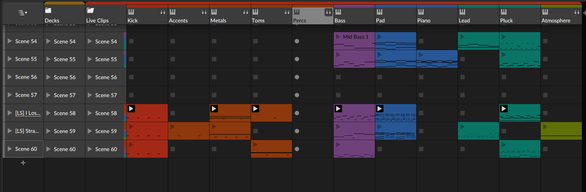

---
title: That Time A Penguin Performed at a Wedding 
date: 2024-03-01 
tags: ["Open Source", "Linux", "Music", "Audio Production"] 
Cover: https://images.unsplash.com/photo-1596485952606-35cd3df9f3e8
---

_A story about Love, Dance, and Linux_

Last year, two of my childhood friends got married just outside of Ottawa in the small town of <>. It was a beautiful
outdoor ceremony beside a lake, picturesque through and through. The reception was also held in the same area, which
leads to my story of how a penguin named Tux got to perform a wedding.

The couple kept the attendance small, it was only close friends and family which also meant, they knew everyone
individually very well from the various stages of life -including their musical preferences. So, a playlist of songs was
prepared which included deep cuts, childhood favourites, and even _pump up the jam_ cliches for all to enjoy. Yet, the
question which had existed before the big day was, who would play them?

I, one of the _two individuals who daily-drove Linux_, was asked if I wanted to pickup my old DJ hat for the reception.
How could I say no? Here's the crux, did I mention I daily drive Linux? I had no Windows / MacOS systems within my
possession and only a small Surface Go 2 Laptop running Fedora 38, to which, I damn well optimised it to run Bitwig
Studio as a lightweight portable music platform. Hmm, Bitwig, similar to my Ableton setup before, supported clip
launching and custom midi mapping. Could I use it with some preparation for the tracks? Unsure, but I knew I had to try!

Here's the specs of the laptop for those curious: 

|               |                       |
| :------------ | --------------------- |
| **Processor** | Intel Core i5-1135G7  |
| **Graphics**  | Intel Iris Xe         |
| **Display**   | 1536 x 1024 (148 PPI) |
| **Memory**    | 8GB                   |
| **Storage**   | 256GB                 |

## Audio in Linux, 2024

I remember the days of struggling to get my audio working; spending hour(s) at a time to fix it during the late hours
when I should have been sleeping just for the next update to break it again. The dreaded Pulse Audio was a beast which
could barely be tamed, and yet fast forward ten years later we have `PipeWire`!

> [PipeWire](https://gitlab.freedesktop.org/pipewire/pipewire) is a project that aims to greatly improve handling of
> audio and video under Linux. It provides a low-latency, graph-based processing engine on top of audio and video
> devices that can be used to support the use cases currently handled by both PulseAudio and JACK. PipeWire was designed
> with a powerful security model that makes interacting with audio and video devices from containerized applications
> easy, with support for Flatpak applications being the primary goal. Alongside Wayland and Flatpak, we expect PipeWire
> to provide a core building block for the future of Linux application development.

So far, it appears to fix many of the grievances that we had as a community with Linux Audio. More impressively, without
needing the `jack` real-time audio server (which, though it was handy, I thought was a pain in the rear to setup and
maintain), I was able to achieve close-to real-time recording latency!  Why does this matter if I'm playing live? Timing
of midi input during live performance and coordinating my beat matching / swaps for the various songs! But how will I do
so?

## The Bitwig Studio Set

My Ableton / Bitwig live setups  have always been inspired by the setups of [Youtube: DEADMAU5 Live
Setup](https://www.youtube.com/watch?v=GTCqeWu094I), [Youtube: Ben Bohmer's How I Play
Live](https://www.youtube.com/watch?v=0gydjvLEpRkL) and [YouTube: How Daft Punk's Alive 2007
Worked](https://www.youtube.com/watch?v=W-Tzvr5lTVM). These setups are cater to a different style of DJ'ing which some
consider to be an alternative take on `Button Pushing`, or, `hitting play and waving your hands`, but I've never seen
nor experienced it like that. Traversing a song in it's individual parts I find to be it's own form of expression where
remixing, live improv and on the fly experimenting can occur within the boundaries (or, none) that you setup. More so,
there's as reason why Ableton Live is called, Ableton _LIVE_. It's the tool for live performance - Bitwig Studio is
getting to that point too. Given that Bitwig runs on Linux, of course I through my wallet and support at the company so
that I could also test what was possible and what I could do on Linux using linux-supported tools for my music creation.
So, here's how I approached my live setup based on those that I often looked up to and referenced, abridged. NOTE: each
song being a single clip here is purely to make for a better screenshot, but also I expanded the tracks here to
individual channels  instead of grouped ones as I did during the performance because working with 110 PPI was rough.

### Decks

The Decks group contains 3 audio channels, all of which have the exact same setup and files. These are treated similar
to a DJ's `A`, `B`, and `C` channels, and I use them in exactly that manner.  Often, the third channel `C` becomes a
loop channel that I'll throw random titbits into for transition and buildups. _Think of it similar to a modern cardbox
box in Toronto which costs over 2 million; a two bedroom and a den_. Each track has the following effects, again
following the spirit of the traditional DJ mixer: 

- Low pass filter
- High pass filter
- Beat Repeat (Grid Device)
- Delay / Flange (Grid Device)

### Live Clips

While I can continue to be ignorant and stubborn, I like to keep all my tracks as MIDI where possible. My logic has
always been so that I can interact with the clips themselves and change key, melody and even instrumentation on the fly
instead of working with printed audio which is far less flexible. Of course, this comes with it's own issues including
having to port project files and sounds over to a far more portable format while also battling CPU requirements and mix
/ master requirements since they're now closer to their raw sound vs their mastered sound.

Each track has a set of four effects which I believe are useful to that specific instrument domain, and all have access
to the same effects sends which get routed directly to master.  Each of course are also routed against the kick /
percussion so that I can still retain the sidechain sound that we all love to various degrees.

- Bass - Low pass filter - High pass filter - Delay (high passed) - Distortion & fuzz
- Pad & Piano - High pass filter - Spring Delay (Chorused) - Tremolo - Beat Repeat
- Pluck & Lead - Low Pass Filter - Gated Delay - Distortion & Fuzz - Reverb Washes
- Atmosphere - Low Pass Filter - High Pass Filter - Tremolo - Pitched Delay

## Controlling Bitwig Studio

Well, that seems like quite a bit to manage, how did you manage? Well, first let me explain that only 30 minutes of this
specific event was using my live clips / instruments area, and the rest was all powered by the Decks channels doing the
conventional DJ fades & mashups. So, really what I needed was a device or few for a few critical offerings: 

1. Midi mappable
2. Linux compatible
3. Bitwig Native Controller Extension
4. Portable & Expendable

Enter, two controllers which fit the bill entirely: The Akai Fire (a FL Studio controller!), and the Akai Midi Mix.

### Akai Fire

The Akai Fire is an interesting, recently released controller. Instead of being built as a grid controller similar to
other button-centric midi options, Akai partner with Image line to build a 16 Step / pattern styled controller!

Bundled with an endless Rotary encoder, a pressure sensitive `16x4` grid and an OLED screen,  I had to wonder, how hard
would it be to work with any other software. To my relief, [Github:
DrivenByMoss](https://github.com/git-moss/DrivenByMoss), an open-source project which ports controllers to work with
Bitwig Studio, supported the device already. With Moss' script, I had access to every view I needed right out of the
box:

1. Clip Launcher
2. Pattern Editor
3. Scene Navigation
4. Data display via the OLED screen.

All of course, were configurable and could be overridden in application, or depending on complexity, in the java
codebase. All that was left was augmenting this setup if I wanted to, to which I did.

### Midi Mix

Though the Akai Fire includes a volume and send page, there's something about the tactility of faders which I crave. The
Midi Mix fit that purpose well, allowing me to map 8 of my grouped channels to each fader and it's associated channel
strip buttons:

1. Deck A
2. Deck B
3. Deck C
4. Kick
5. Percussion(s)
6. Bass
7. Leads (Piano, Synthesizers, Loops)
8. Atmospheres (Pads, Ambiences, Loops)

## The Outcome

The TLDR? The night went off without an issue! My biggest concern was performance of the system being inadequate, which
at loud volume would produce stuttering that no good excuse could hide. Yet, only once did I start to hear the first bit
of audio artifacts that would lead to such, and that was because of a few factors that I reasoned with as it was
occurring:

- I had just gotten past the second set, which meant that the laptop and the systems had been going for over 4 hours
	without break - The laptop's CPU was starting to overheat, a common problem for this specific laptop that leads it
	to throttle far more than anyone would like.
- With playing over 4 hours of music, the RAM itself has been entirely spent along with the SWAP on audio files and
  plugin instances. Changing to new clip launches results in this never being recycled, but instead just retained and
  bubbling over time.

Because of some of the performance concerns, I even considered moving a lot of the known track arrangements and mixes to
the linear timeline view but, that left me with two new problems:

1. This really did make the set like a push play and wage style of set, which I wasn't fond of.
2. Turns out with 8GB of ram, putting the audio tracks into the timeline retained them in memory for the entire session,
   which would cause stuttering as the one playing would push out others which came before or after trying to protect
   its place in memory. This raised the CPU to 100 every time the play-head moved.

Another consideration I had made specifically for the laptop was to move to KDE Plasma 5.7, which without any scientific
research on my part, felt lighter on the system. Perhaps it was more of the C++ running the environment in contrast to
JavaScript, but I digress and don't want to start a flame war. On this specific bit of hardware, I've always had better
standby performance using Plasma, which for a laptop, was nice. Did I care in this case? No. Just fun to point out.

Still! Considering all the odds and various hills to climb, the fact that I was able to achieve this night with a
non-traditional setup which was run entirely by the penguin was fun. The other Linux gent and I spent lots of time
gushing over the details of the setup, the background processes and reasons for how things were setup and the
controllers themselves with my custom mappings thrown over top. I even have him a couple of minutes before the ceremony
started to get familiar and mess with the live set since everything was locked down to read-only, meaning I simply had
to reload the project to restore my original setup. It brought us both back to our high school days messing with audio
production and DJ sets (to which, he helped me even back then), which I knew he loved.

## Resources

- [Cover Image: Photo by Susanne Neumair on Unsplash](https://unsplash.com/photos/person-playing-dj-controller-on-stage-V3S4EaKv35o)
- [Bitwig](https://www.bitwig.com/)
- [Tracktion](https://www.tracktion.com/products/waveform-free)
- [Akai Fire](https://www.akaipro.com/akai-fire.html)
- [Akai Midi Mix]()
- [YouTube: Make Your Live Sets Sound Great (Ableton Live Stock Devices)](https://www.youtube.com/watch?v=OyvRRA5yNR0)
- [Pipewire](https://pipewire.org/)