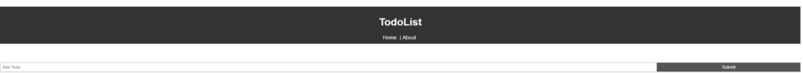
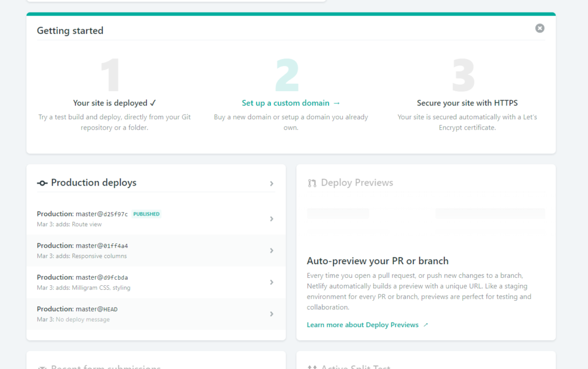

## Adding Styling to a Simple VueJS Application

After completing the two hour VueJS crash course, I felt the wanting to extend the functionality to include an edit, and details view. Furthermore, I wanted to integrate a new CSS framework as well to give the project a coherent and modern look -gasp, without using my framework of choice: Bulma? Well I want to learn something new, evaluate a skeleton (minimalist) framework. For this little addition, I was considering using a heavyweight framework such as Formantic UI (a community fork of Semantic UI), but instead landed on the minimalist framework Milligram [https://milligram.io/](https://milligram.io/#blockquotes). For this article, due to work also keeping me incredibly busy on top of other obligations, I opted to split up the two (styling vs functionality) with this article targeting the former. Without further ado, let’s talk about enhancing the experience.

## Creating the Experience

It’s been a while since I last used a css framework loaded through a modern web packer, npm being my choice for this project. Following the instructions here enables you to install the framework, but no instruction makes it clear how to import and utilize

Pre Importing the Milligram Framework

[https://github.com/milligram/milligram](https://github.com/milligram/milligram). After a little Googling, it became evident to me that I can simply import it as if any other module, and the css will be included in the project ala `_import milligram from 'milligram';_` in my App.vue file.

After Importing, Milligram playing funny with Brad's other styles

Color Pallet Chosen

I decided that the color scheme will derive from this palette, which I think is a good starting place for a pleasing, pastel inspired aesthetic [https://coolors.co/0c1713-5e6572-69a2b0-21897e-af3e4d](https://coolors.co/0c1713-5e6572-69a2b0-21897e-af3e4d). From there, I used transparent variants of the colors to form the UI components and call to action elements. I could actually go into a huge post about how the Coolors application has provided and driven every project I’ve worked on in the past three years, and how utterly amazing it is for those such as yours truly who’s not taken design courses and lack original color coordination insights.

### Layout and Mobile First Design

I liked the todo’s layout, including the search above. The one item that I decided right way to change was the title and navigation components, pulling them left to and removing any and all text from being centred. Because of the simplicity to this application, there was no real changes to the layout aside from what I had just mentioned. More on this to follow if I have the chance to add the details and edit view.

Responsive Testing via Developer Tools

When designing and developing web pages, the term ‘Mobile First’ gets thrown around quite often by frameworks and developers alike. It’s the indication that your canvas should be designed on the smallest viewfactor first (Mobile, Cellphone/Tablet), and then expanding to the desktop viewports. This enables a different perspective, which is better defined in the explanation I’ve included at the bottom of this article. Simply put, it enables for one to consciously be aware of how responsive elements will act and scale to various form factors from the start, instead of it being an afterthought.

### Hover, Focus, and Spacing

One of the first items I learned while doing front-end development was to always highlight your call to action buttons; to make sure the user knew they were interactive and clickable. I did exactly that by adding css to the :hover and :focus states of each button, following an easy to understand pattern described below.

#### **Checkbox idle, disabled, and focused.**

I wanted to make it apparent that these were buttons meant to be clicked, since the original HTML checkbox didn’t vibe very well with the page aesthetic I was going for.

Instead, I switched them to buttons and used the Unicode symbol for a check mark inside. The rounding to the right side is a personal choice, but I think it attributes to a bullet-list, once which is very common in Todos and journals. From there, I wanted to indicate when an item was already crossed off, and thus added the grayed-out class which would visually distinct the completed and uncompleted from the bullets alone. Finally, I gave the [hover](https://github.com/raygervais/VueJSPosts/blob/master/Posts/src/components/TodoItem.vue#L64\) the darkest variant of my primary, that color deriving directly from the pallet and the other shades being lighter transparencies or alphas of it.

---

#### **Delete button Hover**

I’ve grown fond of Material Design 2.0, and the reliance of button outlines instead of filled in elements. I think they should be used sparingly -as I like to think I did with only the submit button and delete using such a way. Again, personal preference and ignorance. I wanted to do more than just fill the button in on hover, I wanted to make it move under your cursor and signify great intent. To achieve this, I actually set the border radius to a sharper 3REM as opposed to the standard 1REM that I had been using in the idle state. I think this enhancement also helps provide some clarity if it was needed, since many are used to seeing a round red X or STOP sign as opposed to the original [look](https://github.com/raygervais/VueJSPosts/blob/master/Posts/src/components/TodoItem.vue#L57).

---

#### **Navigation Button Hover**

We never want to be lost, even in the simplest of web applications. That’s why I first set out learning that the VueJS router automatically appends the class router-link-active to the currently active route, and making sure there was some styling in place to take advantage of that. An bottom border is that’s needed to provide some context.  
I then wanted to make sure you knew those navigation items were indeed links, since there is no indication aside from experience that you’ve seen this button-less navigation bar before. So, I added the to the hover element a bit of gray, so you knew something magical happens [here](https://github.com/raygervais/VueJSPosts/blob/master/Posts/src/components/layout/header.vue#L29).

---

Each “page” also is encapsulated in Milligram’s container class, which reduces the width from full screen to 112REM (roughly 1012px) and keeps the app at a good size. Milligram’s default font is Google’s Roboto, which I thought worked really here as well. No need to change what is not broken.

Lastly, I wanted to approach a native animation style for all list elements (that being the ToDo objects in this case) to better resemble native applications compared to simply disappearing as web components often do. This also taught me about Vue’s transition component, which I found already to quite more flexible compared to Angular’s. In my next project, I want to reference the `Native-like Animations` tutorial I’ve included in the references at the bottom to further enhance the experience.

## Deploying to the Internets

When it came to deploying and testing, I figured I’d follow Traversy’s recommendation, I started using Netlify. Netlify acts as a CI/CD deployment pipeline with many built in features which I’ve grown to love, one I highly appreciate is the preview deployments which allows me to spin up per pull request or commit a commit based instance of the project. This way, it’s easy to A/B, and compare. An example of this in action is viewing the original end-state of Todos for Vue, which is the last commit I did based off of Brad’s tutorial: [https://5c7c1215662a58cc5535abb6--todos-for-vue.netlify.com/#/](https://5c7c1215662a58cc5535abb6--todos-for-vue.netlify.com/#/). That link is also the starting place for what became my final style-based work on the final project: [https://todos-for-vue.netlify.com/#/](https://todos-for-vue.netlify.com/#/)!

Having delayed releasing this article due to other obligations, I can say that I’ve been using Netlify for over a month now with various Node applications -built both for clients and myself. I keep finding more and more reasons to love the platform, even in the free tier for that matter! The integration with Github as well, both public and private repositories in the form of the Netlify bot also ensures that no code is merged into the primary branches without being fully aware that they are stable, built, and demo-able through the hashed instance.

## Why Delay the Details?

So, a month later since starting this foray and still no details code has made it’s way to Netlify, what gives? Well, I realized very early on that in order to maintain a proper VueJS / Web Application data structure, I needed to integrate Vuex (similar to Redux) or some form of state management since there was no backend to talk to in this case. I also knew that in doing so, I had to rewrite quite a bit of the component logic to work with the Vuex system, one of which I was happy to do but had no time for right now. It’s still on my todo list, the priority rising even higher as Brad just released a lovely video on Vuex as well during the time of the article being written. I’m going to go through that video first, and then circle back here to finish up.

## References

- [VueJS](https://vuejs.org)
- [Milligram](http://www.milligram.io)
- [Traversy Vue Crash Course](https://www.youtube.com/watch?v=Wy9q22isx3U)
- [Traversey Vuex Video](https://www.youtube.com/watch?v=5lVQgZzLMHc)
- [Netlify](https://netlify.com/)
- [Understanding Mobile First](https://medium.com/@Vincentxia77/what-is-mobile-first-design-why-its-important-how-to-make-it-7d3cf2e29d00)
- [Native Like Animations](https://css-tricks.com/native-like-animations-for-page-transitions-on-the-web/)
