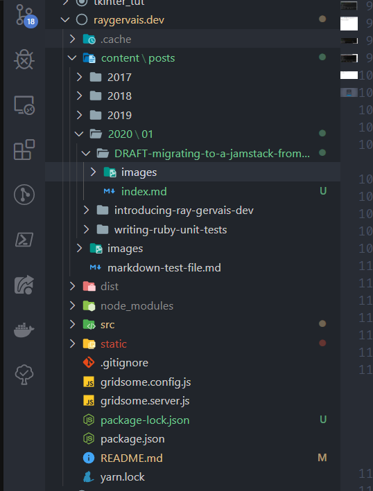

_An Overview of Migrating My Old Site_

## Why Did I Switch

I've been working with Gridsome and VueJS for a few hobby projects throughout 2019, and was quite impressed with what JAMstacks offered. It intrigued the systematic side of me; the one which is always looking for efficiency, for the next big thing which bridges upcoming and established platforms and produces a user experience like no other. Having always resented the (truthfully, well developed) WordPress editors (both new and classic), the concept of writing blog posts in Markdown and having them compiled to a static website seemed incredibly modern. Imagine blogging without ever having to leave your editor (assuming you're confident in your spelling of course for this example!), and a commit taking that little markdown file to your published blog in such a way that you can't help but say grin in aw. Netlify of course handles the deployments, which I've discussed and raved about many a times in the past, so I'll leave the details of that special relationship out of this article. Needless to say, it's hosting and deploying the site -triggered by every commit like a patient wizard waiting to take your post to outer-space on it's next-gen SpaceX-powered broomstick. Even Draco would be jealous.

Furthermore, I wanted to have a platform which I could configure and develop cleanly. I've had my fair share of WordPress theme development in the past, and have found myself often fighting more than celebrating with them and the overall platform. I even at one point attempted to help maintain BulmaPress, a Bulma-based theme which though suited many needs, didn't leave me with the "wow" factor that I longed for. Having worked with MEAN (Mongo, Express, Angular, Node) stacks for two years at previous career, the idea of working in PHP for my own site seemed more like a regression the more I dwelled on it.

## Migrating the Data

### Exporting WordPress Content

Exporting a WordPress site is pretty simple with the builtin tool which allows you to take your posts, pages, fields and media in an XML file. I opted to export only the posts since the page content was in dire need of a refresh. Once downloaded, you'll see all your posts along with content, image references and metadata in the huge XML file. Make sure you keep the file safe, we're not done with it!


_Source: [WpCrib](https://wpcrib.com/export-import-wordpress-website/)_

### Converting to Markdown

While browsing for a scripted solution to converting the posts to Markdown files, I discovered the Node powered [WordPress to Markdown Tool](https://github.com/lonekorean/wordpress-export-to-markdown) project by [Lonekorean](https://github.com/lonekorean) which specialized in exactly what was needed, including a few configurable options as well which allowed for me to specify the file structure organization, and to download images at the same time with the command:

```sh
#!/bin/bash

node index.js \
  --yearmonthfolders=true \
  --addcontentimages=true
```

The posts themselves downloaded into the output folder without a problem, but I did notice images would rarely download despite the correct arguments being provided. This was a two-stage problem that I was encountering, the first being very simple to remedy: SSL. My SSL Cert had expired on the site (_again, a reason why I'm so excited to move over to a modern platform_) which would cause the `HTTPS` requests to fail by the script's API dependency. Once I had a _then_ new SSL certificate, _some_ images downloaded correctly. Every time I ran the script, the previous images would be overwritten with blank files (essentially, references waiting for data) and a new set of random images would be downloaded, often 5 or fewer.

Resolving the second issue took me through a few hoops, with me ultimately creating a [bug](https://github.com/lonekorean/wordpress-export-to-markdown/issues/14) on GitHub to get some help and advice from `Lonekorean`. Before creating the ticket, I went through the networking instruments GoDaddy provides to ensure that my IP address wasn't being blacklisted (with the script doing constant API and web scraping calls, I was expecting my server to turn against me and declare my computer a DDOS attack bound to occur), and that WordPress wasn't aggressively blocking the script either. Checking these confirmed that I was on the right track, as the developer's response was:

> If you have many large images to download, then the script may be eating up all your bandwidth with too many concurrent downloads. Try changing the 25 on this line to something much more generous, like 3000: https://github.com/lonekorean/wordpress-export-to-markdown/blob/master/index.js#L285

This was correct, but funnily enough the bandwidth itself that was suffering was server-side. The script had shown me the limitations of that WordPress' ability to server concurrent calls in rapid succession. Increasing the value from `25` to `3000` greatly increased the runtime of the script, but worked flawlessly. Luckily, I only had to run the script once to scrape and convert every published post I had ever put on that site. I love technology when it works or when you learn something new!

```sh
$ ./run_me.sh
Scraped http://raygervais.ca/wp-content/uploads/2017/01/Vagrant_Up-943x1024.png.
Scraped https://cloud.githubusercontent.com/assets/25212/22001231/76a7f2e6-dbf8-11e6-8bd3-173a18f23903.png.
Scraped http://raygervais.ca/wp-content/uploads/2017/02/CSS_Thimble_Fix_1635.png.
Scraped http://raygervais.ca/wp-content/uploads/2017/02/PR_DIFF.png.
Scraped https://developer.apple.com/xcode/interface-builder/images/interface-builder.png.
Scraped https://bootstrapstudio.io/assets/img/app_2.jpg.
Scraped http://www.getspokal.com/wp-content/uploads/2015/07/wpid-image161.jpg.
Scraped http://raygervais.ca/wp-content/uploads/2017/02/Screenshot-from-2017-02-25-14-05-18-1024x506.png.
Scraped http://raygervais.ca/wp-content/uploads/2017/02/Screenshot-from-2017-02-25-14-08-33-1024x282.png.
Scraped http://raygervais.ca/wp-content/uploads/2017/02/SpacemacsLogo-1024x470.png.
Scraped http://raygervais.ca/wp-content/uploads/2017/02/Screenshot-from-2017-02-28-12-58-36-1024x576.png.
Scraped http://raygervais.ca/wp-content/uploads/2017/02/Screenshot-from-2017-02-28-18-29-40-1024x576.png.
Scraped http://raygervais.ca/wp-content/uploads/2017/02/Screenshot-from-2017-02-28-17-54-36-1-1024x576.png.
Scraped http://raygervais.ca/wp-content/uploads/2017/02/Screenshot-from-2017-02-28-18-48-29-1024x576.png.
Scraped http://raygervais.ca/wp-content/uploads/2017/02/Screenshot-from-2017-02-28-18-37-38-1024x576.png.
Scraped http://raygervais.ca/wp-content/uploads/2017/02/Screenshot-from-2017-02-28-18-37-16-1024x576.png.
Scraped http://raygervais.ca/wp-content/uploads/2017/02/Screenshot-from-2017-02-28-18-35-44-1024x576.png.
...
Scraped http://raygervais.ca/wp-content/uploads/2018/04/Screen-Shot-2018-04-22-at-4.02.12-PM-715x1024.png.
Scraped http://raygervais.ca/wp-content/uploads/2018/09/DSC03413-2.jpg.
Scraped http://raygervais.ca/wp-content/uploads/2018/09/DSC03330.jpg.
Scraped http://raygervais.ca/wp-content/uploads/2018/09/DSC02404.jpg.
Scraped http://raygervais.ca/wp-content/uploads/2018/09/DSC03152.jpg.
Scraped http://raygervais.ca/wp-content/uploads/2018/09/DSC03162.jpg.
Scraped http://raygervais.ca/wp-content/uploads/2018/09/DSC03484.jpg.
Scraped http://raygervais.ca/wp-content/uploads/2018/09/DSC02204.jpg.
Scraped http://raygervais.ca/wp-content/uploads/2018/09/DSC04650.jpg.
Scraped http://raygervais.ca/wp-content/uploads/2018/09/DSC01174.jpg.
Scraped http://raygervais.ca/wp-content/uploads/2018/09/DSC01200.jpg.
Scraped http://raygervais.ca/wp-content/uploads/2018/09/DSC03079.jpg.
Scraped http://raygervais.ca/wp-content/uploads/2018/09/IMG_20180806_143720.jpg.
Scraped http://raygervais.ca/wp-content/uploads/2018/09/DSC01073.jpg.
Scraped http://raygervais.ca/wp-content/uploads/2018/09/DSC02947.jpg.
Scraped http://raygervais.ca/wp-content/uploads/2018/09/RayWay-Run02-1.png.
Scraped http://raygervais.ca/wp-content/uploads/2018/09/RayWay-Run03-1.png.
Scraped http://raygervais.ca/wp-content/uploads/2018/09/RayWay-Run04-1.png.
Scraped http://raygervais.ca/wp-content/uploads/2018/09/NodeWay-Build.png.
Scraped http://raygervais.ca/wp-content/uploads/2018/09/NodeWay-Build02.png.
Scraped http://raygervais.ca/wp-content/uploads/2018/09/NodeWay-Run02.png.
Scraped https://raygervais.ca/wp-content/uploads/2018/12/Admin-Login-1024x538.png.
```

A short example of a converted file, which I noticed failed to export the tags. After further investigation, it appears none of the files properly picked up the original blog tags. That's alright, a minor setback which allows me to clean up and redo what could have been a great tag-based dystopia.

```md
---
title: "Extending Traversey Media’s VueJS Crash Course"
date: "2019-04-03"
---


## Adding Styling to a Simple VueJS Application

After completing the two hour VueJS crash course, I felt the wanting to extend the functionality to include an edit, and details view. Furthermore, I wanted to integrate a new CSS framework as well to give the project a coherent and modern look -gasp, without using my framework of choice: Bulma? Well I want to learn something new, evaluate a skeleton (minimalist) framework. For this little addition, I was considering using a heavyweight framework such as Formantic UI (a community fork of Semantic UI), but instead landed on the minimalist framework Milligram [https://milligram.io/](https://milligram.io/#blockquotes). For this article, due to work also keeping me incredibly busy on top of other obligations, I opted to split up the two (styling vs functionality) with this article targeting the former. Without further ado, let’s talk about enhancing the experience.

## Creating the Experience

It’s been a while since I last used a css framework loaded through a modern web packer, npm being my choice for this project. Following the instructions here enables you to install the framework, but no instruction makes it clear how to import and utilize


Pre Importing the Milligram Framework

[https://github.com/milligram/milligram](https://github.com/milligram/milligram). After a little Googling, it became evident to me that I can simply import it as if any other module, and the css will be included in the project ala \`_import milligram from 'milligram';_\` in my App.vue file.
```

### Adding to the Gridsome Blog Template

With a fresh export of markdown files, steaming hot from the virtual press, I was off to the races. From the `README.md` found on [Gridsome's Starter Blog](https://github.com/gridsome/gridsome-starter-blog) project, I initialized my blog and copied the markdown files to `/content/posts`.



Running `npm run develop` started the development server, and I opened up the site on `localhost:8080` to see how my beautiful past writing liked it's new home. It appeared they didn't like it at all, in fact I can accurately say that nothing appeared at all on the posts side aside from the three samples that the template provides. Talk about a disappointing image to end the night with.


### Correcting Formatting, Article Metadata

Let's play a game and use hindsight as a tool that's available. Let's compare this current article's metadata compared to the exported.

**Current Article**

```yml
---
title: Migrating a WordPress Site to JAMStack
date: 2020-01-20
draft: false
tags:
  [
    "Open Source",
    "VueJS",
    "JavaScript",
    "Markdown",
    "PHP",
    "WordPress",
    "Apollo",
    "Gridsome",
    "Web Development",
  ]
series: false
image: https://images.unsplash.com/photo-1576792275520-2226541b2889?ixlib=rb-1.2.1&ixid=eyJhcHBfaWQiOjEyMDd9
canonical_url: false
description: "I've been working with Gridsome and VueJS for a few hobby projects throughout 2019, and was quite impressed with what JAMstacks offered. It intrigued the systematic side of me; the one which is always looking for efficiency, for the next big thing which bridges upcoming and established platforms and produces a user experience like ..."
---

```

**Export Example**

```yml
---
title: "Extending Traversey Media’s VueJS Crash Course"
date: "2019-04-03"
---

```

Notice anything different? Missing? Having double quotes where it's not needed? _Hint hint_. Over the winter holidays, I went through all the exported articles and corrected the metadata to reflect the expected format. This included:

1. Removing title and date quotations
2. Re-adding the correct tags
3. Adding `draft: false`
4. Adding a description
5. For the newer ones, correcting the `image` formatting.

Once the above was corrected for each, the blog posts were appearing in the correct order with all the correct metadata! If the published field was set to false or not set at all, the article would never appear. Take note!

## Alert("MVP Launch in 3, 2, 1!");

The final output is what you're looking at right now, so I'll save you the bandwidth by not including a screenshot displaying an inception-like image which simply repeats exactly the post that you're reading at a smaller scale. Maybe I will, that would look cool the more I think about it. I digress. Having learned how to export the posts, correcting the metadata and formatting so that ~90 displays within an acceptable view, and how to write better posts in the process is exactly the kind of experience that will drive this site into the next decade full speed ahead. Even more so, writing in Markdown I find to be more accessible and portable; which has encouraged me to write more frequently so far since I can type anywhere and commit to the repo where appropriate.

## Resources

- [WordPress to Markdown Tool](https://github.com/lonekorean/wordpress-export-to-markdown)
- [How to Export WordPress Data](https://wpcrib.com/export-import-wordpress-website/)
- [How to Export WordPress Posts to Gatsby](https://peterakkies.net/export-wordpress-to-gatsby-markdown/)
