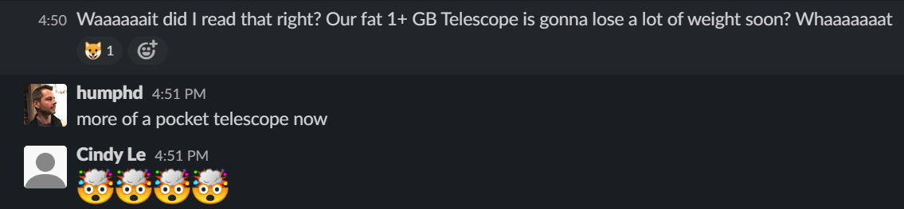
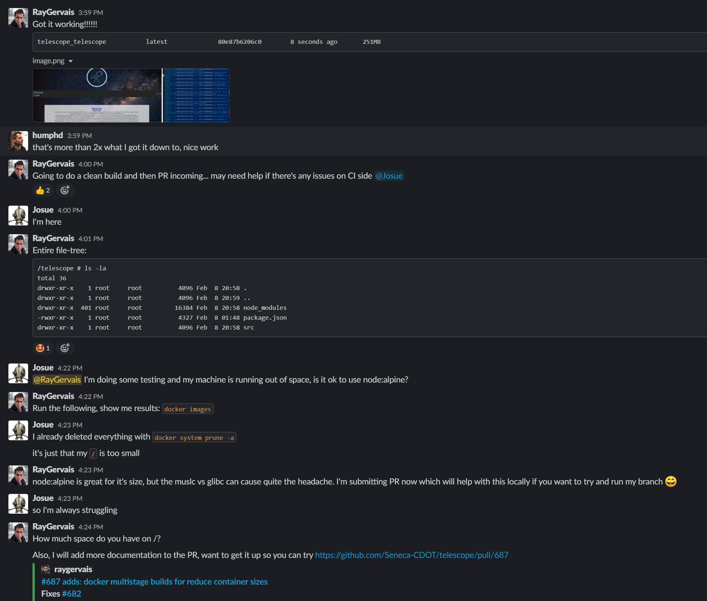

## RUN export context="this"



In my free time, I've tried to contribute some of my Docker and development experience to [@humphd](twitter.com/@humpd)'s Telescope project, a recent [contribution](https://github.com/Seneca-CDOT/telescope/pull/687) that I'm proud is helps reduce the space complexity of the production and development images for the overall platform. Before my work, A local Docker container of `telescope` would weigh ~2GB and comprise of the entire codebase, all node modules needed for both development and release, and other tooling which added to the storage cost. For those with small drives, this could make quite the ugly development experience! I had worked on Docker in the past for one of my internships, optimizing our microservice build pipeline to utilize multi-stage containers (at the sake of time complexity) which enabled far smaller artifacts to be stored in the private repository which had the compiled resources and bare minimum node-modules that were needed. For that microservice architecture, we successfully decreased the size from ~1GB (x 7 for the services) to ~140mb (x 7). That's just under 1GB for the entire architecture compared 7GB previously!

## FROM node:lts-alpine



I think we can all agree, Node applications are rather grand in the dependency scale which attributes to quite the big container. Moreso, the default Docker node container (based on Debain / Ubuntu) also includes many packages which are not needed. This is where Alpine Linux shines, a minimalistic (mmmmm, minimalism) system which is geared towards servers and containers! A downside to Alpine is the integration of [`musl-libc`](https://alpinelinux.org/posts/Alpine-Linux-has-switched-to-musl-libc.html) as opposed to `glibc` which is the GNU standard C library often used for building applications. To remedy this for those encountering issues, see under [Resources](#resources) the `GCC on Alpine Linux` link which I discovered this week.

Moving from `node:lts` to `node:lts-alpine` reduced the base container size from 1GB to 140MB alone! Dave experiment with installing only the production dependencies reduced the build as well by over half, going from `1.91GB` to `640MB` and asked that I help implement the multistage builds that I had mentioned previously. So, let's go about that and explain how it's done.

## CMD: ["init", "Multi-stage", "Builds"]

So, let's explain some of the process going on here! I've included below the current Dockerfile, which may grow out of date over time with the Telescope project. So, here's a link to the project [project](https://github.com/Seneca-CDOT/telescope/)!

```dockerfile

# This Docker file is used  for
# `development`, `test`, and `staging` enviornments
#
# CLI command to run this file: script="some-name" docker-compose up --build
# `some-name` is one of the names provided under `scripts` tag in `package.json` file
# example: $ script="test" docker-compose up --build    --> will run telescope with `test` script
# default: $ docker-compose up --build                  --> will run telescope with `start` script


# Dockerfile
#
# -------------------------------------
# Context: Build
FROM node:lts-alpine as build

# Tini Entrypoint for Alpine
RUN apk add --no-cache tini
ENTRYPOINT [ "/sbin/tini", "--"]

# Set Working Directory Context
WORKDIR "/telescope"

# Copy shared context
COPY package.json .

# -------------------------------------
# Context: Dependencies
FROM build AS dependencies

# Get Entire Codebase
COPY . .

# Install Production Modules, Build!
RUN npm install --only=production --no-package-lock
RUN npm run build


# -------------------------------------
# Context: Release
FROM build AS release

# GET deployment code from previous containers
COPY --from=dependencies /telescope/node_modules /telescope/node_modules
COPY --from=dependencies /telescope/src/frontend/public /telescope/src/frontend/public
COPY ./src/backend ./src/backend

# Environment variable with default value
ENV script=start

# Running telescope when the image gets built using a script
# `script` is one of the scripts from `package.json`, passed to the image
CMD ["sh", "-c", "npm run ${script}"]
```

### Context: Build

- This container will serve as our base alpine image, which contains the bare minimum Node installation and entry-point handler (`tinit`).
- We set the working directory context so that all commands going forward default to said directory.
- Copy Telescope's root-level `package.json` so that we can later execute the install and build commands with the proper context and dependencies.

### Context: Dependencies

- Use `build` container as base.
- Copy the entire codebase so that we can utilize the install scripts and utilities for building the Gatsby front-end.
- Execute `npm install` against only the required production node_modules! PS, no package lock please.
- Execute `npm build`, which handles the installation of Gatsby development modules and building of the front-end.

### Context: Release

- Let's copy the production dependencies from the previous container to here.
- Let's copy the `compiled` front-end files from the previous container to here.
- Let's copy the back-end source code which includes our express server.
- Since we are utilizing `docker-compose`, let's set a nice default variable for our NPM script: `start`.
- Finally, before the fireworks of a green build go off, let's set the entry process as `npm run ${script}`!

## Closing Thoughts

So, what's the benefit to doing the above compared to the previous (_and common_) single-container Dockerfile (found below)? Firstly, if your dependencies don't change over time then the container hashes won't either. This means that for local development, upon building the `dependencies` container successfully for the first time, it's cached and ready to mingle! If your dockerfile or application were to fail down the line, docker would jump straight through the `dependencies` container logic since nothing changed in that part, effectively reducing build time by at least 50% -from my experience. Furthermore, if it wasn't clear from my earlier explanation, we are tagging and leveraging only the (_measly ~250MB_) `release` container. The other containers can be thrown away in all other use-cases unless having them cached is an advantage. Likewise, we don't have to worry about the caching of unnecessary artifacts in CI/CD since the pipelines (in all cases that I've seen to date) run in a immutable manner. Their life-cycle is utterly limited and gets thrown away at the end.

Dave shared in the Telescope Slack this [article](https://www.ardanlabs.com/blog/2020/02/docker-images-part1-reducing-image-size.html), which I believe truly explains in-depth what I had implemented! Likewise, as I was writing the context steps above I see where further improvement can be made to reduce the container size or increase the performance of the builds. Maybe that'll be the next contribution to Telescope!

```dockerfile
# This Docker file tends to be used only
# for `development` and `test` stage
#
# CLI command to run this file: script="some-name" docker-compose up --build
# `some-name` is one of the names provided under `scripts` tag in `package.json` file
# example: $ script="test" docker-compose up --build    --> will run telescope with `test` script
# default: $ docker-compose up --build                  --> will run telescope with `start` script


# Dockerfile

# Context: Build Container
# Use `node` long term stable image as the parent to build this image
FROM node:lts

# Use Redis image via compose-file

# Change working directory on the image
WORKDIR "/telescope"

# Copy package.json and .npmrc from local to the image
# Copy before bundle app source to make sure package-lock.json never gets involved
COPY package.json ./
COPY .npmrc ./
# Bundle app source
COPY . .

# Install all Node.js modules on the image
RUN npm install --no-package-lock

# Build Frontend before deployment
RUN npm run build


# ADD . src/frontend/public

# User is root by default (only for development)

# Expose the server port from compose file

# Environment variable with default value
ENV script=start

# Running telescope when the image gets built using a script
# `script` is one of the scripts from `packege.json`, passed to the image
CMD ["sh", "-c", "npm run ${script}"]
```

## Resources

- [Cover Image: Photo by Paweł Czerwiński on Unsplash](https://unsplash.com/photos/f_sUgtC7lV0)
- [Github PR: 687 - adds: docker multistage builds for reduced container sizes](https://github.com/Seneca-CDOT/telescope/pull/687)
- [GCC on Alpine Linux](https://wiki.alpinelinux.org/wiki/GCC)
- [Alpine Switches to musl-libc](https://alpinelinux.org/posts/Alpine-Linux-has-switched-to-musl-libc.html)
- [Docker Images: Part 1 - Reducing Image Size](https://www.ardanlabs.com/blog/2020/02/docker-images-part1-reducing-image-size.html)
