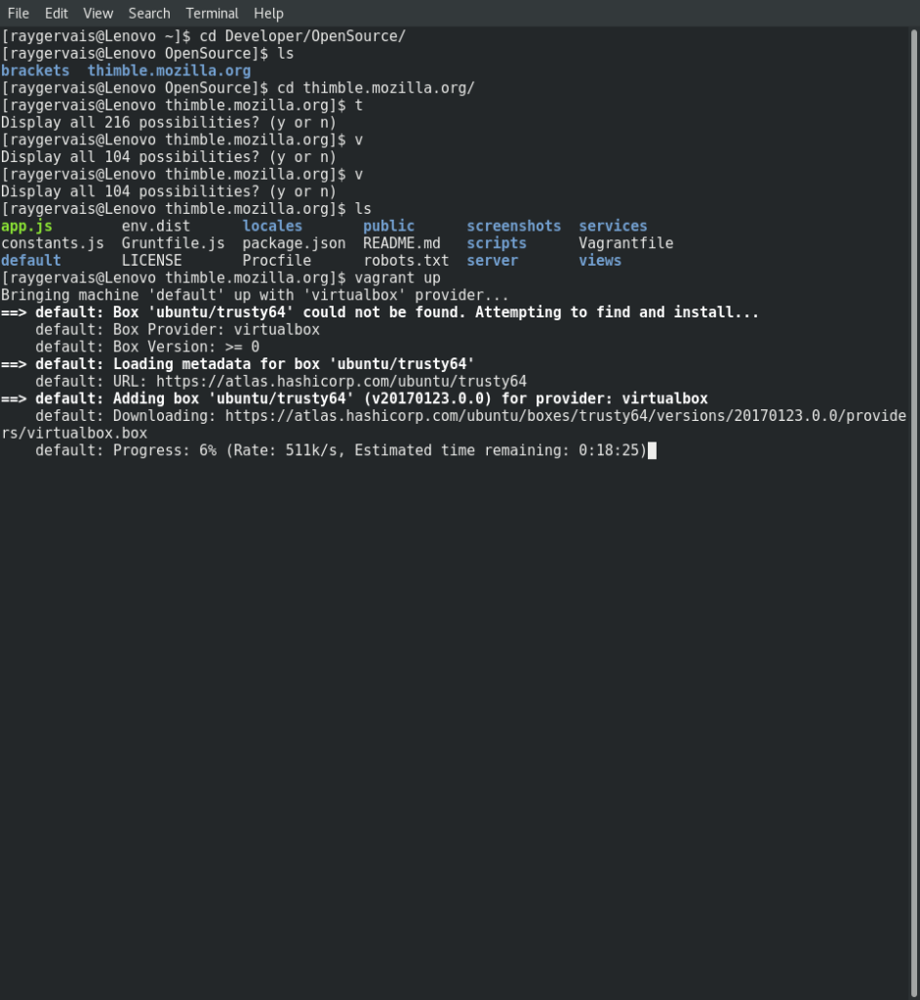

OSD600 Week Three Deliverable

Before I could attempt to fix this bug in [Thimble](https://github.com/mozilla/thimble.mozilla.org/issues/1635), I had to setup a local brackets program first on my workstation. Doing so was simplistic, following a the steps found [here](https://github.com/mozilla/thimble.mozilla.org#setup.):

- Fork the [Brackets repository](https://github.com/mozilla/brackets) and then clone it to your local machine using git clone --recursive https://github.com//brackets.git
- In the cloned repository directory, run `npm install` to install the dependencies for Brackets
- Run `npm run` build to create the built editor files that will be used by Thimble
- Run `npm start` to start a server that will allow the editor to be accessed on http://localhost:8000/src

 You can find out more information about setting up Brackets locally by referring to the instructions [here](https://github.com/mozilla/brackets#how-to-setup-bramble-brackets-in-your-local-machine) After successfully getting Brackets to run on my machine locally, the next step was to get Thimble and it’s services up and running. This involved forking and cloning the Thimble repository, and then running vagrant up. Because my workstation was running a minimalist package set, I had to install vagrant firstly before I could proceed. Then, running the previous command required my workstation to have Virtual Box installed, which at the time I didn’t. So, another call to the package manager and now I have Virtual Box running on the workstation. After installing any other dependencies, running vagrant up built thimble. The process took an estimated 20 minutes, but that was entirely dependant on the internet connection too. Once completed you can access Thimble by going to `http://localhost:3500/en-US/#`
