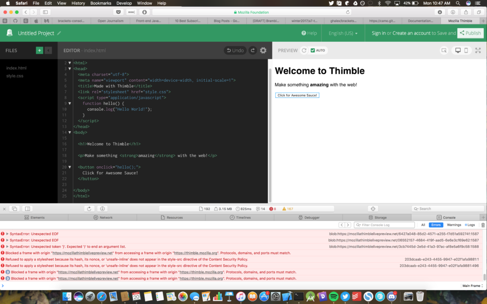

An OSD600 Contribution Update

This small post is an update to the [Thimble Console implementation](http://raygervais.ca/javascript-console-in-thimble/) that I’ve been working on with the help of [David Humphrey](https://github.com/humphd). I’m writing this at the time where a pull request is still being reviewed and extended as requested, which very well could be merged or approved-with the implied “Now do the UI” next step being assigned as well, while I write this post.

# What’s Finished?

The backend, though still in need of flushing out of more specific functions including console.table, console.count, and console.trace. The basic console functions which include console.log, console.warn, console.info, console.error, console.clear, console.time, and console.timeEnd have all been implemented; each supporting multiple arguments -which was critical once the evaluated ‘needs’ of the console implementation were described, citing the importance of using multiple arguments to provide meaningful data and context to the console functions.

# What’s Left?

User interface! The experience, which is also the main focus specifically; the access to the dedicated console without the need for developer tools or third party extensions. With the backend implemented and fleshed out to a releasable state, what is left falls down to the presentation layer, handling of said backend data, and the experience itself. Before, the only accessible means to viewing your console logs was through the developer tools, which included non-specific console data for the entire thimble instance, along with performance related logs, making access to the data you’re interested in borderline impossible at times. Furthermore, before the backend was implemented the console functions themselves referenced a random file which would be your editor’s current open file; though not an issue, it certainly was not clean or user friendly. Here’s an example taken from Safari’s Error Console:

 Brackets Console Extension\[/caption\] This is a popular [console extension](https://github.com/ghalex/brackets-console) for Brackets, which I’ve been advised to extend to work with Bramble seamlessly. With that, I’d change the typography and colors to better follow the standard bramble color scheme, and also modify the interface based on the requirements of Thimble.

\[caption id="" align="alignnone" width="1660"\] Node Console\[/caption\]

This comes from an [Nord](https://github.com/arcticicestudio/nord-intellij-idea-syntax>Intellij plugin Nord-Syntax</a>, which themes the IDE to use the <a href=) color pallet, one of which I am a fan of having recently discovered it. Simply put, while the console will not be togglable at the start, I’d personally advocate the use of the Nord color scheme, or even just a muted version of the Thimble color scheme which returns to the regular theme when interacted with; allowing the console to not intrude or become primary focus on the developer’s screen while programming until needed.
