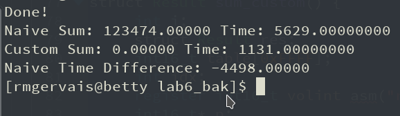

_SPO600 Deliverable Week Seven_

For this exercise, the task was described in the following way, “Write a version of the Volume Scaling solution from the Algorithm Selection Lab for AArch64 that uses the SQDMULH or SQRDMULH instructions via inline assembler”. Though this sounds rather complex to the average programmer, I can assure you that it’s easier to delegate or assign such as task than it is to actually implement if you do not live in a Assembly-centric world. Luckily, this was a group lab so I have to credit the thought process, the logic officers, the true driving force which would lead to the completion of said lab, Timothy Moy and Matthew Bell. Together, we were able to write inline assembly which completed the requirements on an AArch64 system.

## The Assembly Process

Multiple implementations were brought about by the group, some struggling to compile and others segfaulting as soon as the chance arose. One finally exclaimed promise, and all attention was shifted to perfecting it, which the final version of can be seen below. We modified the custom algorithm in the previous exercise with the inline assembly code, and recorded an improved performance metric compared to the naive C function.

```c
#define SIZE 1000000000
#define VOL 0.75

int16_t output[SIZE];
int16_t data[SIZE];

struct Result{
    double elapsed, elapsed_middle;
    struct timeval time_start,time_end;
    double sum;
};

struct Result sum_naive();

struct Result sum_custom();

int main(){
    int i = 0;
    struct Result r1, r2, r3, r4;
    char* fname = "input_data";
    FILE* fp = fopen(fname, "r");

    if(fp == NULL){
        return 1;
    }
    printf("Reading from '%s'\n", fname);

    // Read the file
    fread(&data, 2, SIZE, fp);
    fclose(fp);

    printf("Finished reading!\n");

    printf("Testing naive sum...\n");

    r1 = sum_naive();

    printf("Done!\n");
    printf("Testing custom sum...\n");

    r2 = sum_custom();

    printf("Done!\n");

    r1.elapsed = (r1.time_end.tv_sec - r1.time_start.tv_sec) * 1000 + (r1.time_end.tv_usec - r1.time_start.tv_usec) / 1000;
    r2.elapsed = (r2.time_end.tv_sec - r2.time_start.tv_sec) * 1000 + (r2.time_end.tv_usec - r2.time_start.tv_usec) / 1000;

    printf("Naive Sum: %.5f Time: %.8f\n", r1.sum, r1.elapsed);
    printf("Custom Sum: %.5f Time: %.8f\n", r2.sum, r2.elapsed);

    printf("Naive Time Difference: %.5f\n", r2.elapsed - r1.elapsed);
    return 0;
}

struct Result sum_naive(){
    size_t i;
    struct Result res;
    int16_t val;

    gettimeofday(&res.time_start, NULL);
    res.sum = 0;
    for(i = 0; i < SIZE;i++){
        val = data[i] * VOL;
        output[i] = val;
            res.sum += val;
        }
        gettimeofday(&res.time_end, NULL);

    return res;
}

struct Result sum_custom() {
     int i;
     struct Result res;
     int16_t table[0xFFFF];
     int idx;
     register int16_t volint asm("r20");
     int16_t* p;

     gettimeofday(&res.time_start, NULL);
     res.sum = 0;
     volint = VOL * 32767;

     for(p = output; p < output + sizeof(int16_t) * SIZE;){
         __asm__ ("LD1 {v0.8h}, [%0];  \\
            DUP v1.8h, w20; \\
            SQDMULH v0.8h, v0.8h, v1.8h; \\
            ST1 {v0.8h}, [%0]"
            : //no output
            : "r"(p),"r"(volint) //register holding pointer (refer as %0), then volint register (refer as %1)
            :
         );
        p += 16;
     }

    gettimeofday(&res.time_end, NULL);
    return res;
}
```

[](http://raygervais.ca/wp-content/uploads/2017/03/Screenshot_20170315_171702.png)

Looking back now at the code, I can see where we neglected compiler-performant optimizations such as removal of common loop calculations which may better the performance of the custom algorithm and also reduce multiplication operations. Furthermore the source code was littered with commented out implementations which I have removed from the above, proving that we a class and myself as a developer still have no basic understanding of Assembly.

We also noted during the closing of this exercise that the custom sum did not work properly. Still that was not the focus of the lab so we pressed on. Curious, I did a few changes to optimize the items that were mentioned above to see if there was a performance increase. The new result is below, which effectively shaved off 1.13 seconds the original custom algorithm’s runtime. The biggest change which I’ve included below is simply modifying line 89 to compare the following variable (which was created on line 88) to p instead of doing the calculation of output + sizeof(int16_t) \* SIZE.

```
int16_t sizeComparator = output = sizeof(int16_t) * SIZE;
for(p = output; p < sizeComparator;) {
   DUP v1.8h, w20; \\
            SQDMULH v0.8h, v0.8h, v1.8h; \\
            ST1 {v0.8h}, [%0]"
            : //no output
            : "r"(p),"r"(volint) //register holding pointer (refer as %0), then volint register (refer as %1)
            :
         );
        p += 16;
}
```

## Finding Assembly in Ardour

For the second part for this lab, we had to observe why inline assembly was used in one of the listed open source projects, and the musicians in me was too curious to pass the opportunity to look into Ardour’s source code. Ardour, is the definitive linux project aimed at recording, mixing and even light video editing. It is the Pro Tools of the open source world, the FOSS audio producers dream. I have not kept up to date with it’s recent developments, having played with version 2.\* on my makeshift Ubuntu Studio workstation years ago.

Using GitHub’s ‘search in repository’ feature, a quick search for ‘asm’ led to 40 results, which along with the code base itself, can be seen with the following link. For this analysis, I will focus on the first two unique results which, span two files; the first being is found in ‘~/msvc_extra_headers/ardourext/float_cast.h.input’ and the later being found in ‘libs/ardour/ardour/cycles.h’.

### Float_Cast.h.input Analysis

Opening the file displays this description first, which helps to understand the purprose of said file and answer a few questions such as operating system, cpu architecture targets and configurations:

```c
/*============================================================================
** On Intel Pentium processors (especially PIII and probably P4), converting
** from float to int is very slow. To meet the C specs, the code produced by
** most C compilers targeting Pentium needs to change the FPU rounding mode
** before the float to int conversion is performed.
**
** Changing the FPU rounding mode causes the FPU pipeline to be flushed. It
** is this flushing of the pipeline which is so slow.
**
** Fortunately the ISO C99 specifications define the functions lrint, lrintf,
** llrint and llrintf which fix this problem as a side effect.
**
** On Unix-like systems, the configure process should have detected the
** presence of these functions. If they weren't found we have to replace them
** here with a standard C cast.
*/

/*
** The C99 prototypes for lrint and lrintf are as follows:
**
** long int lrintf (float x) ;
** long int lrint (double x) ;
*/

The file itself seems to have functions which all call the same asm code, and returns different cast variables. The assembly code is below this paragraph and may differ throughout the file, out of the scope of my analysis and current window’s code.

_asm
   { fld flt
     fistp intgr
     } ;
```

#### FLD Instruction

The fld instruction loads a 32 bit, 64 bit, or 80 bit floating point value onto the stack. This instruction converts 32 and 64 bit operand to an 80 bit extended precision value before pushing the value onto the floating point stack. (University of Illinois)

#### FISTP Instruction

The fist and fistp instructions convert the 80 bit extended precision variable on the top of stack to a 16, 32, or 64 bit integer and store the result away into the memory variable specified by the single operand. These instructions convert the value on tos to an integer according to the rounding setting in the FPU control register (bits 10 and 11). As for the fild instruction, the fist and fistp instructions will not let you specify one of the 80x86's general purpose 16 or 32 bit registers as the destination operand.

The fist instruction converts the value on the top of stack to an integer and then stores the result; it does not otherwise affect the floating point register stack. The fistp instruction pops the value off the floating point register stack after storing the converted value. (University of Illinois)

#### What This All Means

Due to the lack of support for the _lrint_ and _rint_ functions on WIN32, they had to be implemented here for proper operation of the program. Once handed a floating point value in the case of the entire function outlined below, the asm code handles converting (or casting in the case of native C code perhaps) the float to an integer; the converted variable being stored in the specified register.

```c
__inline long int
lrintf (float flt)
{    int intgr;
    _asm
    {    fld flt
        fistp intgr
        } ;

    return intgr ;
}
```

### Cycles.h Analysis

Opening this file gave another explanation of it’s purpose at the top, a standard among many of the files here and one that I hope to use in my own future projects:

```c
/*
* Standard way to access the cycle counter on i586+ CPUs.
* Currently only used on SMP.
*
* If you really have a SMP machine with i486 chips or older,
* compile for that, and this will just always return zero.
* That's ok, it just means that the nicer scheduling heuristics
* won't work for you.
*
* We only use the low 32 bits, and we'd simply better make sure
* that we reschedule before that wraps. Scheduling at least every
* four billion cycles just basically sounds like a good idea,
* regardless of how fast the machine is.
*/

The file itself seems to be an interface between the cycle counter and the CPU architecture, attempting to support where it can the different architectures with the same scheduling platform.

#define rdtscll(lo, hi) \\
__asm__ __volatile__("rdtsc" : "=a" (lo), "=d" (hi))
```

#### **ASM** **VOLATILE** Analysis

The typical use of extended asm statements is to manipulate input values to produce output values. However, your asm statements may also produce side effects. If so, you may need to use the volatile qualifier to disable certain optimizations.

GCC’s optimizers sometimes discard asm statements if they determine there is no need for the output variables. Also, the optimizers may move code out of loops if they believe that the code will always return the same result (i.e. none of its input values change between calls). Using the volatile qualifier disables these optimizations. asm statements that have no output operands, including asm goto statements, are implicitly volatile. (GCC GNU Documentation)

#### What This Means

The user of the Volatile argument disables said optimizations which may deem the .asm code to be useless in the program, or the code itself is consistent throughout that of a loop. Disabling such optimization allows for the developer to have deeper control and integration of their variables in the scope of the function and program. This explanation is questionable mind you, for the volatile documentation spans pages and pages of examples which contradict or support my own explanation.

### Final Thoughts on Ardour’s ASM Code

From what I gather, this code is used for the same purpose that allows for support of a greater array of systems, be it on Windows 32bit systems, or AArch64. The CPU scheduler seems to play a pivotal role in how Ardour handles the various recording modes and cycles which play into real-time analysis of the output. The files themselves seem to be an afterthought, someone’s dedication to updated compatibility to an already stable system. That may be simply the sample bias of looking into the select few files that I did for this analysis.
