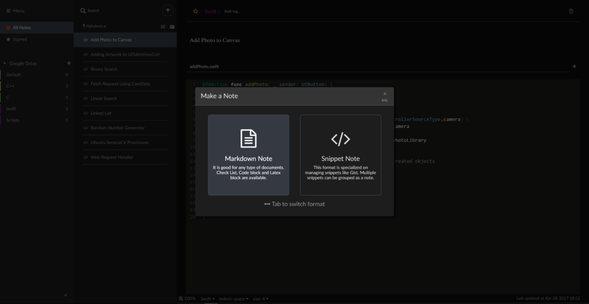
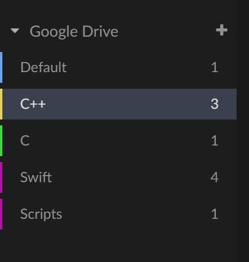

Recently, I came across a [review](https://itsfoss.com/boostnote-linux-review/) conducted by It’s FOSS which described a new open source project aimed at improving the experience of note taking for developers. Titled Boostnote, here’s what I gathered after making the software my default note taking application and snippet manager -replacing SimpleNote in the process.

# Website & Installation

Downloading the software for your respective platform is an uncomplicated process, the [website](https://boostnote.io/) supplying the files & overview of different features. A feature which caught my attention was the cross-platform availability of the note taker, all in credit to the wonderful Electron platform which is powering the vast majority of desktop applications as of recent. What does this mean? It means that I could utilize Boostnote on Linux, Windows, & MacOS devices. For this review, I primarily utilized the application on the later two platforms -my Linux box being moved to Mississauga during the time of this article. Still, I’d like to believe that due to the nature of Electron applications, the experience is ideally cross platform too.

Upon downloading the respective installer for your platform, the installation automatically sets up the program in a predetermined directory -on Windows, MacOS’ installation process simply involved copying the application to your Applications folder.

Finally, on first launch of the application you’re asked to choose a dictionary which will contain the various notes you make. Google Drive & Dropbox support is coming in future releases according to a tooltip, but I found no performance penalty when I created a folder directly in Google Drive (through the desktop applications) which would store the JSON notes. This way, I could keep all the notes synchronized while I or the team behind Boostnote implemented a dedicated server for cross-platform file synchronization.

# Themes

Initially, as all applications default to, the user is presented with the bright brilliance which dulls one’s appetite for night programming, the bane to the common programmer: a light theme. One of the advertised features of Boostnote was the inclusion of both a light and dark themed user interface. I quickly swapped the stark white aesthetic for a pleasing dark, which along with various syntax highlighting themes allows for quite the customization of the application. Because it’s open source, it’s nice to assume that you could contribute and improve the the functionality as you require.

One item that I’m looking into, is creating a dark syntax theme which blends seamlessly with the dark theme of Boostnote itself. So far, I’ve gotten close by using the icecoder theme. My ambition is to make a Nord-based syntax & interface theme which I’d love to contribute back to the project.

You can see from the [issue tracker](https://github.com/BoostIO/Boostnote/issues) on Github, the project is far from perfect. Some inconsistencies, bugs, glitches even, dwell within the current release, whereas enhancements and improvements are also being discussed for future releases. Overall, I’m impressed with the overall polish and current implementation.

# Functionality

## Updates

With all the looks, charms and dark themed components, one has to wonder if it’s the eye candy is to distract from the implementation itself -or if the implementation itself perhaps is even more beautiful than said eye candy. Well, let’s talk about the implementation, features, and general feel of this application.

Opening the application, I was greeted with a small update dialog to the right, simply notifying me of an update downloading in the background -not obstructing or delaying my work with the application. It seems the update runs in the background entirely, meaning the next time you were to run the application the update would apply itself. At the time of writing this document, Boostnote was at version 0.8.8 with 0.8.9 being released within an hour or few according to the application’s Github page. It seems that as more developers discover and play around, they’re equally contributing back to the project and fixing bugs.

## The Editor

Once getting to the editor, the meat of the application some would argue, you’re displayed what could be described as the closest friend you’ve ever known; a text editor. Perhaps some aren’t as fond as I am with the text editing region of a development platform, but if you’re going to spend hours, sometimes days of your entire week staring at a single item, I feel the importance starts to weigh in.

Thanks to the customization I had done previously, which if I may add, were simply for preference and did not improve the editor itself in any way outside of it’s aesthetics, I had an immediately usable, and friendly-at-night interface. How does it work? Well because it’s a simple snippet manager, a note taking platform, I didn’t expect anything beyond the realm of simple text entry and syntax highlighting. Is it a powerful editor? No. It doesn’t need to be, and I think that’s what makes it so inviting for note taking. The lack of “bling” also results in startup time which rivals that of Visual Studio Code -another Electron app, and is only out-shined by the startup-king-of-text-editors: Sublime Text.

Overall, I couldn’t ask for much more from a basic note taking application on the snippet side.

Markdown notes are an interesting case, which can be created by selecting “Markdown Note” instead of “Snippet” when creating a new document. Because of the way Boostnote approaches rendering of the Markdown notes, which is to render the document after the user has become inactive on the document, I was confused at first when my text editor would disappear, replaced with the rendered version while I took a five second break to consider how best to explain the code snippet. This isn’t an issue at all, simply just a different workflow than the standard preview in one window, source in other.

One inconsistencies which I’ve seen so far, is the markdown preview not following the syntax theme I had previously set, instead resolving to the default. It’s too early to throw darts at the application, so once version 1.0.0 is released I’ll take a look into outstanding issues & update this post.

## Organization

Compared to Simplenote, which employed a simple tag system which would continually dump ALL of your notes on your screen, Boostnote takes on the traditional “Folders” setup which I appreciate beyond words. Having to tag a C++ snippet as #cpp used to make me cringe, so I only see good things so far in contrast.  Likewise the ability to include multiple “notes” in a single note (ala OneNote’s notebook style) is useful for those who like to keep bigger snippets separated & organized. ItsFOSS cited an annoyance of not being able to drag-drop notes between various dictionaries, but I did not find that overly frustrating since my workflow rarely if ever calls for such maintenance. Again, different workflows, different preferences.

## Search

I found the current state of the search features to be a mixed bag, expecting the search to run through and return to my code snippets which contained a simple `int` keyword for example, I got no such results. That being said, if I included said keyword in the title, tags, or even description, then that document would be returned within the blink of an eye. Needless to say, we will have to wait and see before judging.

# Conclusion

This application has been a great mix of flourish & disappointment, of wonder and oversight. What else could you expect from an application which hadn’t hit the 1.0 version number? I’m happily watching the development of this application, contributing even in the near future, so that when 1.0 does roll around, it’s improved upon issues I or other developers have encountered while using it. The rough edges shouldn’t keep you away from giving the application a chance, and perhaps you’ll even come to enjoy it as much as I did while writing about it! To conclude, I’ll agree with ItsFOSS’ last remarks, citing that Boostnote is not for everyone -not every workflow is efficient on this platform, nor is the interface attractive to everyone. It’s a hit & miss application, but a great start to one at that.
