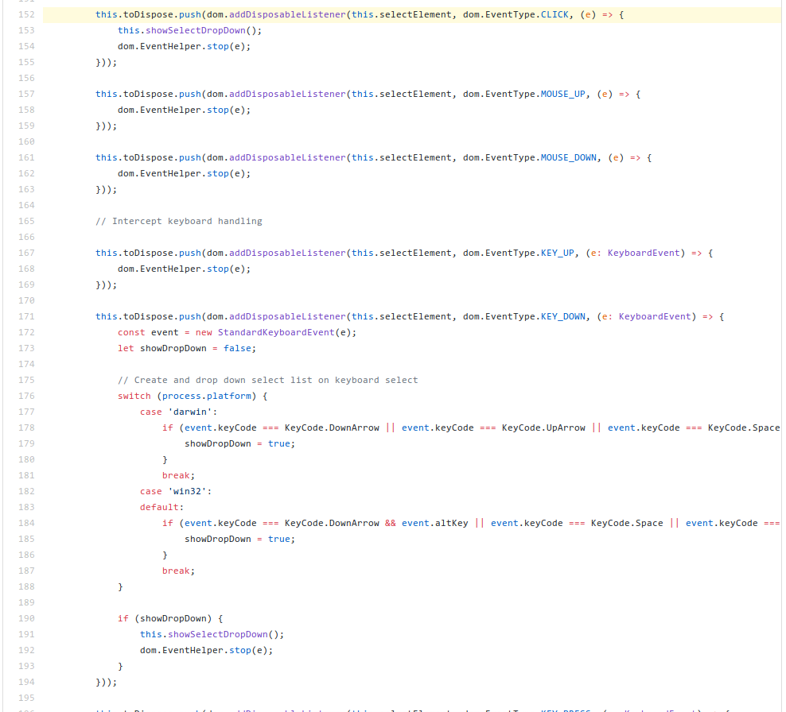
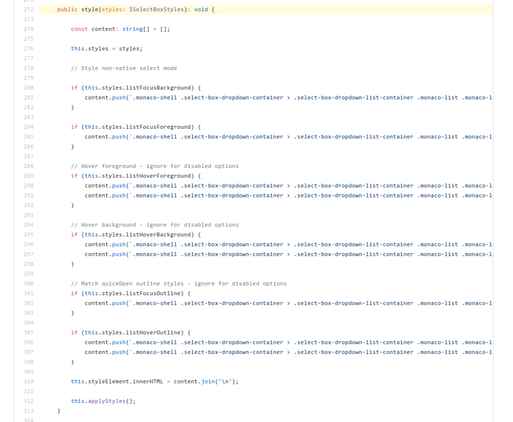
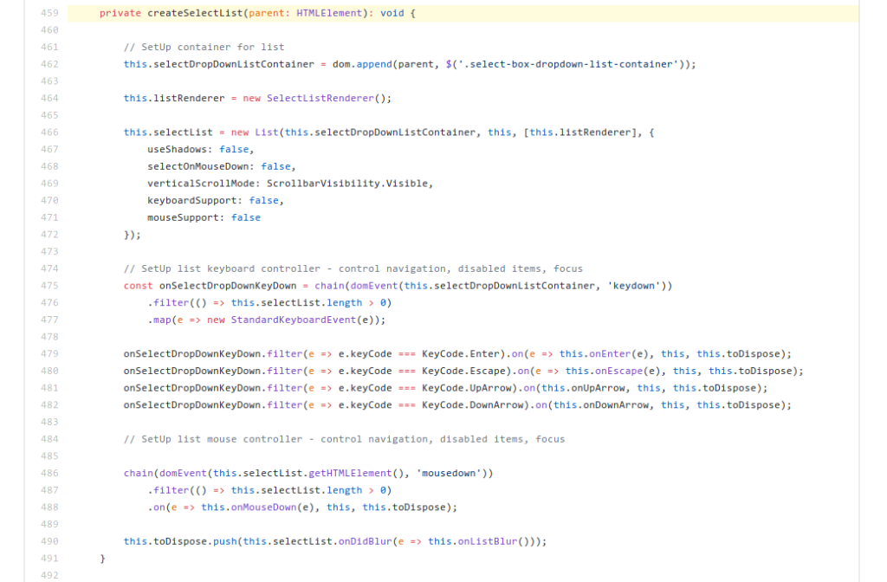

When I first started contributing what I could to Visual Studio Code, I was under the impression that it was written using React. Even while working with the custom drop down component, I was still under the impression there were React Front-end technologies which enabled for the dynamic rendering of various components and functionalities. Only in recent, while debugging and looking for high-level understanding of different scopes, did I realize that Visual Studio Code developed without the front-end JavaScript frameworks such as Angular, Vue, React or even MeteorJS. Without sounding like I just discovered Pluto being once called a planet, this was very left field.

Programmatically Generated UIs is a term I've heard while doing research on iOS Development practices, but I never considered a full-blown web application (including all the HTML attributes and so on) being powered in such a way. I remember using basic JavaScript to change the DOM while learning how to do front-end validation for INT222 (now WEB222) at Seneca, but never to generate entire navigation bars or full-blown text-editors; the concept and understanding of said concept is both the scariest, and most interesting discovery I've attempted to learn and dig deeper into in the past few weeks. Looking back at the custom drop down source code, I realize that I was so caught up in the state persistence and accessibility concern of the bug I was working on, I never realized just how genius the component's implemented; in-house, no external frameworks or libraries.

# The Flipping of Comfort and Concerns

In every project to date; be-it Enterprise for SOTI, Open Source, or even just Seneca course projects, I've never considered a programmatically generated and managed user interface. While looking more into Visual Studio Code's logic, I instead of becoming familiar with it, began to become more concerned quicker and quicker as I had to search for life cycle handlers which a standard layout or framework would handle. DOM manipulation is one thing, but recreating, redrawing, and DOM-managing the entire component while all being in-house along with storing application state is very much left field compared to my experiences. While looking over the code, I did find two valid and worthwhile reason for such design practice, which I'll explain below.

# The Liberation from Framework Idioms

In the past year working with Enterprise level Angular applications, I've come to understand the saying 'going against the grain' when it comes to working with frameworks and libraries; they are amazing when you implement within their design and allowance, and an absolute nightmare when the scope goes beyond or against the framework's design. I see with Visual Studio Code, the happiest of mediums where more time dedicated on design and development, and less on fighting the code and assets which make up your product.

## Examples

[Adding all event listeners to the custom drop down element](https://github.com/Microsoft/vscode/blob/9a5b6ebc08d530463203c75a92e0ea49b6becc73/src/vs/base/browser/ui/selectBox/selectBoxCustom.ts#L152) 

[Dynamic styling of the drop down based on context](https://github.com/Microsoft/vscode/blob/9a5b6ebc08d530463203c75a92e0ea49b6becc73/src/vs/base/browser/ui/selectBox/selectBoxCustom.ts#L272) 

[Creation of the select list HTML element](https://github.com/Microsoft/vscode/blob/9a5b6ebc08d530463203c75a92e0ea49b6becc73/src/vs/base/browser/ui/selectBox/selectBoxCustom.ts#L459) 

# Deeper Management of Application Logic and Views

Compared to having multiple components, edge-cases and sub-component requirements, you can manage all of which (cleanly) in a single well encapsulated scope. This is only possible because of the (granted, concerning) freedom which programmatically managed interfaces offer, since scopes of the element such as data, state, and interface itself derive from the same scope: in a single language and instance (compared to Angular's HTML, TS, and SCSS separated file structure). One video that I had discovered last year which explains the benefits and reasoning why even iOS developers going this route compared to creating storyboard layouts:https://www.youtube.com/watch?v=up-YD3rZeJA

# Final Thoughts

I'm looking forward to exploring new concepts such as this as I go about Visual Studio Code, and hoping that I never stop being thrown into challenging or adventurous situations where the only way out is to learn and understand it. I'm sure I've only uncovered only 5% of the entire concept, still unsure of every reason behind it, and even the proper implementation paradigms in Code; going forward with the bug fixes and improvements I hope will explain more and make me a better developer in the process.
