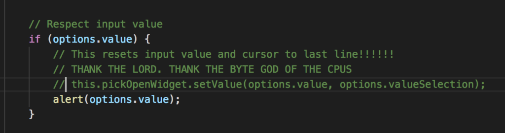

## An OSD Contribution Update – Part 2

# Getting up to Speed in the Late Hours

In my previous [post](http://raygervais.ca/working-with-git-bisect-and-visual-studio-code/), I went through a retelling of anguish, environmental issues and dead ends while trying to evaluate how a bug such as this was possible. Throughout the process, I kept asking myself and even the other developers, what is the scope? Where could this bug be created? The overall scope of QuickOpenController.ts is massive, since it acts as the User Interface between many mediums which all have their own set of requirements, validation rules, and user input rules to be enforced. The scope was never defined in the time that I had to work and understand the bug, so I began an old method which had proven to display results. I console.log'd, and alerted till I was blue in the face. Well, almost blue. I was a mix of 4AM hues: despair, desperation, frustration, and sleep deprivation by the time 'results' started to show themselves.

**A couple of notes before I go on:**

- I owe a working with Git Bisect article, since this one still does not detail the process or my thoughts on said process. To remedy, I think I'm going to rename the article series from 'Working with Git Bisect and Visual Studio Code' to 'The Trials of The Promise-Centric Input, a Visual Studio Code Story'.
- The ending of this article has a rainbow, one which looks like a faded, easy to miss image which compares to tie dye shirts after they start to lose their luminance. It's a happy, 'look what I did hackers!' kind of rainbow, but one that is also easily dismayed by a lack of confidence in the final fix.
- My god have I learned how easily one can glance over the information they are looking for, unknowingly skipping the one line which has the answers to their questions. Thanks David again for finding the extension host argument for Code's CLI.

# Progress looks like a Pillow full of Sweet Nothings

Back on track, where a 4AM 'all or nothing' type of hacking session produced some of the most unexplainable, and yet tangible concept of how the code worked. Through the console logs and alerts, I learned how the `doPick` function worked against the user's input lazily, validating only as conditions were changed instead of every keystroke being entered. It was there that I also managed to catch the scope where the cursor is moved to the back, progress! Now I could remove all breakpoints (saving me what would add up minutes of `step throughs`) and add them into this scope alone. Alas we are moving at lightspeed now R2.

\[caption id="attachment\_730" align="alignnone" width="792"\] A rare moment of light, where the comments reveal my inner thoughts as this little experiment produced golden results.\[/caption\] Following the same path of console logs and the infamous alerts, I managed to emulate a very basic A/B test where a `console.log('PRE:', this)` would occur prior to the cursor change, and the second `console.log('POST:', this)` occurring just after. I had cornered the function itself in between two statements which allowed me to check for state changes, while also establishing the direct line which changed it. I'm pleased to admit that it was from my first article's speculation, I was very close to the money when I guessed that the value being set each time caused the cursor to move to the (default) end of line.

# Break All the Things

Imagine yourself ambushing a single function, knowing that when it's called you're watching it's every move, it's every operation. What do you do to confirm that the function does indeed know where the rainbow's located? Well, I decided to break it. Moreso, I decided that my first step (as one may do when asserting dominance), was to make it disappear.

Making it disappear broadcasted an overall UI change which was hard to miss, and also a removal of the bug itself. Still, I couldn't just leave it commented out and helpless. I removed the comment-line restraints from the conditions found [here](https://github.com/Microsoft/vscode/pull/45077/commits/abad03d1913dc19a435132bfb9fa750242502602#diff-efeb3f5a180f00bd9db3f96c43f67f5cR332), and left `this.pickOpenWidget.setValue(...)` commented out. Now, we were fishing to see which logical block led to the amazing wonders which is well-deserved sleep. It became clear after my next round of reproducing the error that the function itself being called causes the cursor jump, and from my opinion, did not need to be called in every single case.

The logic fix that I opted for which did cover the two edge cases described was to check if the validation process had started, meaning when `options.valueOptions` existed then the user had already begun to input into the component, and we shouldn't be redrawing the input with the previous state -autofocusing in the process. After this corrected the initial issue, I went about testing other command palette functions to ensure that I had not tampered with other bits of functionality. When all was good, I slept.

\[caption width="3368" align="alignnone"\] The Rainbow at the end! Photo by [ Sam Kulesh](https://unsplash.com/@kulesh)\[/caption\]

# 3 Hours Later: Conclusions

The final resolution that I came up with can be found [here](https://github.com/Microsoft/vscode/pull/45077), which contains a pull request being reviewing and evaluated for the validity of the fix -a case I knew would occur since this fix affects almost all non-editor related user input such as the command palette, file opening, symbol finder, etc. Even as I'm writing this, I'm not confident that the fix itself is the most correct of all possible ones, since the scope and affected functionality rings through many other edge cases. Imagine changing how a paragraph tag works on your average website; that big of a change.

\[caption width="640" align="alignnone"\] Custom Function Reproducing the Error... Fixed!\[/caption\]

\[caption width="640" align="alignnone"\] Azure Functions Error Replicated... Fixed!\[/caption\]
