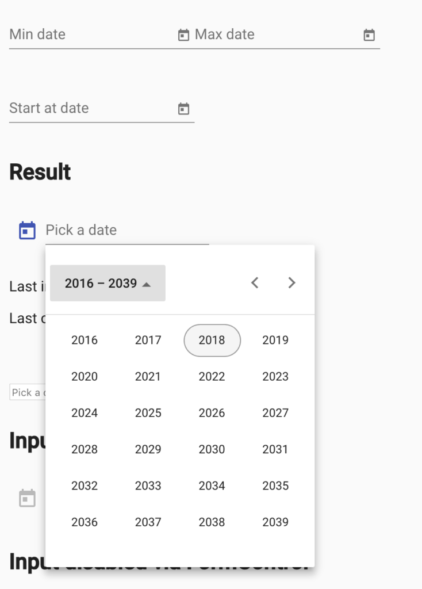
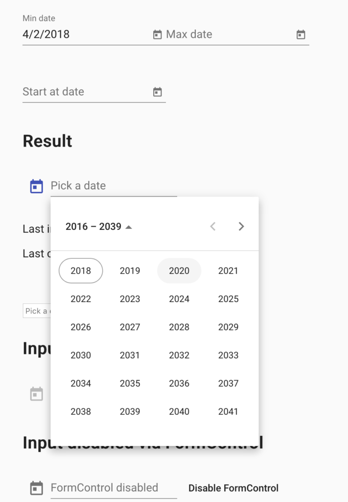
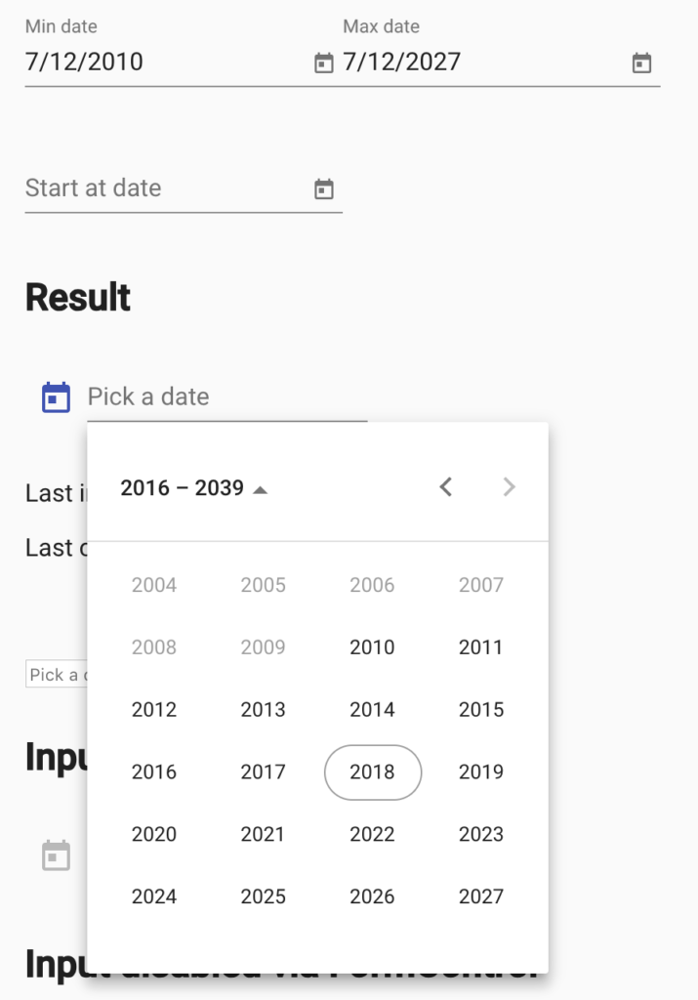

_An OSD700 Contribution Update_

_So here we are, potentially the last contribution to occur for OSD700 from this developer before the semester ends and marks are finalized. No pressure._

For this round, I wanted to tackle a [feature request](https://github.com/angular/material2/issues/10646) which I thought would be beneficial for those who utilize the date picker component (a common UI element). The concept is to dynamically remove and add years to the overall date picker based on the min and max date configurations. Sounds rather simple, right? I thought so, but I also had to admit my lack of experience working with the code which dynamically generated the calendar and years portion to this degree before. The inner workings are vastly complex and data driven, which in itself is an interesting design.

The process so far while working on this has been an off and on "hey I get this", and "I have no idea what to do with the current concepts". You can see throughout my work in progress the various off and on's when it comes to understanding, implementing and asking for advice / suggestions which gets us to where we are now. Currently, as I'm writing this, with the help of [mmalerba](https://github.com/mmalerba) and [WizardPC](https://github.com/WizardPC), I have the dynamic year portion working as desired; some artifacts needed to be addressed such as the displayed year range in the header needed to be updated, the years-per-page seem to overlap on the final year if over 24 years gap between min and max, and a potential 'today' variable which isn't always the current date.

There have been many revisions to the code base that I've been playing in, often rearranging logic and algorithms to accommodate the four edge cases which are: 1. With no Min / Max provided: the Multi-Year Date Picker behaves as current implementation 2. Only min date provided: Year offset is set to 0, making the min-year the first entry 3. Only max date provided: Year offset is set to a calculated index which equates to max-year being the last entry 4. Both min and max provided: Follows same logic as case 3.

The process of making the first edge and second edge case were relatively painless, this in part also due to the advice and comments left prior to me even writing my first line for this feature set. I've included below this that revision and various revisions I had attempted (skipping over the minor changesets) until I finally had the working version a few days later. You can see the progress in my WIP pull request [here.](https://github.com/angular/material2/pull/10910)

**Revision #1 (Min Date Working as Expected)**

```js
this._todayYear = this._dateAdapter.getYear(this._dateAdapter.today());
let activeYear = this._dateAdapter.getYear(this._activeDate);

// Default Behavior for Offset
let activeOffset = activeYear % yearsPerPage;
if (!this._maxDate && this._minDate) {
  activeOffset = 0;
}

// Whole bunch of wrong logic
...
```

After I clarified that this was indeed what we wanted for the second use case (min provided), now came the harder algorithmic portion for use case 3 and 4. What I'm working around looks like the following:

**Revision #2 (A lot closer to expected logic)**

```js
this._todayYear = this._dateAdapter.getYear(this._dateAdapter.today());
let activeYear = this._dateAdapter.getYear(this._activeDate);

// Default Behavior for Offset
let activeOffset = activeYear % yearsPerPage;

if (!this._maxDate && this._minDate) {
  activeOffset = 0;
}

if (this._maxDate) {
  const maxYear = this._dateAdapter.getYear(this._maxDate);

  // Keep number positive
  const yearOffset =
    activeYear - maxYear >= 0
      ? activeYear - maxYear
      : (activeYear - maxYear) * -1;

  // Determine how far to push offset so that max year is at end of page
  const currentYearOffsetFromEnd = yearsPerPage / yearOffset + 1;
  activeOffset = this._minDate ? 0 : currentYearOffsetFromEnd;
}
```

The snippet below was the logic which should be followed, at first I thought nothing of it, but I realized that (yearOffset - Math.floor(yearOffset) would 100% return 0.

**Revision #3 (Snippet)**

```js
const yearOffset = (maxYear - activeYear) / yearsPerPage;
const currentYearOffsetFromEnd =
  (yearOffset - Math.floor(yearOffset)) * yearsPerPage;
const currentYearOffsetFromStart = yearsPerPage - 1 - currentYearOffsetFromEnd;
// Determine how far to push offset so that max year is at end of page
// const currentYearOffsetFromEnd =  Math.floor((yearsPerPage / yearOffset)) + 1;
activeOffset = this._minDate
  ? currentYearOffsetFromStart
  : currentYearOffsetFromEnd;
```

**Final Working (Pre Syntax Cleanup)**

```js
this._todayYear = this._dateAdapter.getYear(this._dateAdapter.today());
let activeYear = this._dateAdapter.getYear(this._activeDate);

// Default Behavior for Offset
let activeOffset = activeYear % yearsPerPage;

if (!this._maxDate && this._minDate) {
  activeOffset = 0;
}

if (this._maxDate) {
  const maxYear = this._dateAdapter.getYear(this._maxDate);

  const yearOffset = (maxYear - activeYear) / yearsPerPage;
  const currentYearOffsetFromEnd =
    (yearOffset - Math.floor(yearOffset)) * yearsPerPage;
  const currentYearOffsetFromStart =
    yearsPerPage - 1 - currentYearOffsetFromEnd;

  activeOffset = this._minDate
    ? currentYearOffsetFromStart
    : (24 % currentYearOffsetFromEnd) - 1;
}

this._years = [];
for (let i = 0, row: number[] = []; i < yearsPerPage; i++) {
  row.push(activeYear - activeOffset + i);
  if (row.length == yearsPerRow) {
    this._years.push(row.map(year => this._createCellForYear(year)));
    row = [];
  }
}
this._changeDetectorRef.markForCheck();
```

[](https://unsplash.com/@7bbbailey)

Words cannot describe the waves of frustrated "this will never work" monologues and "this is progress" relived exhales occurred during the past week while working on this feature, nor can words describe the amount of dancing-while-no-one-is-around that I did when I finally reached the current implementation. Based on the use cases mentioned above, here is a visual for each:

**Case 1: No Min / Max Date Provided** [](http://raygervais.ca/wp-content/uploads/2018/04/Screen-Shot-2018-04-22-at-4.01.24-PM.png)

**Case 1: Min Date Provided** [](http://raygervais.ca/wp-content/uploads/2018/04/Screen-Shot-2018-04-20-at-11.04.22-AM.png)

**Case 1: Max Date Provided** [](http://raygervais.ca/wp-content/uploads/2018/04/Screen-Shot-2018-04-22-at-4.02.33-PM.png)

**Case 1: Both Min / Max Date Provided** [](http://raygervais.ca/wp-content/uploads/2018/04/Screen-Shot-2018-04-22-at-4.02.12-PM.png)

I simply cannot explain the thought process which came to the final conclusion, more so I am able to explain the biggest flaw I had in my own thinking. I over thought quite a bit, and more so became overwhelmed with the thought that I would not complete this or the code base was too complex (I will, it's not). I suppose the time of day I typically worked on this bug didn't cater well to the mentality while approaching the code, nor my mindset of 'one more item due'. Once I took the weekend to correct that, and to slowly relearn the task required and the changes (instead of breaking the scope into much bigger unmanageable portions in attempt to 'get it done'), thoughts and attempts became much clearer.

Whats left? Well, at the time of writing this post I still have to fix the headers, isolate, identify and fix any edge cases which the algorithm doesn't take into account, and also clean up the code of any useless commented out code. I believe that it can be done, and after the progress today I can happily say that I'm more optimistic than I was on Friday to complete this feature request. I've loved contributing, learning what I can through toil and success and also feeling the "I can accomplish" anything high when the pieces finally click. Once I settle down in my new role, I hope to keep contributing both to Angular Material, and new projects which span different disiplines and interests.
