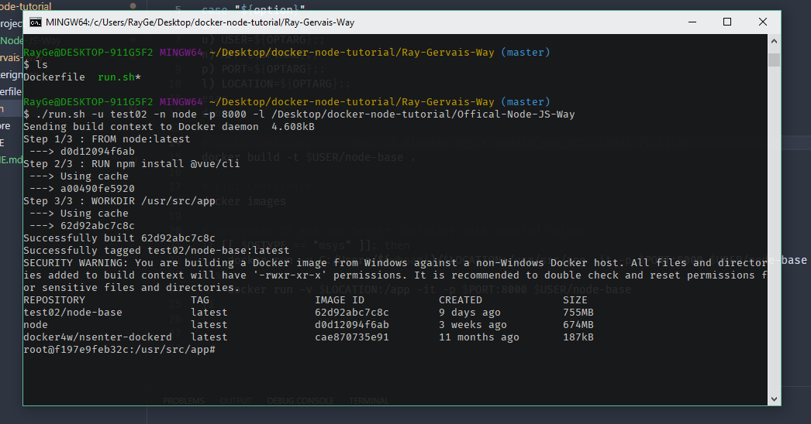
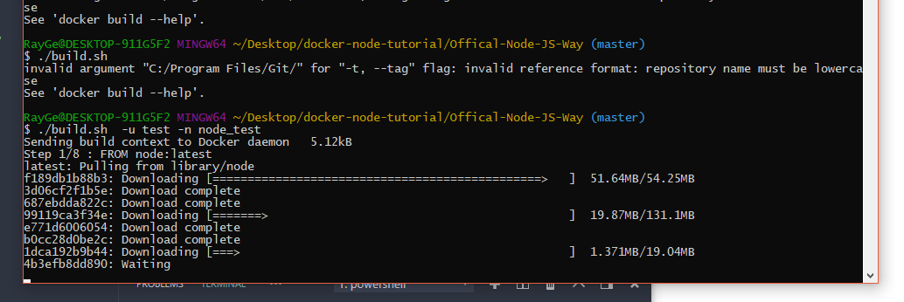

_From a Developer’s Perspective_

> “NodeJS and Windows don’t work well.”  
> “I Need to run with Root Permissions to globally install vue on my MacBook Pro!”  
> “NodeJS broke my Linux Servers FS Permissions.”  
> “NodeJS can’t be found in my PATH!”

I’m sure you could list ten more items before finishing the next paragraph, but it’s clear to see that when discussing NodeJS, you cannot couple such powerful feature sets without the risk of also introducing issues with your own system or as I like to call it, ‘file-clog’ from the thousands of globally installed modules you make available to each project.

I found myself frustrated with this constant battle, be-it on ANY system that I was using. Eventually, they all became too cluttered and unlike a USB key which you could pull away and forget about, it was hard to clear out the jank without exposing your rm -rf habits to critical file systems. This is where I came up with the convoluted but totally awesome idea: Can I run NodeJS projects through Docker, and discard the container when I am done?

Turns out the answer is **yes**!

Aside from the above, why would anyone really look into this approach? Well, let me provide a few examples:

- Your AngularCLI install is out of date, and any attempts to update also messes with your TypeScript version installed in the project or on your system.
- Your testing framework creates files which aren’t cleaned up after, which results in artifacts on your system which are out of date by the next run.
- You don’t want to muddy up your PATH with dozens of modules or leave it as stock as possible.
- You want to leverage similar workflows on multiple computers using a single setup script/configuration.

The two workflows differ due to end-goal, I’ve included NodeJS’ fantastic workflow for 'dockerizing' your application for production and orchestration, alongside my own development workflow. Whereas NodeJS’ simply need minor refinement (such as using multistage Docker builds to reduce final container size -stay tuned for my exploration and updates to that in the tutorial repo outlined below!), my workflow is still a work in progress.

My end goal of reducing .node_modules found on my computer is still not 100%, but it removes the need for global CLI’s and tooling to be existent on my file system, alongside Node itself. I imagine at this point into the post, you’re wondering why would I bother trying to complicate or remove the NodeJS dependencies in my workflow; to which I simply say: why not? In my mind, even if the workflow gets deprecated or shelved entirely, I’m glad that I got the chance to try it out and evaluate the value it could provide.

## Dockerfile - My Workflow Tutorial - Development

My workflow leverages Linux symlinking with your application folder purely for the ability to edit your project in the IDE or text editor of choice, instead of in the container. This, coupled with many CLI’s having auto-build enabled by default creates a powerful and automated development engine. Scripted portions allow for simplistic automation of the redundancies such as mounting the code directory to /app, and all that is left is for you to run in the container (which the script lands you in):

npm install && npm start!

Leveraging the Seneca Application in the Offical-Node-JS-Way Folder

_One critical item which you need to do is enable in the Docker settings the shared volume location for your work/development directory. Without this, the script will fail to copy a symlink version of your project. On Windows 10, this is still an uphill battle where permissions and file system securities make this a not-as-smooth process. See the following [link](http://support.divio.com/local-development/docker/how-to-use-a-directory-outside-cusers-with-docker-toolbox-on-windowsdocker-for-windows) for an explanation why the bash script determines your OS and changes location prefix:_

Running run.sh puts us directly into the container with our code in /app

The beauty of this method, in my opinion, is that it allows for consistent environments (such as what Docker is intended for) both for development and testing, with the absolute minimum of clean up or exposure to your filesystem. Because of the system link to your project folder, files modified in your editor or in the container reflect the other. This leads to node_modules also being a residual artifact that my next version of this workflow aims to remove from the equation. Once you’ve shut down the container -and thus, removed the link to your project(s), a container-cleanup is as simple as: `docker kill CONTAINER_ID`. Or to kill all running containers `docker kill $(docker ps -a -q) # to kill all`. Then to finally remove the image `docker rmi CONTAINER_ID` or to remove all image(s) `docker rmi $(docker images -a -q) -f`.

Development Server working via Port 8080, utilizing a Node module such as Nodemon would cause rebuild and refresh (client-side) per code change. Damn useful!

And boom, you are now back to a clean filesystem with your project safely and cleanly in its own place, the only remainder being the .node_modules folder in the project itself which you can delete manually.

## Dockerfile - NodeJS Tutorial - Production Build

The official way that NodeJS recommends using Docker is for containerizing your final application, which I highly recommend once you get to said stable state. It’s fantastic for having all your final dependencies and compiled source code running in a container that can be handed off to the cloud for orchestration and management.

Running build.sh to pull Docker image

I used this method quite often when deploying MEAN-based microservices at SOTI, and also for my own projects which are then orchestrated with Docker Swarm, or Kubernetes.

Configuration and listing of Docker images

The benefits with this workflow include being able to utilize Docker’s multi-stage build process so that the node_modules prior to being bundled in the application exists in a staging container which is never included in your final image, and instead, only the final output is bundled.

Local test of final application container

Taking their tutorial, I wrote two scripts titled build.sh and run.sh (pictured above), which automate some more of the process. Taking an old, lightweight application written for OSD600 and leveraging Express as a dependency, you can see how powerful this option for bundling and containerization is!

## Closing Thoughts on V1

Well, I hope you get the chance to utilize this workflow and improve upon it. I’m looking forward to seeing what you can do with this little experiment of mine, and also how it may better maintain the health of your host operating system while exploring the hundreds of JavaScript frameworks and libraries which are created daily!

I decided to label this Version1, implying that when I have the chance to revisit the process I’ll update and improve it. In that vein, I also did some thinking and decided to compare or share some thoughts on both processes:

- Following the NodeJS way is far too costly since it would recreate the container each time, the current workflow at least keeps all global cli’s to the container itself, and Node itself is contained as well to the image.
- Likewise, following the NodeJS direction would remove some of the modularity I was aiming to keep, so that it could be used on one, three, ten projects all the same.
- I had Toto’s Africa on repeat for a good hour or so while drafting this, apologies if you can notice any rhythmic mimicry to the first verse at points in the writing.
- Updates to this will come, but for now I am content with the current workflow despite shortcomings and complexity.
- Docker’s documentation is by far one of the best pieces of technical writing I’ve ever been exposed to. It’s that good.

Tell me, what is your Docker workflow? How do you use Docker outside of the norm?

[Tutorial Repository](https://github.com/raygervais/node-docker-workflow-tutorial)

## References & Research:

[https://nodejs.org/en/docs/guides/nodejs-docker-webapp/](https://nodejs.org/en/docs/guides/nodejs-docker-webapp/)  
[https://github.com/raygervais/OSD6002017](https://github.com/raygervais/OSD6002017)

## Troubleshooting:

[http://support.divio.com/local-development/docker/how-to-use-a-directory-outside-cusers-with-docker-toolbox-on-windowsdocker-for-windows](http://support.divio.com/local-development/docker/how-to-use-a-directory-outside-cusers-with-docker-toolbox-on-windowsdocker-for-windows)
