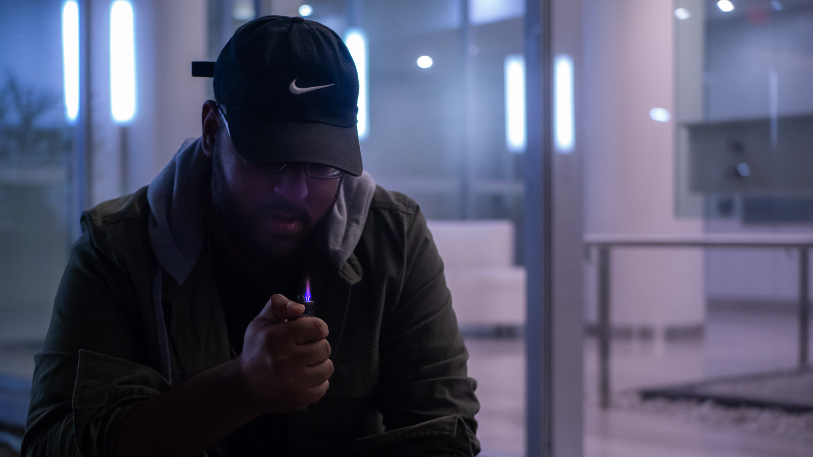
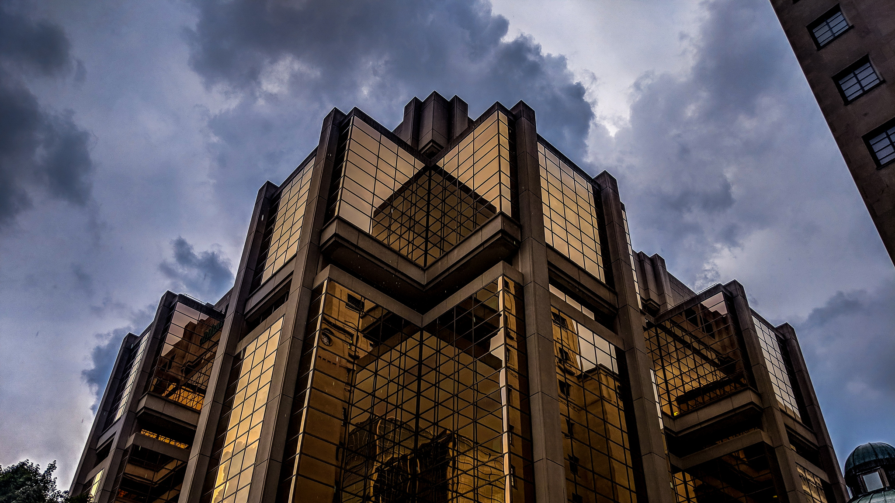
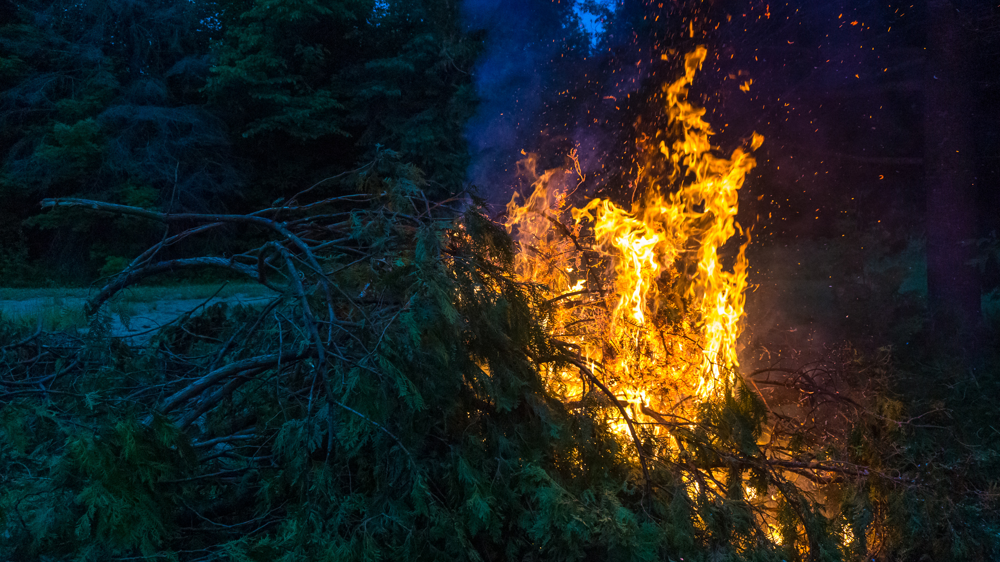

\[caption id="attachment\_857" align="alignnone" width="2048"\] "City Blur"\[/caption\]

So, this blog post has been long overdue. There is both so many experiences and thoughts I want to share, and yet so few which I personally feel would be of any use to you. Regardless, without any order, here are some of the activities that I’ve enjoyed and also learned from this summer. For the technical, programming centric, let me follow that up with a smaller post since I didn’t commit anything major this summer outside of my work at ManuLife (which has its own lessons including Docker, Kubernetes, Concourse, Chef, … let’s write an article on that soon, okay?).

**PS**. TLDR can be found at the bottom.

## Photography

It’s no surprise to many who’ve followed my social media channels outside of Twitter that I’ve started adopting many vlogger / cinematography based habits including in-the-moment streaming, hourly updates, and capturing images in any way I can while trying to express a dramatic composition. Through social media, I also complained about small annoyances (such as not being able to change the focal length or aperture on my Pixel 2 XL. First world problems?) which probably should have been simple annoyances, but instead led me to purchasing a second-hand Sony Alpha A6000. Out of all the impulse purchases made, I think this is arguably one of the most spontaneous, and also best purchases I’ve made without hesitation. The camera enables both a new level of expressive outlets, and also a new money-swallowing hobby for me to jump headfirst into.

\[caption id="attachment\_866" align="alignnone" width="1152"\] Svitlana likes to use the camera as well\[/caption\]

Yet, I didn’t once hesitate or draw regret over the purchase or the hobby. Instead, I began planning more and more events, trips, areas to visit with frequent friends such as Svitlana, Jessica, and Nick. I began spending countless hours learning about framing, editing RAW images, and also how to manage a basic following -all through the magic of YouTube, Udemy or Pluralsight (Thanks ML for hooking me up with PS for free!). The visits to the hometown became much more meaningful, and allowed me to stretch the concepts I was learning where possible. I spent two hours waiting for a chipmunk (named Fred fyi) to come and go, getting closer and closer to the camera until finally I captured shots such as this.

\[caption id="attachment\_864" align="alignnone" width="2048"\] Fred the Chipmunk\[/caption\]

My interests in Photography also helped both my father’s media and branding, and my friends who’s social media accounts were itching for new profile pictures, content, and edits. I suppose the creative side broke through quite a bit over the summer thanks to photography. Here are some shots which are either my favorite, my friend’s favorites, or ones being withheld from Instagram for now as I figure out the direction and tone I’d like to push towards _\-assuming there is energy, passion and time in the day to account such. Leaving it as a hobby is equally a likely scenario, which I’m content with as well, because it enables a new way to capture memories such as upcoming trips and events._

\[caption id="attachment\_869" align="alignnone" width="2048"\] "Staged", Taken by Nick\[/caption\]

\[caption id="attachment\_870" align="alignnone" width="2048"\] Nick Guyadeen\[/caption\]

[Svitlana Galianova](http://raygervais.ca/wp-content/uploads/2018/09/DSC03484.jpg)

## Videography

I’ve always been a huge fan of the \`Tech YouTuber / Content Creator\` niche, and have felt a genuine connection to them similar to how one may with Twitch Streamers or Bookhauls (two other content-based digital niches). Likewise, I always had a small voice in my head who enjoyed cinematography of different genres, different moods; good or bad. I sometimes found myself coming up with frames, transition ideas which at the time, I thought were a sign that I was thinking of UX improvements on whichever project I happened to be working on.

\[caption id="attachment\_873" align="alignnone" width="2048"\] Toronto Island Sunset\[/caption\]

\[caption id="attachment\_874" align="alignnone" width="2048"\] Todd Folks - Thunder in the Hills\[/caption\]

As YouTuber’s became more prevalent in my life, I began to shift some of my ‘idol space’ over from musicians to these new faces. Marques Brownlee, Jonathan Morrison, Michael Fisher, Karl Conrad, Kai Wong, Peter McKinnon; the list could go on. Regardless, with my foray into photography I figured this is the perfect stepping stone into videography as well. Who’s parent doesn’t want their child to be a vlogger? (sarcasm). In all seriousness though, I remember during my first software development COOP in Haliburtion the opportunity to edit some videos for a client who required audio work, reframing etc to be done. I volunenteered since I was the must comfortable with linear timeline editing and audio production, and to this day I still have the Google Keep note that I made which simply said 'I really love video editing'. It was a thought which at the time seemed so perverse, I had to jot it down and see what I thought down the road. Guess all things come back in time if they are meant to?

\[caption id="attachment\_875" align="alignnone" width="2048"\] Fireworks #1\[/caption\]

\[caption id="attachment\_876" align="alignnone" width="2048"\] Fireworks #2\[/caption\]

## Building a PC

Major shoutout to my roommate Jack, who helped choosing the parts which enabled the following comforts as I threw my wallet directly into a morgue with a DNR taped to the front:

- 4 year minimum future proof
- 4K Video Editing capable
- 10+ VSTi3’ / VST3’s per channel in a +32 channel project (320 VSTs) <- Looking at you Ableton Live Set
- Upgradable DDR4 Memory to 64GB
- Power two 1440p screens or so down the line

### Specifications:

**PCPartPicker** [part list](https://ca.pcpartpicker.com/list/FhfFKB)

**CPU**: Intel - Core i7-8700K 3.7GHz 6-Core Processor

**CPU Cooler**: Cooler Master - Hyper 212 EVO 82.9 CFM Sleeve Bearing CPU Cooler

**Motherboard**: MSI - Z370 GAMING PLUS ATX LGA1151 Motherboard

**Memory**: G.Skill - Ripjaws V Series 16GB (2 x 8GB) DDR4-3000 Memory

**Storage**: Samsung - 850 EVO 500GB M.2-2280 Solid State Drive

**Storage**: Western Digital - Caviar Blue 1TB 3.5" 7200RPM Internal Hard Drive

**Video Card**: Gigabyte - GeForce GTX 1070 8GB G1 Gaming Video Card

**Case**: Phanteks - Enthoo Pro M Tempered Glass (Black) ATX Mid Tower Case

**Power Supply**: EVGA - SuperNOVA G2 750W 80+ Gold Certified Fully-Modular ATX Power Supply

**Sound Card**: Asus - Xonar DGX 24-bit 96 KHz Sound Card

**Wireless Network Adapter**: Gigabyte - GC-WB867D-I PCI-Express x1 802.11a/b/g/n/ac Wi-Fi Adapter

## Songwriting / Recording

This one should come to no surprise to any of my peers, since I’ve had this off and on again relationship with music production, songwriting, and the idea of expressing one’s self through noise.  With the building of a production-grade computer (workstation I’ll continue to use term wise, since I do hope to employ many technologies / containers for orchestration), I’ve also rediscovered a drive to make music. This drive I felt died years ago, where even my [SoundCloud](https://soundcloud.com/raymond-gervais) (_subtle plug of older material!_) displayed a stagnated cut off between such passion, and eventually what my idea of being an ‘adult’ was. In other words, priorities changed, music was thrown out to make space for studies and relationships. I did manage to record a small cover that I talked about earlier in the year with some friends while living in Mississauga, but even that experience felt like a forced effort at times. That can be found in a separate [account](https://soundcloud.com/ray-gervais-711531601) which will become my primary I imagine:.

\[caption id="attachment\_878" align="alignnone" width="2048"\] 2007 Fender Stratocaster\[/caption\]

Music is limitless genre wise, and there are many items that I’ve dabbled in the past and also on my Guitar / Piano recently. I’ve grown in interests and also listening preferences, often jumping even further into the spectrum of previous interests:

- The usage of ambience for both foreground and background textures.
- The removal of instruments to provide more power to the few playing.
- Layering different parts instead of layers of repeated motifs.
- Not striving for the ‘Analog’ sound where it doesn’t need to be.
- Allowing songs to be simple tangible four chords structures, instead of 17 chord theory-based monstrosities which I dubbed Progressive House appropriate.
- Allowing a song to be described as ‘lush’, ‘dark’, ‘moody’. This helps to drive the tonality instead of strip away from fear of being too ‘emotional’ lyric / sound wise.

I could probably go on, and I’m sure I’m also forfeiting many better, outstanding notes I’ve made in the past. You get the idea! I’m excited once I find a good balance post-summer, to create and share through here and more conventional mediums and networks. I already have a few instrumentals and lyric-driven songs waiting to be worked on that encapsulate some of this interesting year.

\[caption id="attachment\_879" align="alignnone" width="2048"\] Manulife Tower\[/caption\]

## Summing the Above: Content Creator

While discussing offline with some friends, they’ve managed to piece together quite a bit of what my final focus of the above will look like; which is the interests above can and will be joined at times into a single project: a music video, short film, or for vlogging / content-creation related mediums!

\[caption id="attachment\_881" align="alignnone" width="2048"\] Fire Up North\[/caption\]

\[caption id="attachment\_882" align="alignnone" width="2048"\] Nick's mixtape cover\[/caption\]

### Bonus!

I decided during this long weekend to give the above idea a try, creating a rough song template / mood, followed by (all B-Roll) footage which could paint a small mood. Utilizing the time that I wouldn’t be annoying my roommate Jack with loud music or constant swearing when shots ended up out of focus, here is what I came up with as an one-day-release experiment! All was captured, created and released in a single day (including the music!).

[Waiting - Demo Concept](https://www.youtube.com/watch?v=p5FdbLllrUI)

<iframe width="980" height="550" src="https://www.youtube.com/embed/p5FdbLllrUI" frameborder="0" allow="autoplay; encrypted-media" allowfullscreen="allowfullscreen"></iframe>

**TLDR**: Disregarded common hobbies / passions in exchange for social experiments, creative outlets, allowed hobby programming to take backseat.

**PSS**: I feel rusty having no written a blog post in a while, so as things hopefully improve and soar to better heights, I hope you don’t contract a sickness while reading this one. It’s another off-the-rails style, with very little preplanning / scripting and instead following one’s train of thought.
