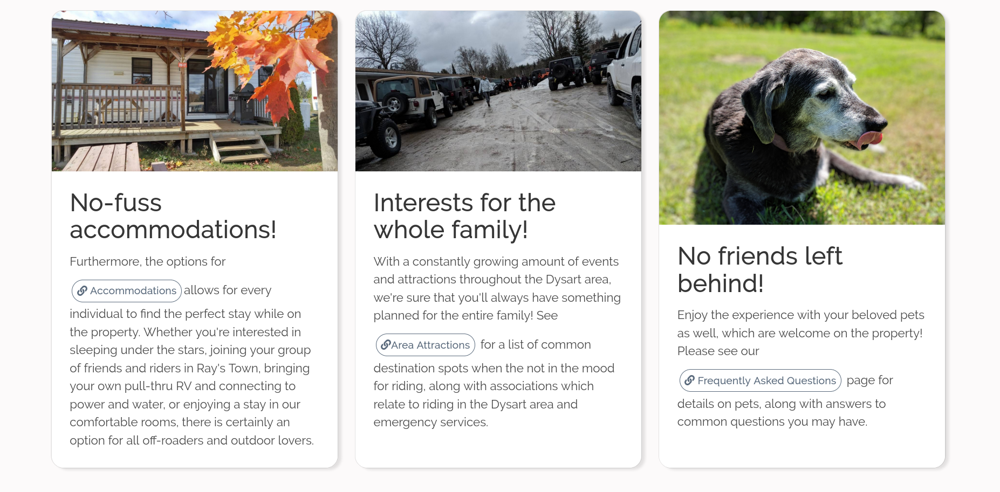
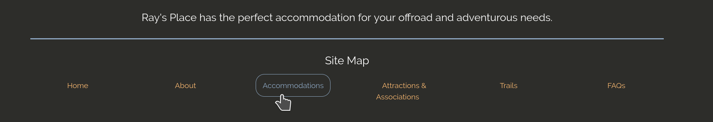
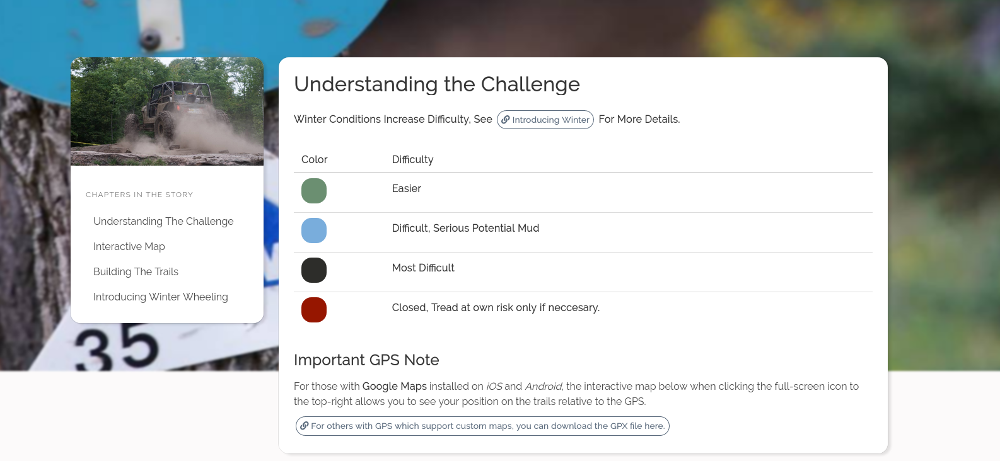

It's been just around a month now since [v3.0 of Ray'z Place](https://rayzplace.ca) was released, which included a complete rewrite of the stack (straight HTML then, with a dash of PHP for database handling) to Gridsome (VueJS, Apollo, Markdown, APIs)! I figured now would be a good time to share a few items that I had learned while developing and testing the site along with some of the technical-debt that I'm aware was created in consequence to some of these lessons. The site isn't open source yet, but I do aspire to make portions of it open over time if allowed. That's a red-tape battle that many wage wars against on various mediums, so let's gloss over that and move to the points.

You'll see that the five points that I'm sharing below all deal around the context of user experience (UX) more than developer experience. This is because I find it's easy to dismiss -or ignore- user experience as a developer and simply neglect the finer details as deadlines approach. Some are common sense, and yet still easily missed. It's all about growing as a developer!

## Use Reusable Components and Styling

So you use a Card Component for 90% of your content, best make this a reusable component that can be configured as needed! Great, you've already thought this through and saw where a codebase can be improved or reused. After all, who wants to be doing per-file searches to modify your Card layout CSS after realizing you like `4rem` border-radius instead of `3rem`? So this isn't where I messed up, but funnily enough, it's a great example of why reusable components are essential in a project.


<br />


Where I had forgotten to leverage a single reusable component was in my internal links. Sure, I was leveraging Gridsome's `g-link` component, but in an attempt to be more accessible for the various uses who'd be consuming the site I also put a link icon and border to ensure it stood out among the various content. This didn't appear too bad in my mind until the week before launch, where I had noticed that in my hubris, various links were displaying different styling! They even went so far as to conspire (my guess, not proven at the time) and present interaction differently with the user `:hover`, `:active` and `:disabled` states. All because there was no reusable link component. For the curious, here is an example of the `Link.vue` component which I developed in the final moments of sanity(?) -in attempts to begin the standardized approach for all internal links- before release. I'm sure it can be greatly improved.

```javascript
<template>
  <div>
    <g-link
      class="button is-round is-clear link"
      :to="to"
      v-if="isExternal"
      @click="handleCallback()"
      :class="type"
    >
      <font-awesome :icon="['fas', 'link']" /> {{ text }}
    </g-link>
    <a class="button is-round is-clear link" :href="to" v-if="isExternal">
      <font-awesome :icon="['fas', 'link']" /> {{ text }}
    </a>
  </div>
</template>

<script>
export default {
  name: "Link",
  props: ["to", "isExternal", "text", "hasCallback", "type"],
  methods: {
    handleCallback(e) {
      if (hasCallback && e) {
        e.preventDefault();
        this.hasCallback(e);
      }
    }
  }
};
</script>
```

TLDR: Just as you should always write coding with the DRY principle in mind, apply that same logic to UI components. If a UI element presents itself more than twice, make it reusable!

## Search Engine Optimization Is Essential

## Accessibility Must Start In The Design

For a while, I had blogged quite a bit about the importance of A11Y in 2017 and 2018, but never really touched the subject since in my blog posts. Yet, I had not shelved the importance of understanding WCAG 2.0 AA compliance and simply, deemed it a subject to worry about once the site had an MVP status. That was a mistake. Lighthouse pointed out at least 12 separate contrast violations with the links (damn you non-existent link component!) alone, and various attributes being missing from the images, sections and overall site. For someone who was such an advocate of accessibility (and even commends Apple for their focus on it), I was ashamed of the results. Many were fixed with a few lines of code for example, but one fact became very apparent when fixing the links: accessibility has to start with the design.



What I mean is, when you're designing the layout of your content, the colors, themes, overall experience -that is the time to consider accessibility. Is this font color too pale against a dark background? Can we be intentional with the touch targets when on mobile? Can we communicate interactivity through color and borders? It's not just for the general experience, but it's ensuring that all users on various mediums can access the content. As you can see with [ACheker](https://achecker.ca/checker/index.php), I still have a few more fixes to do.

## High Resolution Images === Bad Time for Slower 3G Connections

This one should be a given... but it's so easy to lose track of how big your site becomes if it's loading a dozen 3MB images per page.



## Static HTML > main.js

Let's make it plain, in the world where device performance varies greatly between the low-end laptops to the high-end smartphones, static HTML requires no heavy lifting at all. Compare that to a SPA built on React, Angular, Vue (to name the most common) or Gatsby site which has to consume `main.js` before being able to paint, and you'll start to see the differences. Gatsby and Gridsome I find are the beautiful balance between static HTML and dynamic JavaScript -enabling a "hydration" lifecycle when implemented correctly. Lighthouse provides great analytics on the first paint render of a page, and how different connection speeds and device performance can affect the overall user experience of the site.
